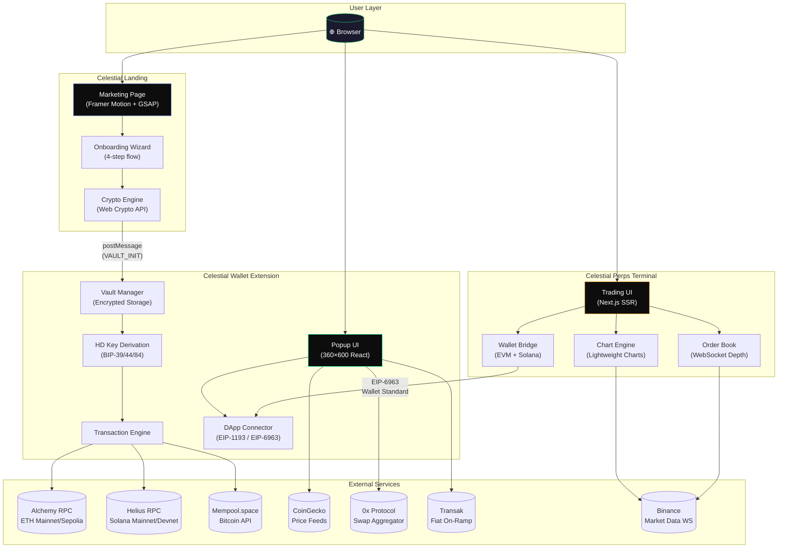
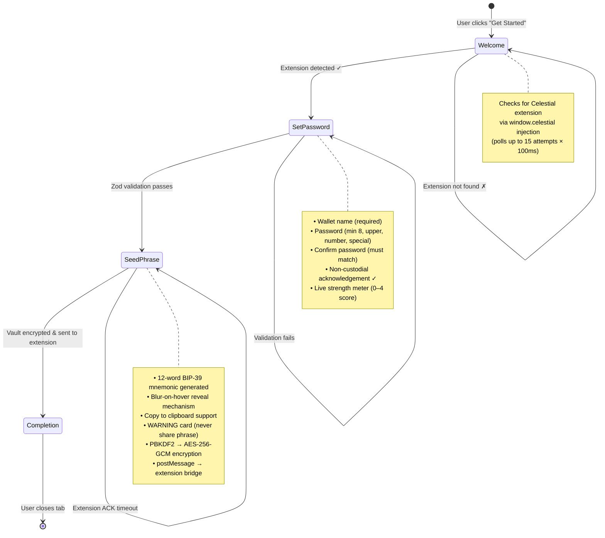
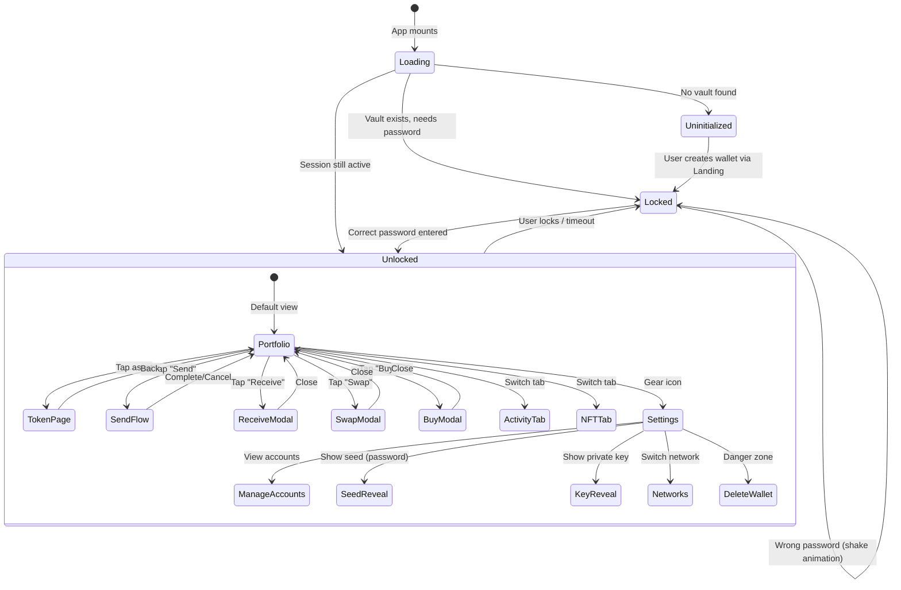
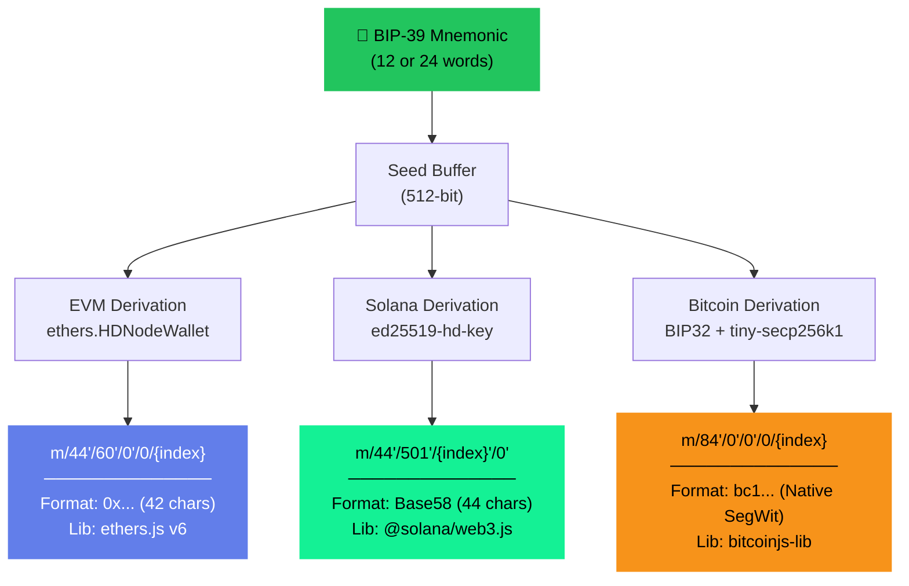
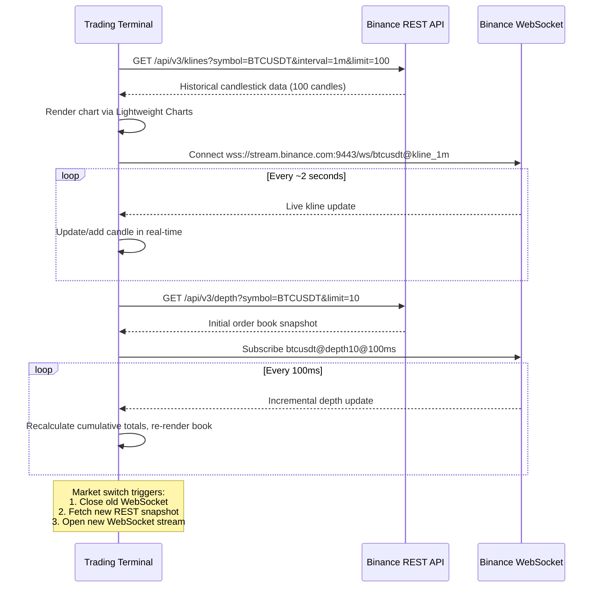
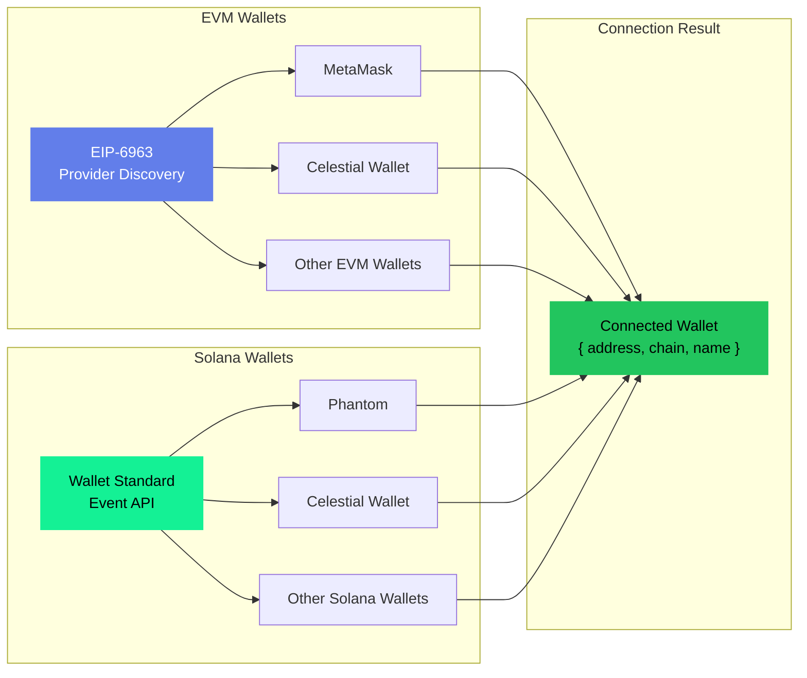
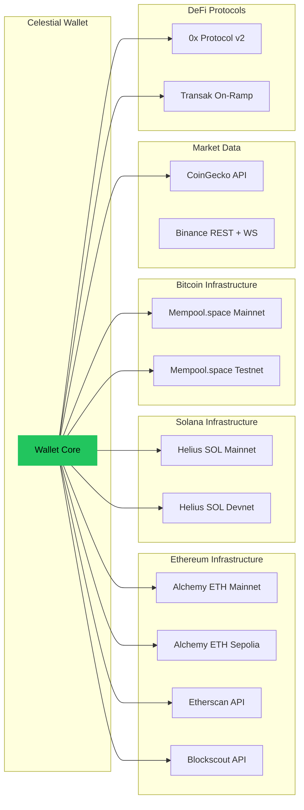

<p align="center">
  
</p>

<h1 align="center">
  <br/>
  ✦ CELESTIAL ✦
  <br/>
  <sub>The Next-Generation Decentralized Finance Ecosystem</sub>
  <br/>
</h1>

<p align="center">
  
  
  
  
  
  
  
  
  
  
</p>

<p align="center">
  <strong>Self-custody wallet · Perpetual trading terminal · Multi-chain onboarding</strong>
  <br/>
  <em>Built by <a href="https://github.com/DevanshBehl">Devansh Behl</a></em>
</p>

---

<br/>

## 📑 Table of Contents

| # | Section |
|:-:|---------|
| 1 | [Overview](#-overview) |
| 2 | [Monorepo Structure](#-monorepo-structure) |
| 3 | [High-Level Architecture](#-high-level-architecture) |
| 4 | [Celestial Landing](#-celestial-landing--onboarding-portal) |
| 5 | [Celestial Wallet](#-celestial-wallet--browser-extension) |
| 6 | [Celestial Perps](#-celestial-perps--perpetual-trading-terminal) |
| 7 | [Security Architecture](#-security-architecture) |
| 8 | [Multi-Chain Support](#-multi-chain-support) |
| 9 | [Tech Stack Deep Dive](#-tech-stack-deep-dive) |
| 10 | [Getting Started](#-getting-started) |
| 11 | [Environment Variables](#-environment-variables) |
| 12 | [Development Scripts](#-development-scripts) |
| 13 | [Project Roadmap](#-project-roadmap) |
| 14 | [Contributing](#-contributing) |
| 15 | [License](#-license) |

---

<br/>

## 🌌 Overview

**Celestial** is a complete, production-grade decentralized finance ecosystem consisting of three tightly integrated applications. Together, they provide users with a fully non-custodial experience — from wallet creation and asset management to advanced perpetual futures trading — all without ever surrendering control of private keys.

```
┌─────────────────────────────────────────────────────────────────┐
│                                                                 │
│   ╔═══════════════╗   ╔═══════════════╗   ╔═══════════════╗    │
│   ║   CELESTIAL   ║   ║   CELESTIAL   ║   ║   CELESTIAL   ║    │
│   ║   LANDING     ║──▶║    WALLET     ║──▶║    PERPS      ║    │
│   ║  (Onboarding) ║   ║  (Extension)  ║   ║  (Terminal)   ║    │
│   ╚═══════════════╝   ╚═══════════════╝   ╚═══════════════╝    │
│         │                     │                    │            │
│    Vault Creation        Asset Mgmt         50x Leverage       │
│    Seed Generation     Multi-Chain TX     Live Order Book       │
│    AES-256 Encrypt     NFT Gallery        WebSocket Feeds      │
│    Extension Bridge    Token Swaps        Wallet Connect        │
│                                                                 │
│         ▼─────────────────────▼────────────────────▼            │
│                                                                 │
│              ┌──────────────────────────┐                       │
│              │    BLOCKCHAIN LAYER      │                       │
│              │  Ethereum · Solana · BTC │                       │
│              └──────────────────────────┘                       │
│                                                                 │
└─────────────────────────────────────────────────────────────────┘
```

### ✦ Core Principles

| Principle | Description |
|-----------|-------------|
| **🔐 True Self-Custody** | Private keys never leave the user's device. Not even Celestial developers can access funds. |
| **🌐 Multi-Chain Native** | First-class support for Ethereum (EVM), Solana, and Bitcoin from a single recovery phrase. |
| **⚡ Performance First** | Sub-second interactions, real-time WebSocket data feeds, optimized rendering pipelines. |
| **🎨 Premium Design** | Apple-tier visual quality with micro-animations, glassmorphism, and obsidian dark themes. |
| **🛡️ Military-Grade Crypto** | AES-256-GCM encryption, 600K PBKDF2 iterations, zero-knowledge vault architecture. |

---

<br/>

## 📁 Monorepo Structure

```
DEx/
├── 📂 celestial-landing/          ← Onboarding portal & marketing site
│   ├── src/
│   │   ├── App.tsx                   # Router + global nav/footer
│   │   ├── pages/
│   │   │   ├── LandingPage.tsx       # Animated marketing page
│   │   │   └── OnboardingPage.tsx    # 4-step wallet creation wizard
│   │   ├── components/
│   │   │   ├── PasswordStrength.tsx  # Real-time strength meter
│   │   │   └── SeedPhraseGrid.tsx    # Interactive 12-word display
│   │   └── lib/
│   │       ├── crypto.ts            # AES-256-GCM + PBKDF2 vault encryption
│   │       └── validation.ts        # Zod password schema + strength scoring
│   ├── index.html
│   ├── vite.config.ts
│   └── package.json
│
├── 📂 celestial-react-wallet/     ← Chrome extension popup
│   ├── src/
│   │   ├── App.tsx                   # 2058-line wallet UI (states/views)
│   │   ├── components/
│   │   │   ├── TokenPage.tsx         # Individual asset detail view
│   │   │   ├── ReceiveModal.tsx      # QR code + address copy
│   │   │   ├── SwapModal.tsx         # DEX swap interface
│   │   │   ├── BuyModal.tsx          # Fiat on-ramp (Transak)
│   │   │   ├── ActivityTab.tsx       # Transaction history feed
│   │   │   ├── NFTTab.tsx            # NFT gallery viewer
│   │   │   ├── ConnectionModal.tsx   # dApp connection approval
│   │   │   └── SignTransactionView.tsx # TX signing confirmation
│   │   ├── utils/
│   │   │   ├── walletUtils.ts        # HD key derivation (BIP-39/44/84)
│   │   │   ├── rpcUtils.ts           # Balance & price fetching
│   │   │   ├── txUtils.ts            # Transaction signing & broadcast
│   │   │   ├── swapUtils.ts          # 0x Protocol swap quotes
│   │   │   ├── historyUtils.ts       # Cross-chain TX history
│   │   │   ├── nftUtils.ts           # NFT fetching (Alchemy + Helius)
│   │   │   └── onrampUtils.ts        # Transak fiat integration
│   │   ├── config/
│   │   │   └── networks.ts           # RPC endpoints & API keys
│   │   ├── types/
│   │   │   └── index.ts              # TransactionRecord, NFTRecord
│   │   └── lib/
│   │       └── crypto.ts             # Vault decryption mirror
│   ├── index.html                    # 360×600 popup dimensions
│   ├── vite.config.ts                # WASM + top-level-await plugins
│   └── package.json
│
├── 📂 celestial-perps/            ← Perpetual futures trading terminal
│   ├── app/
│   │   ├── layout.tsx                # Root layout + Inter/JetBrains Mono
│   │   ├── globals.css               # Obsidian dark theme design system
│   │   ├── page.tsx                  # Landing page with GSAP animations
│   │   └── trade/
│   │       └── page.tsx              # Full trading terminal
│   ├── next.config.ts
│   ├── postcss.config.mjs
│   └── package.json
│
└── package.json                   # Root workspace configuration
```

---

<br/>

## 🏗 High-Level Architecture



---

<br/>

## 🚀 Celestial Landing — Onboarding Portal

The landing application serves dual purpose: a high-fidelity marketing showcase and a secure onboarding portal where users create their Celestial wallet.

### ✦ Landing Page Features

| Feature | Implementation |
|---------|---------------|
| **Interactive Wallet Mockup** | 3D tilt-responsive card with live token balances, tab switching, and hover states |
| **Security Vault Animation** | Concentric rotating rings with floating AES-256, PBKDF2, Zero-Knowledge labels |
| **Multi-Chain Visual** | Animated blockchain cards (ETH, SOL, BTC) with connection status indicators |
| **Animated Counters** | Intersection Observer–triggered count-up animations for key statistics |
| **Floating Network Logos** | Parallax-scrolling blockchain icons (Solana, Bitcoin, Ethereum, Arbitrum, Sui) |
| **Ambient Gradient Blobs** | Morphing CSS backdrop blurs creating a living, breathing background |

### ✦ Onboarding Wizard — 4-Step Wallet Creation



### ✦ Vault Encryption Pipeline

```
┌──────────────┐     ┌──────────────┐     ┌──────────────┐
│   Password   │     │  Random Salt │     │  Random IV   │
│   (user)     │     │  (16 bytes)  │     │  (12 bytes)  │
└──────┬───────┘     └──────┬───────┘     └──────┬───────┘
       │                    │                    │
       ▼                    ▼                    │
   ┌──────────────────────────┐                  │
   │       PBKDF2-SHA256      │                  │
   │   600,000 iterations     │                  │
   │   Non-extractable key    │                  │
   └────────────┬─────────────┘                  │
                │                                │
                ▼                                ▼
        ┌──────────────────────────────────────────┐
        │            AES-256-GCM Encrypt           │
        │    plaintext: BIP-39 mnemonic phrase     │
        └───────────────────┬──────────────────────┘
                            │
                            ▼
                 ┌─────────────────────┐
                 │     VaultBlob       │
                 │  ─────────────────  │
                 │  version: 1         │
                 │  id: wallet_xxx     │
                 │  name: "Wallet 1"   │
                 │  salt: base64(...)  │
                 │  mnemonic: {        │
                 │    iv: base64(...)   │
                 │    ciphertext: ...   │
                 │  }                  │
                 │  createdAt: unix    │
                 └──────────┬──────────┘
                            │
                  postMessage(VAULT_INIT)
                            │
                            ▼
                 ┌─────────────────────┐
                 │  Chrome Extension   │
                 │  Background Script  │
                 │  (chrome.storage)   │
                 └─────────────────────┘
```

---

<br/>

## 💎 Celestial Wallet — Browser Extension

The wallet is a feature-complete Chrome extension (360×600 popup) that manages multi-chain assets with a premium, iOS-inspired interface.

### ✦ Wallet State Machine



### ✦ Core Features

<table>
<thead>
<tr>
<th width="200">Feature</th>
<th>Description</th>
<th width="180">Key Technologies</th>
</tr>
</thead>
<tbody>
<tr>
<td><strong>🏠 Portfolio Dashboard</strong></td>
<td>Real-time portfolio value with animated odometer transitions, per-asset P&L, and interactive area chart showing historical performance across configurable time ranges (1D, 1W, 1M, 3M, 1Y, ALL)</td>
<td><code>recharts</code>, CoinGecko API</td>
</tr>
<tr>
<td><strong>📤 Send Transactions</strong></td>
<td>Multi-chain native transfers with asset picker, address validation, amount input, and a satisfying slide-to-confirm gesture. Supports ETH, SOL, and BTC with proper gas/fee estimation</td>
<td><code>ethers.js</code>, <code>@solana/web3.js</code>, <code>bitcoinjs-lib</code></td>
</tr>
<tr>
<td><strong>📥 Receive</strong></td>
<td>Per-chain address display with QR code generation, one-tap copy, and clear chain identification badges</td>
<td><code>qrcode.react</code></td>
</tr>
<tr>
<td><strong>🔄 Token Swaps</strong></td>
<td>DEX aggregation via 0x Protocol (mainnet) with testnet mock quotes. Shows exchange rate, expected output, gas estimates, and slippage protection</td>
<td>0x Protocol v2, <code>ethers.js</code></td>
</tr>
<tr>
<td><strong>💰 Fiat On-Ramp</strong></td>
<td>Transak integration allowing users to buy crypto with fiat currency. Pre-fills wallet address, chain, and preferred currency</td>
<td>Transak Staging SDK</td>
</tr>
<tr>
<td><strong>📊 Activity History</strong></td>
<td>Cross-chain transaction feed with send/receive classification, status indicators, relative timestamps, and direct links to block explorers</td>
<td>Blockscout, Solana Explorer, Mempool.space</td>
</tr>
<tr>
<td><strong>🖼️ NFT Gallery</strong></td>
<td>Fetches and displays NFT collections from Ethereum (Alchemy NFT API v3) and Solana (Helius DAS API) with IPFS gateway resolution</td>
<td>Alchemy v3, Helius DAS</td>
</tr>
<tr>
<td><strong>🔗 DApp Connector</strong></td>
<td>EIP-1193 provider injection for Ethereum dApps + EIP-6963 multi-wallet discovery. Handles connection requests and transaction signing confirmations</td>
<td>EIP-1193, EIP-6963, Wallet Standard</td>
</tr>
<tr>
<td><strong>🧑‍💼 Account Management</strong></td>
<td>Hierarchical deterministic (HD) multi-account support — add unlimited derived accounts from a single seed phrase with per-account chain breakdowns</td>
<td>BIP-32, BIP-39, BIP-44, BIP-84</td>
</tr>
<tr>
<td><strong>🌐 Network Switching</strong></td>
<td>Toggle between Mainnet and Testnet (Sepolia, Devnet, Testnet) with separate RPC endpoints and explorer links</td>
<td>Alchemy, Helius, Mempool</td>
</tr>
</tbody>
</table>

### ✦ HD Key Derivation Paths



---

<br/>

## 📈 Celestial Perps — Perpetual Trading Terminal

A professional-grade decentralized perpetual futures trading terminal with live market data, real-time order books, and wallet connectivity.

### ✦ Landing Page

The perps landing page is a high-impact marketing showcase featuring:

| Section | Details |
|---------|---------|
| **Hero** | Bold "Trade Perps. Stay Sovereign." headline with GSAP stagger animations and a live green pulse indicator |
| **Stats Band** | `$2.4B+` volume, `180+` markets, `50×` leverage, `Zero` custody |
| **Terminal Preview** | Full SVG candlestick chart with 38 deterministic candles, 7-period moving average, volume bars, order book (asks/bids), and live last-price indicator |
| **Features Grid** | Self-custodial by default · Works with any wallet · Built for real trading |
| **Chain Logos** | Floating Ethereum, Solana, Bitcoin, Arbitrum, Base, Optimism icons with GSAP multi-directional oscillation |

### ✦ Trading Terminal Architecture

```
┌────────────────────────────────────────────────────────────────────────┐
│  CELESTIAL PERPS — Trade Terminal                        [Wallet: 0x…]│
├────────┬───────────────────────────────────────────────┬──────────────┤
│        │                                               │              │
│ Market │          CANDLESTICK CHART                     │  ORDER FORM  │
│ Select │     (Lightweight Charts v5)                    │              │
│        │  ┌─────────────────────────────────────────┐  │  ┌────────┐  │
│ BTC-USD│  │  🟩🟥🟩🟩🟥🟩🟩🟥🟩🟥🟩🟩🟥🟩🟥│  │  │ LONG   │  │
│ ETH-USD│  │  ║  │ ║║  │ ║║  │ ║  │ ║║  │ ║  │ ║  │  │  │ SHORT  │  │
│ SOL-USD│  │  ║  │ ║║  │ ║║  │ ║  │ ║║  │ ║  │ ║  │  │  ├────────┤  │
│        │  │  ║  │ ║║  │ ║║  │ ║  │ ║║  │ ║  │ ║  │  │  │ Market │  │
│        │  │▃▃▅▃▃▅▅▃▃▅▃▃▅▅▃▃▅▃▃▅▅▃▃▅▃▃▅ VOLUME  │  │  │ Limit  │  │
│        │  └─────────────────────────────────────────┘  │  │ Stop   │  │
│        │                                               │  ├────────┤  │
│        ├───────────────────┬───────────────────────────┤  │ Lever- │  │
│        │    ORDER BOOK     │      MARKET STATS         │  │ age:   │  │
│        │  ┌─────────────┐  │  Price:  $67,432.10       │  │ [10x]  │  │
│        │  │ ASKS (red)  │  │  24h:    +2.34%           │  ├────────┤  │
│        │  │ 64,452.5    │  │  Volume: $1.24B           │  │  Size  │  │
│        │  │ 64,448.0    │  │  Funding:+0.0102%         │  │ [____] │  │
│        │  │ ── SPREAD ──│  │  Spread: 0.5              │  │        │  │
│        │  │ 64,425.0    │  │                           │  │[Place] │  │
│        │  │ 64,420.5    │  │                           │  │[Order] │  │
│        │  │ BIDS (green)│  │                           │  │        │  │
│        │  └─────────────┘  │                           │  └────────┘  │
├────────┴───────────────────┴───────────────────────────┴──────────────┤
│                        POSITIONS / ORDERS / HISTORY                    │
│  BTC-USD │ Long │ 10x │ 0.75 BTC │ Entry: $65,900 │ PnL: +$1,149   │
└────────────────────────────────────────────────────────────────────────┘
```

### ✦ Live Data Pipeline



### ✦ Wallet Connection Flow

The trading terminal supports wallet connectivity through two modern discovery standards:



---

<br/>

## 🔐 Security Architecture

### ✦ Threat Model & Mitigations

| Threat Vector | Mitigation | Implementation |
|:---|:---|:---|
| **Brute-force password attack** | 600,000 PBKDF2-SHA256 iterations with 16-byte random salt | `crypto.ts` → `deriveKey()` |
| **Memory extraction** | CryptoKey marked `extractable: false` — key bytes can never leave the JS VM | Web Crypto API constraint |
| **Ciphertext tampering** | AES-256-GCM provides authenticated encryption — any modification causes decryption failure | GCM authentication tag |
| **Seed phrase exposure** | Blur-by-default display, hover-to-reveal UX, clipboard auto-clear warnings | `SeedPhraseGrid.tsx` |
| **Cross-origin data leak** | Vault transmitted via `postMessage` with explicit target, content script isolation | `window.postMessage()` |
| **Malicious dApp** | Connection request modal with explicit origin display, user must approve | `ConnectionModal.tsx` |
| **Transaction manipulation** | Full transaction details shown before signing, user must confirm | `SignTransactionView.tsx` |
| **Plaintext seed in storage** | Seed phrase is **always** encrypted at rest in `chrome.storage.local` | `VaultBlob` format |

### ✦ Encryption Specification

```
╔═══════════════════════════════════════════════════════════════╗
║                   CELESTIAL VAULT v1 SPEC                    ║
╠══════════════════╦════════════════════════════════════════════╣
║ Algorithm        ║ AES-256-GCM (Galois/Counter Mode)         ║
╠══════════════════╬════════════════════════════════════════════╣
║ Key Derivation   ║ PBKDF2-SHA256                             ║
╠══════════════════╬════════════════════════════════════════════╣
║ KDF Iterations   ║ 600,000                                   ║
╠══════════════════╬════════════════════════════════════════════╣
║ Salt             ║ 16 bytes (crypto.getRandomValues)         ║
╠══════════════════╬════════════════════════════════════════════╣
║ IV / Nonce       ║ 12 bytes (crypto.getRandomValues)         ║
╠══════════════════╬════════════════════════════════════════════╣
║ Key Length       ║ 256 bits                                   ║
╠══════════════════╬════════════════════════════════════════════╣
║ Key Extractable  ║ false (non-exportable CryptoKey)          ║
╠══════════════════╬════════════════════════════════════════════╣
║ Auth Tag         ║ 128 bits (GCM default)                    ║
╠══════════════════╬════════════════════════════════════════════╣
║ Plaintext        ║ BIP-39 mnemonic (12 or 24 words)         ║
╠══════════════════╬════════════════════════════════════════════╣
║ Encoding         ║ Base64 for all binary fields              ║
╠══════════════════╬════════════════════════════════════════════╣
║ Runtime          ║ Native Web Crypto API (zero dependencies) ║
╚══════════════════╩════════════════════════════════════════════╝
```

---

<br/>

## 🌐 Multi-Chain Support

### ✦ Chain Comparison Matrix

| | **Ethereum (EVM)** | **Solana** | **Bitcoin** |
|:---|:---:|:---:|:---:|
| **Derivation Standard** | BIP-44 | SLIP-0044 (ed25519) | BIP-84 (SegWit) |
| **Derivation Path** | `m/44'/60'/0'/0/x` | `m/44'/501'/x'/0'` | `m/84'/0'/0'/0/x` |
| **Key Curve** | secp256k1 | ed25519 | secp256k1 |
| **Address Format** | `0x` + 40 hex chars | Base58 (44 chars) | `bc1` (Bech32) |
| **Signing Library** | `ethers.js` v6 | `@solana/web3.js` | `bitcoinjs-lib` + `ecpair` |
| **RPC Provider** | Alchemy | Helius | Mempool.space |
| **Balance Method** | `eth_getBalance` | `getBalance` (RPC) | UTXO sum (REST) |
| **TX Broadcast** | `wallet.sendTransaction` | `sendAndConfirmTransaction` | Mempool REST `POST /tx` |
| **Block Explorer** | Etherscan / Sepolia | Solana Explorer | Mempool.space |
| **NFT Standard** | ERC-721 / ERC-1155 | Metaplex / cNFT | *N/A* |
| **NFT API** | Alchemy NFT v3 | Helius DAS | *N/A* |
| **Swap Protocol** | 0x Protocol v2 | — | — |
| **Fiat On-Ramp** | Transak | Transak | Transak |
| **Testnet** | Sepolia | Devnet | Testnet |

### ✦ RPC & API Provider Map



---

<br/>

## 🔧 Tech Stack Deep Dive

### ✦ Frontend Technologies

| Technology | Version | Used In | Purpose |
|:---|:---:|:---:|:---|
| **React** | `19.x` | All | UI component framework with concurrent features |
| **TypeScript** | `5.9+` / `6.0` | All | Static type safety across entire codebase |
| **Tailwind CSS** | `v4` | All | Utility-first CSS with `@theme` design tokens |
| **Vite** | `8.x` | Landing, Wallet | Lightning-fast HMR and optimized bundling |
| **Next.js** | `15.x` | Perps | SSR, file-based routing, React Server Components |
| **Framer Motion** | `12.x` | Landing | Declarative animations, layout transitions, gestures |
| **GSAP** | `3.13` | Perps | ScrollTrigger animations, timeline sequencing |
| **Lightweight Charts** | `5.2` | Perps | High-performance financial candlestick charting |
| **Recharts** | `3.9` | Wallet | Portfolio history area charts |
| **Lucide React** | latest | All | Consistent SVG icon library |
| **React Router** | `7.x` | Landing | Client-side routing (SPA) |

### ✦ Blockchain & Crypto Libraries

| Library | Purpose | Chain |
|:---|:---|:---:|
| `ethers.js` v6 | EVM interactions, HD wallet derivation, transaction signing | ETH |
| `@solana/web3.js` | Solana RPC client, keypair management, transaction building | SOL |
| `bitcoinjs-lib` | Bitcoin transaction construction, P2WPKH outputs | BTC |
| `bip32` + `bip39` | Hierarchical deterministic key derivation | BTC |
| `ed25519-hd-key` | Ed25519 curve key derivation for Solana | SOL |
| `tiny-secp256k1` | Secp256k1 elliptic curve operations | BTC |
| `ecpair` | Bitcoin key pair creation from WIF | BTC |
| `bs58` | Base58 encoding/decoding for Solana keys | SOL |
| `@scure/bip39` | Mnemonic generation (landing page) | All |
| `qrcode.react` | QR code generation for receive addresses | All |
| Web Crypto API | AES-256-GCM encryption, PBKDF2 key derivation | — |

### ✦ Validation & Developer Tooling

| Tool | Purpose |
|:---|:---|
| `zod` v4 | Runtime schema validation (password rules, env parsing) |
| `ESLint` v10 | Static analysis with React Hooks + Refresh plugins |
| `PostCSS` | CSS processing pipeline (Perps) |
| `vite-plugin-wasm` | WebAssembly support for `tiny-secp256k1` |
| `vite-plugin-top-level-await` | Top-level await for WASM initialization |

---

<br/>

## 🚀 Getting Started

### ✦ Prerequisites

| Requirement | Minimum Version |
|:---|:---|
| **Node.js** | `20.x` LTS |
| **npm** | `10.x` |
| **Git** | `2.x` |
| **Chrome** | Latest (for wallet extension) |

### ✦ Installation

```bash
# 1. Clone the repository
git clone https://github.com/DevanshBehl/DEX.git
cd DEX

# 2. Install root dependencies
npm install

# 3. Install all subproject dependencies
cd celestial-landing && npm install && cd ..
cd celestial-react-wallet && npm install && cd ..
cd celestial-perps && npm install && cd ..
```

### ✦ Running Each Project

<table>
<thead>
<tr>
<th>Project</th>
<th>Command</th>
<th>URL</th>
</tr>
</thead>
<tbody>
<tr>
<td><strong>Celestial Landing</strong></td>
<td>

```bash
cd celestial-landing
npm run dev
```

</td>
<td><code>http://localhost:5173</code></td>
</tr>
<tr>
<td><strong>Celestial Wallet</strong></td>
<td>

```bash
cd celestial-react-wallet
npm run dev
# — or —
npm run build  # then load dist/ in chrome://extensions
```

</td>
<td><code>http://localhost:5174</code><br/>(or Chrome extension popup)</td>
</tr>
<tr>
<td><strong>Celestial Perps</strong></td>
<td>

```bash
cd celestial-perps
npm run dev
```

</td>
<td><code>http://localhost:3000</code></td>
</tr>
</tbody>
</table>

### ✦ Loading the Chrome Extension

```
1. Run `npm run build` in celestial-react-wallet/
2. Open Chrome → navigate to chrome://extensions
3. Enable "Developer mode" (toggle in top-right)
4. Click "Load unpacked"
5. Select the celestial-react-wallet/dist/ folder
6. The Celestial icon appears in your browser toolbar
7. Visit the Landing page to create your wallet
```

---

<br/>

## 🔑 Environment Variables

### `celestial-react-wallet/.env`

```env
# ═══════════════════════════════════════════════
#  CELESTIAL WALLET — Environment Configuration
# ═══════════════════════════════════════════════

# Ethereum RPC (Alchemy)
VITE_ALCHEMY_ETH_URL=https://eth-mainnet.g.alchemy.com/v2/YOUR_KEY
VITE_ALCHEMY_SEPOLIA_URL=https://eth-sepolia.g.alchemy.com/v2/YOUR_KEY

# Solana RPC (Helius)
VITE_HELIUS_SOL_URL=https://mainnet.helius-rpc.com/?api-key=YOUR_KEY
VITE_HELIUS_DEVNET_URL=https://devnet.helius-rpc.com/?api-key=YOUR_KEY

# Bitcoin API (Mempool.space)
VITE_MEMPOOL_BTC_URL=https://mempool.space/api/address/
VITE_MEMPOOL_TESTNET_URL=https://mempool.space/testnet/api/address/

# Price Data (CoinGecko)
VITE_COINGECKO_API_KEY=YOUR_COINGECKO_DEMO_KEY

# Block Explorer (Etherscan)
VITE_ETHERSCAN_API_KEY=YOUR_ETHERSCAN_KEY

# DEX Aggregator (0x Protocol) — mainnet only
VITE_ZEROEX_API_KEY=YOUR_0X_API_KEY
```

> **⚠️ Important:** Never commit real API keys. Copy `.env.example` to `.env` and fill in your own keys. The wallet functions in degraded mode (mock data) without keys configured.

---

<br/>

## 📜 Development Scripts

### ✦ Celestial Landing

| Script | Command | Description |
|:---|:---|:---|
| **Dev Server** | `npm run dev` | Start Vite dev server with HMR |
| **Production Build** | `npm run build` | TypeScript check + Vite production bundle |
| **Preview** | `npm run preview` | Preview production build locally |
| **Lint** | `npm run lint` | ESLint with React rules |

### ✦ Celestial Wallet

| Script | Command | Description |
|:---|:---|:---|
| **Dev Server** | `npm run dev` | Start Vite dev server (browser mode) |
| **Extension Build** | `npm run build` | Build for Chrome extension loading |
| **Preview** | `npm run preview` | Preview production build |
| **Lint** | `npm run lint` | ESLint static analysis |

### ✦ Celestial Perps

| Script | Command | Description |
|:---|:---|:---|
| **Dev Server** | `npm run dev` | Start Next.js dev server |
| **Production Build** | `npm run build` | Next.js optimized production build |
| **Start** | `npm run start` | Serve production build |
| **Lint** | `npm run lint` | Next.js built-in ESLint |

---

<br/>

## 🗺 Project Roadmap

```mermaid
gantt
    title Celestial Ecosystem Roadmap
    dateFormat YYYY-Q
    axisFormat %Y Q%q

    section Wallet
    Core Multi-Chain Wallet       :done, w1, 2025-Q1, 2025-Q2
    NFT Gallery & Activity Feed   :done, w2, 2025-Q2, 2025-Q3
    DApp Connector (EIP-6963)     :done, w3, 2025-Q3, 2025-Q3
    Token Swaps (0x Protocol)     :done, w4, 2025-Q3, 2025-Q4
    Fiat On-Ramp (Transak)        :done, w5, 2025-Q4, 2025-Q4
    Hardware Wallet Support       :active, w6, 2026-Q1, 2026-Q3
    Cross-Chain Bridging          :w7, 2026-Q3, 2027-Q1

    section Perps
    Landing Page + Terminal UI    :done, p1, 2025-Q3, 2025-Q4
    Live Binance Data Feeds       :done, p2, 2025-Q4, 2025-Q4
    Wallet Connect Integration    :done, p3, 2025-Q4, 2026-Q1
    Smart Contract Integration    :active, p4, 2026-Q1, 2026-Q3
    Live Order Matching Engine    :p5, 2026-Q3, 2027-Q1
    Multi-Market Support          :p6, 2027-Q1, 2027-Q2

    section Landing
    Marketing Page                :done, l1, 2025-Q1, 2025-Q2
    Onboarding Wizard             :done, l2, 2025-Q2, 2025-Q3
    Vault Encryption Pipeline     :done, l3, 2025-Q2, 2025-Q3
    Multi-Language Support        :l4, 2026-Q2, 2026-Q4
```

---

<br/>

## 🤝 Contributing

### ✦ Development Conventions

| Convention | Rule |
|:---|:---|
| **File naming** | `kebab-case` for files, `PascalCase` for components |
| **Component style** | Functional components with hooks, no class components |
| **State management** | Local state + `useReducer` for complex flows, no global store |
| **Styling** | Tailwind CSS v4 utility classes, `@theme` tokens for design system |
| **Type safety** | Strict TypeScript everywhere, explicit return types on exports |
| **Error handling** | Graceful fallbacks, user-facing error messages, no silent failures |
| **Commit style** | Conventional Commits (`feat:`, `fix:`, `chore:`, `docs:`) |

### ✦ Branch Strategy

```
main              ← Production-ready, always stable
├── dev           ← Integration branch
│   ├── feat/*    ← New features
│   ├── fix/*     ← Bug fixes
│   └── chore/*   ← Maintenance tasks
```

---

<br/>

## 📄 License

This project is licensed under the **ISC License** — see the [package.json](./package.json) for details.

---

<br/>

<p align="center">
  <sub>
    Built with obsessive attention to detail by <a href="https://github.com/DevanshBehl"><strong>Devansh Behl</strong></a>
    <br/>
    <br/>
    
    
    
  </sub>
</p>
