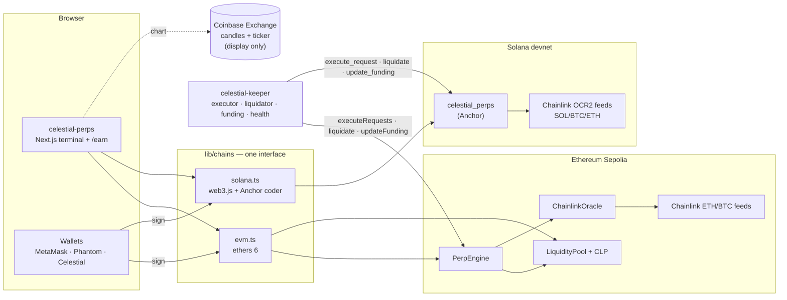
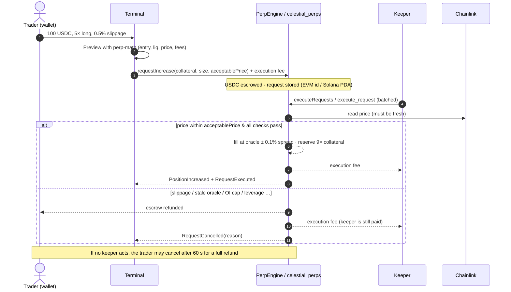

<p align="center">
  
</p>

<h1 align="center">
  ✦ CELESTIAL ✦
  <br/>
  <sub>A self-custody wallet and a two-chain perpetuals exchange — one monorepo</sub>
</h1>

<p align="center">
  
  
  
  
  
  
  
  
  
  
</p>

<p align="center">
  <strong>Celestial Perps</strong> · pool-backed perpetual futures on <strong>Ethereum Sepolia</strong> and <strong>Solana devnet</strong>, priced by Chainlink, filled by a keeper<br/>
  <strong>Celestial Wallet</strong> · a multi-chain (EVM · Solana · Bitcoin) browser extension &nbsp;·&nbsp; <strong>Celestial Landing</strong> · onboarding and vault creation
</p>

<p align="center"><em>Built by <a href="https://github.com/DevanshBehl">Devansh Behl</a></em></p>

> [!WARNING]
> **Testnet software.** Everything here runs on Sepolia and Solana devnet with **mock USDC**. The contracts and program have not been externally audited. Do not use real funds.

---

## 📑 Contents

| | | |
|:--|:--|:--|
| 1. [At a glance](#-at-a-glance) | 7. [Getting started](#-getting-started) | 13. [Wallet support](#-wallet-support) |
| 2. [Live deployments](#-live-deployments) | 8. [Configuration](#-configuration) | 14. [Security model](#-security-model) |
| 3. [Architecture](#-architecture) | 9. [Testing](#-testing) | 15. [Roadmap & status](#-roadmap--status) |
| 4. [How a trade works](#-how-a-trade-works) | 10. [Celestial Perps — app](#-celestial-perps--the-trading-app) | 16. [Documentation index](#-documentation-index) |
| 5. [Protocol economics](#-protocol-economics) | 11. [Celestial Wallet](#-celestial-wallet--browser-extension) | 17. [Contributing](#-contributing) |
| 6. [Repository map](#-repository-map) | 12. [Celestial Landing](#-celestial-landing--onboarding) | 18. [License](#-license) |

---

## 🌌 At a glance

**Celestial Perps** is a GMX-style perpetual exchange implemented **twice, identically** — once in Solidity for Ethereum and once as an Anchor program for Solana. Traders go long or short with up to **20× leverage** against a shared **USDC liquidity pool (CLP)**; LPs are the counterparty and earn trading fees and funding. Prices come from **Chainlink**; orders are two-step (request → keeper fills at the oracle price), which keeps execution simple and fair on a push oracle.

| Package | What it is | Stack | Status |
|:--|:--|:--|:--|
| [`celestial-contracts/`](celestial-contracts/README.md) | EVM protocol: `PerpEngine`, `LiquidityPool`, `CLP`, `ChainlinkOracle`, `MockUSDC` | Solidity 0.8.24 · Foundry | ✅ Deployed & verified on Sepolia |
| [`celestial-solana/`](celestial-solana/README.md) | Solana protocol: the `celestial_perps` Anchor program (same economics as EVM) | Rust · Anchor 1.1.2 · Token-2022 | ✅ Deployed on devnet |
| [`celestial-keeper/`](celestial-keeper/README.md) | One process that executes orders, liquidates and updates funding on **both** chains | TypeScript · ethers 6 · web3.js | ✅ Running live on both chains |
| `celestial-perps/` | Trading terminal + `/earn` LP page, one UI for both chains | Next.js 15 · React 19 · Tailwind 4 | 🟡 Phase 6: Solana verified live, Sepolia browser run pending |
| `celestial-react-wallet/` | Self-custody Chrome extension (EVM · Solana · BTC), NFTs, swaps, dApp connector | Vite 8 · React 19 · MV3 | ✅ Working (Solana dApp signing not yet implemented) |
| `celestial-landing/` | Marketing site + 4-step onboarding that encrypts the vault and hands it to the extension | Vite 8 · React 19 · Framer Motion | ✅ Working |

**One set of numbers, two chains.** The protocol maths is specified once in [`docs/perp-math.md`](docs/perp-math.md) with worked examples, and **four** implementations reproduce every example to the last unit: `PerpMath.sol`, the Rust `math.rs`, the keeper's `math.ts`, and the frontend's `perpMath.ts`.

---

## 🛰 Live deployments

Markets: **BTC-USD, ETH-USD** on Sepolia; **SOL-USD, BTC-USD, ETH-USD** on Solana devnet (Sepolia has no Chainlink SOL/USD feed). Each pool was seeded with **5,000,000 mock USDC**.

### Ethereum Sepolia (chain id 11155111)

| Contract | Address |
|:--|:--|
| `PerpEngine` | [`0x49765B9bEFed004A6462ad2025C240191e762b60`](https://sepolia.etherscan.io/address/0x49765B9bEFed004A6462ad2025C240191e762b60) |
| `LiquidityPool` — holds all USDC, **approve this** | [`0xB2DF5d7C1BCa2d82ECA1D591F0E58B335387b24b`](https://sepolia.etherscan.io/address/0xB2DF5d7C1BCa2d82ECA1D591F0E58B335387b24b) |
| `CLP` (18 decimals) | [`0x303C049BF526bD40d82E2Bd405af34bB095A55DA`](https://sepolia.etherscan.io/address/0x303C049BF526bD40d82E2Bd405af34bB095A55DA) |
| `ChainlinkOracle` | [`0xFF6a6Da437b16e5dd29D2eF8Aa38517911320cC0`](https://sepolia.etherscan.io/address/0xFF6a6Da437b16e5dd29D2eF8Aa38517911320cC0) |
| `MockUSDC` (6 decimals, public faucet) | [`0x88a77050162285276d6346a4Bc07C406572d6cD2`](https://sepolia.etherscan.io/address/0x88a77050162285276d6346a4Bc07C406572d6cD2) |
| Keeper | `0xA0c3A70806983a965e43961DE48658a9D41f2322` · engine deploy block `11757411` |
| ~~`CelestialVault`~~ (legacy, deprecated) | `0x786f4037924772c79F39D49C302dC3D3eDd14b04` |

### Solana devnet

| Account | Address |
|:--|:--|
| Program `celestial_perps` | [`EK1KpDGfUiZ4XkWixAaRFonDexZYSKnJm8oJz5s7HLTL`](https://explorer.solana.com/address/EK1KpDGfUiZ4XkWixAaRFonDexZYSKnJm8oJz5s7HLTL?cluster=devnet) |
| `Config` PDA | `CCof8LtZZpL6U2wXDS7sp3yV2r6v5QuTbvE6ms8m2wgX` |
| `Pool` PDA / USDC vault | `2jZjsSQMRrRWhRupktSbHeo1SDLgAs4fePT5ndhtTNmF` / `5spmkMFD9EiX9LFd7dAXzXDAjm6UDVea6wUEsNthJv5o` |
| CLP mint (Token-2022, 6 decimals) | `JCboCWJVi1qq3P1vhSwqc1TEhq1udxf3AnxT2UJ27iTz` |
| Mock USDC mint (Token-2022) | [`2LW8DzDa2KVxDxqUqZLALc6htcVSDwGK1JGz4VaaTn1Y`](https://explorer.solana.com/address/2LW8DzDa2KVxDxqUqZLALc6htcVSDwGK1JGz4VaaTn1Y?cluster=devnet) — mint authority is the program's faucet PDA `xAsm3yj7Y1XbBi4DKXPA2UHuLX3GyEgWpVBdR7HkPUB` |
| Markets (AUM order) | SOL-USD `2TJGAi…K3dJ` · BTC-USD `H2T9yj…Mrmfs` · ETH-USD `CXrmiK…BzZW3` |
| Chainlink feeds | SOL `99B2bT…6ynrR` · BTC `6PxBx9…kFJe` · ETH `669U43…Jpw3P` (OCR2 store `HEvSKo…WHny`) |
| Keeper | `6DoRfsEtFC2LFEEvSEuYjeNo7vJHnFrx8EzffksVy5ED` |

Full records, including every deployment and smoke-test transaction: [`deployments/sepolia.json`](deployments/sepolia.json), [`deployments/solana-devnet.json`](deployments/solana-devnet.json).

---

## 🏗 Architecture


```mermaid
flowchart LR
    subgraph Browser
        UI["celestial-perps<br/>Next.js terminal + /earn"]
        W1["Wallets<br/>MetaMask · Phantom · Celestial"]
    end

    subgraph ChainLayer["lib/chains — one interface"]
        EVMC["evm.ts<br/>ethers 6"]
        SOLC["solana.ts<br/>web3.js + Anchor coder"]
    end

    subgraph Sepolia["Ethereum Sepolia"]
        ENG["PerpEngine"]
        POOL["LiquidityPool + CLP"]
        ORA["ChainlinkOracle"]
        CLE["Chainlink ETH/BTC feeds"]
    end

    subgraph Devnet["Solana devnet"]
        PROG["celestial_perps<br/>(Anchor)"]
        CLS["Chainlink OCR2 feeds<br/>SOL/BTC/ETH"]
    end

    K["celestial-keeper<br/>executor · liquidator · funding · health"]
    CB[("Coinbase Exchange<br/>candles + ticker<br/>(display only)")]

    UI --> EVMC & SOLC
    UI -. chart .-> CB
    W1 -- sign --> EVMC & SOLC
    EVMC --> ENG & POOL
    SOLC --> PROG
    ENG --> POOL
    ENG --> ORA --> CLE
    PROG --> CLS
    K -- executeRequests · liquidate · updateFunding --> ENG
    K -- execute_request · liquidate · update_funding --> PROG
```

- **Contracts / program** hold all funds and enforce every rule. The keeper and frontend can't move money on their own.
- **The keeper** is a convenience, not a trusted party. It can only execute orders the trader signed, at the on-chain oracle price, within the trader's `acceptablePrice`. If it stops, traders can still cancel after 60 s and get a full refund.
- **The frontend** talks to both chains through one `PerpsChain` interface (`celestial-perps/lib/chains/`). It uses the connected wallet's own provider and never touches a private key.

---

## 🔁 How a trade works


```mermaid
sequenceDiagram
    autonumber
    actor T as Trader (wallet)
    participant UI as Terminal
    participant C as PerpEngine / celestial_perps
    participant K as Keeper
    participant O as Chainlink

    T->>UI: 100 USDC, 5× long, 0.5% slippage
    UI->>UI: Preview with perp-math (entry, liq. price, fees)
    UI->>C: requestIncrease(collateral, size, acceptablePrice) + execution fee
    Note over C: USDC escrowed · request stored (EVM id / Solana PDA)
    K->>C: executeRequests / execute_request (batched)
    C->>O: read price (must be fresh)
    alt price within acceptablePrice & all checks pass
        C-->>C: fill at oracle ± 0.1% spread · reserve 9× collateral
        C-->>K: execution fee
        C-->>UI: PositionIncreased + RequestExecuted
    else slippage / stale oracle / OI cap / leverage …
        C-->>T: escrow refunded
        C-->>K: execution fee (keeper is still paid)
        C-->>UI: RequestCancelled(reason)
    end
    Note over T,C: If no keeper acts, the trader may cancel after 60 s for a full refund
```

A business failure (slippage, stale oracle, open-interest cap, reserve cap, leverage, minimum collateral) **cancels** the request instead of failing the transaction, on both chains. So a keeper can fill a whole batch even when one order in it cancels. Closing, partial closing, adding and removing collateral are the same two-step flow with `requestDecrease` / `requestIncrease`.

Measured on the live testnets: Solana fills land about **2 s** after the request. On Sepolia the keeper sends the fill about **2–3 s** after the request's block, and it lands 1–2 blocks later (about 12–24 s).

---

## 📐 Protocol economics

Source of truth: [`docs/protocol-spec.md`](docs/protocol-spec.md) (parameters) and [`docs/perp-math.md`](docs/perp-math.md) (formulas, rounding, 10 worked examples).

| Parameter | Value |
|:--|:--|
| Collateral | Mock USDC, 6 decimals (valued at $1) |
| Max leverage / maintenance margin | **20×** / **2.5%** of size |
| Open & close fee | **0.06%** of size each (90% to LPs, 10% protocol) |
| Execution spread | **0.1%** against the trader (longs fill at oracle × 1.001, shorts × 0.999) |
| Liquidation | when `collateral + PnL − funding − close fee < 2.5% × size`; keeper fee **0.5%** of size, capped at collateral; the rest goes to LPs |
| Profit cap | **9 × collateral**, reserved in the pool when the position opens, so the pool is always solvent |
| Open-interest cap | **30%** of pool AUM per side, per market |
| Funding | `min(0.01%/h, 0.03%/h × |longOI − shortOI| / AUM)`; the heavier side pays LPs |
| Oracle max age | 3,960 s on Sepolia (heartbeat + 10%) · 120 s on Solana devnet |
| Orders | Two-step; the owner can cancel after 60 s |
| LP pool (CLP) | Mint fee 0.1%; withdrawals open 15 min after your last deposit and only use unreserved liquidity |
| Rounding | **Always against the trader**, identical on both chains |

Where the chains differ (settled and documented in the spec): CLP has **18 decimals on EVM and 6 on Solana**, so balances fit in `u64`. The execution fee is ETH on Sepolia (0.0002) and lamports on Solana (50,000). On Solana a new position also prepays about 0.0014 SOL of account rent, refunded on close.

---

## 🗂 Repository map

```
DEx/
├── celestial-contracts/      Foundry · Solidity protocol (EVM)
│   ├── src/PerpEngine.sol          two-step orders, positions, funding, liquidation, views
│   ├── src/pool/                   LiquidityPool (all USDC) + CLP (LP token)
│   ├── src/oracle/                 ChainlinkOracle (staleness, answer checks, 8-dp normalisation)
│   ├── src/libraries/PerpMath.sol  every formula (mirrors docs/perp-math.md)
│   ├── src/MockUSDC.sol            testnet collateral with a 24 h faucet
│   ├── src/legacy/                 deprecated CelestialVault prototype
│   ├── src/test-nfts/              ERC-721/1155 fixtures for the wallet
│   ├── script/                     DeployPerps, DeployMockUSDC, …
│   └── test/                       unit · fuzz · invariant suites
│
├── celestial-solana/         Anchor workspace · Solana protocol
│   ├── programs/celestial-perps/src/
│   │   ├── instructions/           one file per instruction (22 in the devnet build)
│   │   ├── engine.rs · math.rs     execution core + maths (mirrors PerpMath.sol)
│   │   └── oracle.rs               Chainlink OCR2 decoder (+ test-only mock oracle)
│   ├── tests/                      LiteSVM suites + Chainlink cloned-validator test
│   └── scripts/                    check-oracle · init-devnet
│
├── celestial-keeper/         Keeper service for both chains
│   ├── src/evm/ · src/solana/      executor, liquidator, funding, health per chain
│   ├── src/math.ts                 off-chain liquidation checks (bit-exact)
│   └── test/                       maths vectors · Anvil + local-validator end-to-end
│
├── celestial-perps/          Next.js trading terminal + /earn
│   ├── app/                        routes: /, /trade, /earn
│   ├── components/                 TradeForm, PositionsPanel, OrderTracker, MarketInfo, …
│   ├── lib/chains/                 PerpsChain interface · evm.ts · solana.ts · errors
│   ├── lib/perpMath.ts             bigint port of the protocol maths (+ tests)
│   ├── hooks/                      usePerps · useOrders · useWallet (provider)
│   ├── src/abis · src/idl          exported ABIs and the Anchor IDL
│   └── test/                       chain-layer end-to-end on Anvil + local validator
│
├── celestial-react-wallet/   Chrome MV3 extension (EVM · Solana · BTC)
├── celestial-landing/        Marketing site + onboarding wizard
├── deployments/              Deployed addresses + tx records per network
├── docs/                     Technical reference (architecture, spec, maths, per-package docs, ops, security)
└── phases.md                 Build plan and status, phase by phase
```

---

## 🚀 Getting started

### Prerequisites

| Tool | Version | Needed for |
|:--|:--|:--|
| Node.js | **24.x** | everything TypeScript |
| npm | 10+ | `celestial-perps`, `celestial-react-wallet`, `celestial-landing` |
| pnpm | **11.x** | `celestial-keeper`, `celestial-solana` |
| Foundry (`forge`, `anvil`, `cast`) | latest | contracts, EVM end-to-end tests |
| Rust + solana-cli **3.1.10** (Agave) + anchor-cli **1.1.2** (avm) | — | Solana program, local-validator tests |
| Chrome + a wallet | — | MetaMask / Phantom (and the Celestial extension) |

### 1 · Run the trading app against the live testnets (fastest path)

```bash
git clone https://github.com/DevanshBehl/DEX.git && cd DEX/celestial-perps
npm install
cp .env.example .env.local        # optional: add your own devnet RPC (see Configuration)
npm run dev                       # → http://localhost:3000/trade
```

Connect a wallet on **Sepolia** (MetaMask, Phantom, or Celestial) or **Solana devnet** (Phantom), then click **Get test USDC**. You need a little Sepolia ETH or devnet SOL for fees; the USDC comes from the faucet. Orders are only filled while a keeper is running (see step 3).

### 2 · Build & test the protocols

```bash
# EVM
cd celestial-contracts && forge build && forge test

# Solana (maths + LiteSVM suite with a test-only mock oracle)
cd celestial-solana && pnpm install
cargo test -p celestial-perps --lib     # every perp-math.md vector
pnpm test                               # builds with `mock-oracle`, runs the TS suite
pnpm test:chainlink                     # devnet build + real Chainlink accounts cloned into a local validator
```

### 3 · Run the keeper

```bash
cd celestial-keeper && pnpm install
cp .env.example .env    # RPC URLs, EVM keeper key, Solana keypair PATH (never commit .env)
pnpm keeper             # both chains · or keeper:evm / keeper:solana
```

The keeper key must be whitelisted on-chain (`PerpEngine.isKeeper` / `Config.keepers`). See [`celestial-keeper/README.md`](celestial-keeper/README.md) for its jobs, JSON logs, alerts and troubleshooting.

### 4 · Wallet extension & landing

```bash
cd celestial-react-wallet && npm install && npm run build
# chrome://extensions → Developer mode → Load unpacked → celestial-react-wallet/dist
cd ../celestial-landing && npm install && npm run dev   # → http://localhost:5173 (create a wallet)
```

---

## ⚙️ Configuration

Every package ships an `.env.example`. **Never commit a real `.env` / `.env.local` / keypair**; they are gitignored.

| Package | File | Variables |
|:--|:--|:--|
| `celestial-perps` | `.env.local` | `NEXT_PUBLIC_SEPOLIA_RPC_URL`, `NEXT_PUBLIC_SOLANA_RPC_URL`, `NEXT_PUBLIC_MARKET_REST_URL`, `NEXT_PUBLIC_MARKET_WS_URL` |
| `celestial-keeper` | `.env` | `SEPOLIA_RPC_URL`, `EVM_KEEPER_PRIVATE_KEY`, `SOLANA_RPC_URL`, `SOLANA_KEEPER_KEYPAIR_PATH`, `ENABLE_EVM`/`ENABLE_SOLANA`, interval + alert settings |
| `celestial-contracts` | `.env` | `SEPOLIA_RPC_URL`, `PRIVATE_KEY`, `ETHERSCAN_API_KEY` (deploy/verify only) |
| `celestial-react-wallet` | `.env` | Alchemy / Helius / Mempool / CoinGecko / Etherscan / 0x keys (`VITE_*`) |

> [!IMPORTANT]
> `NEXT_PUBLIC_*` values are **bundled into the browser**. Only put RPC keys there that are fine to expose (devnet-only, or domain-restricted in your provider's dashboard).
> The public Solana devnet RPC rate-limits heavily, so a dedicated devnet endpoint (for example Helius) is strongly recommended for both the app and the keeper.

---

## 🧪 Testing

Every layer is tested against the same maths vectors, and every end-to-end suite runs the **real keeper** against **real deployments of the protocol on local chains**.

| Package | Command | What it proves | Result |
|:--|:--|:--|:--|
| `celestial-contracts` | `forge test` | Unit, fuzz and 6 invariants (pool solvency, reserve ≤ pool, payouts ≤ inflows) | 107 tests · 98–100% line coverage on the protocol |
| `celestial-solana` | `cargo test -p celestial-perps --lib` | `math.rs` reproduces Ex 1–10 exactly; oracle decoding on a real devnet account | 20/20 |
| | `pnpm test` | Every trading, LP, faucet, admin and cancel path on LiteSVM, with an invariant check after every scenario | 48/48 |
| | `pnpm test:chainlink` | Real Chainlink store + feeds cloned from devnet: list markets, read prices, open and close | ✅ |
| `celestial-keeper` | `pnpm test` | `math.ts` vectors + oracle, config and logging units | 18/18 |
| | `pnpm test:local` | Anvil + local validator: fills within 5 s, batching, liquidation, funding, RPC outage with exactly-once recovery | 11/11 |
| `celestial-perps` | `npm run test:math` | `perpMath.ts`: Ex 1–10 including both CLP columns, the UI order preview, unit parsing | 9/9 |
| | `npm run test:chain` | The chain layer end-to-end on Anvil and a local validator, with the keeper: faucet → open → partial close → collateral changes → close → history → LP → cancel. Solana client state equals the on-chain `get_*` views | 19/19 |
| `celestial-react-wallet` | `npm test` | NFT module: indexers, normalisation, spam filter, media, transfers, marketplaces | unit suite (`tests/nft`) |

The local suites need `forge build` (contracts artifacts) and `pnpm build:test` in `celestial-solana` (the mock-oracle program fixture).

---

## 📈 Celestial Perps — the trading app

`celestial-perps/` is one UI for both chains. The chain is chosen by the connected wallet: an EVM wallet trades on Sepolia, a Solana wallet on devnet. SOL-USD data always comes from Solana.

| Area | What you get |
|:--|:--|
| **Trade form** | USDC collateral with balance and % buttons, a leverage slider (max read on-chain) and slippage presets. The order summary shows size, estimated entry, acceptable price, **liquidation price**, open fee, execution fee (plus the refundable position rent on Solana), funding per hour and remaining side capacity. It is computed with the same bigint maths as the chain. |
| **Pre-flight checks** | Nothing is sent if it would cancel: minimum collateral, leverage bounds, capacity, balances, market enabled, not paused, fresh oracle. On Sepolia the first order asks for a USDC **approval** (exact or max) and then places the order, from one click. |
| **Order tracker** | *Confirm in wallet → submitted → pending keeper (elapsed seconds) → filled* (price, fee) or *cancelled* (a readable reason), with explorer links for the request and the fill. |
| **Positions** | Size, collateral, entry, mark (oracle), liquidation price, net PnL (capped profit − close fee − funding), funding owed. **Close**, **Partial** (%), **+Coll**, **−Coll** (checked against leverage and liquidation). |
| **Orders & history** | Pending requests with a **Cancel** button that enables after 60 s. History comes from on-chain events: orders, fills, cancellations with reasons, increases and decreases with realised PnL, liquidations, faucet and LP actions. |
| **Market info** | Oracle price and age, gap to the Coinbase index, available liquidity, long/short OI with a skew bar, capacity per side, funding for each side, max leverage and fees. |
| **`/earn`** | Pool AUM, CLP price, unreserved and reserved liquidity, your CLP, share and value, and a 7-day fee APR estimate. Add liquidity with a min-CLP guard. Remove with a min-USDC guard, a **cooldown countdown**, and a clear message when reserved liquidity blocks the withdrawal. |
| **`/status`** | Health of both deployments read straight from the chains (works when the keeper is down): order queue age, keeper balance and whitelist, oracle freshness, pool and OI per market, funding. |
| **Guards & errors** | A Sepolia network guard (switch or add the chain; writes are blocked until then). Contract and program errors are decoded into plain language ("Price moved past your slippage limit", "Rejected in wallet", …). Slow or rate-limited RPCs show a retrying banner instead of hanging. |

Chart and index price come from the Coinbase Exchange public API and are **display only**. Every fill uses the on-chain Chainlink price.

---

## 💎 Celestial Wallet — browser extension

`celestial-react-wallet/` is a Chrome **Manifest V3** extension (360 × 600 popup) with an encrypted vault created by Celestial Landing.

| Feature | Details |
|:--|:--|
| Multi-chain HD accounts | One BIP-39 phrase → EVM `m/44'/60'/0'/0/i`, Solana `m/44'/501'/i'/0'`, Bitcoin native SegWit `m/84'/0'/0'/0/i`; unlimited derived accounts |
| Portfolio & assets | Live balances and prices, token pages, ERC-20 and SPL tokens, activity history per chain |
| Send / receive | Native and token transfers with fee estimation; QR receive |
| NFTs | EVM (Alchemy) and Solana (Helius DAS) indexers, spam filtering, media resolution, detail pages, send flows, marketplace data (OpenSea, Magic Eden, Tensor) |
| Swaps & on-ramp | 0x Protocol quotes (mainnet) · Transak fiat on-ramp |
| dApp connector | EIP-1193 provider + **EIP-6963** discovery with connect and **`eth_sendTransaction` signing popups**; Solana **Wallet Standard** registration (connect/disconnect) |
| Networks | Mainnet ↔ testnet toggle (Sepolia, Solana devnet, Bitcoin testnet) |

---

## 🚀 Celestial Landing — onboarding

`celestial-landing/` is the marketing site plus a **4-step onboarding wizard**: detect the extension → set a password (Zod rules and a live strength meter) → generate and back up a 12-word BIP-39 phrase → encrypt and hand the vault to the extension.

The vault is encrypted in the browser with the Web Crypto API: **PBKDF2-SHA256 (600,000 iterations, 16-byte salt) → AES-256-GCM (12-byte IV)**, with a non-extractable key. Only the encrypted `VaultBlob` is sent to the extension (`postMessage` → `chrome.storage.local`). The plaintext phrase never leaves the page.

---

## 🔌 Wallet support

| Wallet | Sepolia (EVM) | Solana devnet |
|:--|:--|:--|
| **MetaMask** | 🟡 supported via EIP-6963 (connect + signing); live browser run pending | — |
| **Phantom** | 🟡 supported (EVM provider); live browser run pending | ✅ **verified live**: faucet, open, partial and full close, history, add liquidity |
| **Celestial Wallet** | 🟡 connect + `eth_sendTransaction` signing popup; live browser run pending | ⚠️ connect only: its `solana:signTransaction` / `signAndSendTransaction` are not implemented yet; the app says so clearly |

Phantom tips: turn on **Testnet Mode** and select **Solana Devnet** / **Sepolia**, so the wallet previews transactions on the right network.

---

## 🛡 Security model

**Protocol**
- **Solvent by construction:** every position reserves its maximum profit (9 × collateral) in the pool when it opens. LPs can't withdraw reserved liquidity, and open interest is capped at 30% of AUM per side.
- **Rounding always goes against the trader**, identically on both chains. Four implementations are cross-checked against the same worked examples.
- **Oracle hygiene:** Chainlink answers are checked for staleness (per-chain max age), a positive value and a future-timestamp skew, and normalised to 8 decimals. Solana verifies the feed account's owner (the OCR2 store) and key.
- **Two-step orders:** fills happen at the oracle price at execution time, bounded by the trader's `acceptablePrice`. Stale, slipped or over-cap orders cancel with a full refund. Unfilled orders are cancellable after 60 s.
- **Solana account validation:** every PDA, mint and token program is checked. The AUM instructions require **every** market and its oracle in `Config` order, so leaving one out to game AUM fails.
- **EVM:** Checks-Effects-Interactions, `ReentrancyGuard`, `SafeERC20`, `Ownable2Step`, parameter setters with bounds, and a global pause (which blocks increases; decreases, cancels and liquidations keep working).

**Keeper**
- It never double-executes: EVM skips non-pending ids, and a Solana request account is closed on execution.
- It never pays for a transaction it knows will fail: EVM sends are gas-estimated first, and Solana sends run with preflight.
- It only retries sends that failed before being accepted. Solana reads use `minContextSlot`, so a lagging RPC node can't show stale state.
- Secrets are never logged. The Solana keypair is loaded by path inside the process only.

**Wallet & app**
- Non-custodial: keys live only in the encrypted vault. The trading app signs through the connected wallet and never holds a key.
- Writes go through the **provider the user picked** (EIP-6963), never `window.ethereum` blindly. EVM writes are blocked until the wallet is on Sepolia.

> Not yet done (planned for Phase 7/8): external audit, timelock + multisig admin, permissionless liquidations, low-latency pull oracle for front-running protection.

---

## 🗺 Roadmap & status

| Phase | Scope | Status |
|:--|:--|:--|
| 0 | Cleanup, toolchains, shared protocol spec | ✅ 2026-09-22 |
| 1 | Frontend data: Coinbase chart + Chainlink oracle price, order book removed | ✅ 2026-09-22 |
| 2 | Mock USDC on both chains (+ faucets) | ✅ 2026-09-22 (Solana faucet in Phase 4) |
| 3 | EVM contracts: tests, invariants, Sepolia deploy + verification | ✅ 2026-09-22 |
| 4 | Solana Anchor program: tests, Chainlink integration, devnet deploy | ✅ 2026-09-25 |
| 5 | Keeper service for both chains, live on testnets | ✅ 2026-09-25 |
| 6 | Frontend integration: chain layer, trade flow, positions & history, `/earn`, faucet, network guard; Celestial Wallet Solana signing | ✅ 2026-09-27 (verified live on both chains) |
| 7 | Hardening & public testnet: cross-chain consistency test, longer fuzzing, Slither/clippy, internal security review, monitoring dashboard, user/LP guides | 🟡 Built and tested; remaining: tester round |
| 8 | Mainnet-only: limit/stop orders, pull oracle, real USDC + depeg handling, permissionless liquidations, audits, multisig + timelock | ⏳ |

Detailed checklists, decisions and deviations for every phase: [`phases.md`](phases.md).

---

## 📚 Documentation index

The full technical reference lives in [`docs/`](docs/README.md). Start with the [reading guide](docs/README.md). Testers: [Trader guide](docs/user-guide.md) · [LP guide](docs/lp-guide.md).

| Document | Contents |
|:--|:--|
| [`docs/user-guide.md`](docs/user-guide.md) · [`docs/lp-guide.md`](docs/lp-guide.md) | How to trade and provide liquidity with test funds, costs, risks, troubleshooting |
| [`docs/architecture.md`](docs/architecture.md) | System context, the two-chain design, order lifecycle, money flow, app and wallet architecture |
| [`docs/protocol-spec.md`](docs/protocol-spec.md) | Every protocol rule and parameter (with admin bounds), order checks, funding, liquidation, LP, fees, per-chain deviations |
| [`docs/perp-math.md`](docs/perp-math.md) | Formulas, rounding rules and 10 worked examples (EVM and Solana CLP columns) |
| [`docs/contracts.md`](docs/contracts.md) | EVM contracts: pool buckets, storage, execution, oracle adapter, events, errors, access control |
| [`docs/solana-program.md`](docs/solana-program.md) | Anchor program: PDAs, instructions, the `remaining_accounts` market set, copy-then-commit execution, OCR2 decoding |
| [`docs/keeper.md`](docs/keeper.md) | Keeper process, jobs, correctness guarantees, configuration, observability |
| [`docs/frontend.md`](docs/frontend.md) | Trading app: `PerpsChain` layer, EVM/Solana implementations, hooks, order tracking, config |
| [`docs/wallet.md`](docs/wallet.md) | Browser extension: components, vault crypto, derivation, dApp providers, known limitations |
| [`docs/wallet-nfts.md`](docs/wallet-nfts.md) | Wallet NFT module: indexing, spam/media, sending all 7 standards, marketplace data, fixtures |
| [`docs/landing.md`](docs/landing.md) | Onboarding flow and the encrypted vault handoff to the extension |
| [`docs/operations.md`](docs/operations.md) | Addresses, deploy runbooks, routine admin tasks, RPC guidance, troubleshooting |
| [`docs/testing.md`](docs/testing.md) | Test matrix, invariants, local end-to-end suites |
| [`docs/security.md`](docs/security.md) | Trust boundaries, protections, known risks per component |
| [`phases.md`](phases.md) | Build plan, status, and done-when criteria per phase |
| [`deployments/`](deployments) | Addresses and transaction records for Sepolia and Solana devnet |

---

## 🤝 Contributing

| Convention | Rule |
|:--|:--|
| **Spec first** | Change `docs/protocol-spec.md` / `docs/perp-math.md` first, then **both** chains. The four maths implementations must keep matching the worked examples. |
| **Money is integer maths** | USD 1e6 · price 1e8 · funding 1e18 · bigint / `u128` / `uint256` everywhere; floats only for display |
| **Branches** | One branch per phase (`phase-N`) merged into `main` with `--no-ff`; conventional commits (`feat:`, `fix:`, `docs:`, `chore:`) |
| **Tests** | Every behaviour change comes with tests at the layer it touches, plus the local end-to-end suite |
| **Secrets** | Never commit `.env`, `.env.local`, private keys or keypair JSON. Keypairs are passed to tools by **path** only |
| **Style** | Strict TypeScript, functional React, Tailwind v4, no silent failures: every error reaches the user in plain language |

---

## 📄 License

ISC — see [`package.json`](package.json).

<p align="center">
  <sub>
    Built by <a href="https://github.com/DevanshBehl"><strong>Devansh Behl</strong></a><br/><br/>
    
    
    
  </sub>
</p>
