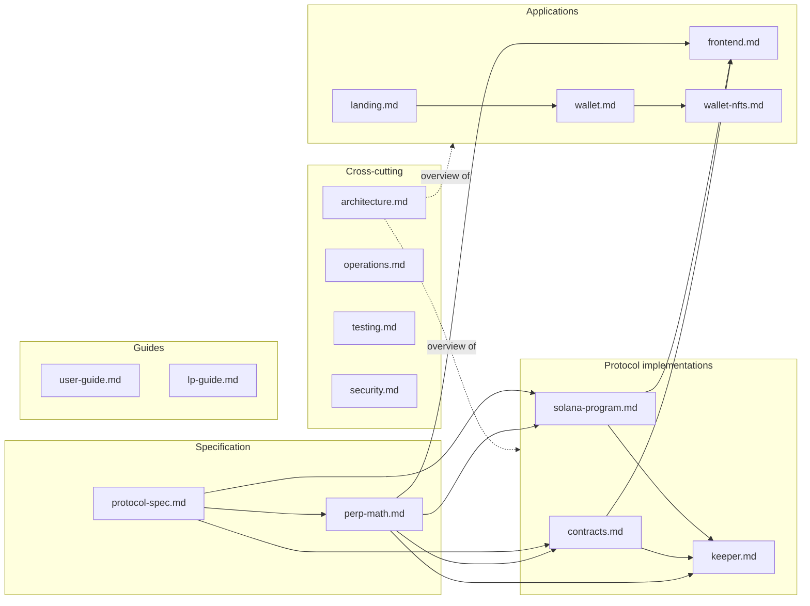

# Celestial Documentation

This folder is the technical reference for the Celestial monorepo. It covers the perpetuals protocol on Ethereum Sepolia and Solana devnet, the keeper that operates it, the trading app, the Celestial Wallet browser extension, and the onboarding site.

Each document describes the system **as implemented**. Parameters, formulas and addresses here match the code and the deployment records in [`../deployments/`](../deployments/). If a document and the code disagree, the code is the bug. Fix one of them, and change the spec first (see [Contributing](#keeping-the-docs-correct)).

## Reading guide

| If you want to… | Start with |
|---|---|
| Trade or provide liquidity as a tester | [Trader guide](user-guide.md) · [LP guide](lp-guide.md) |
| Understand the whole system in 10 minutes | [Architecture](architecture.md) |
| Know every protocol rule and parameter | [Protocol specification](protocol-spec.md) |
| Implement or verify the maths | [Perp maths & test vectors](perp-math.md) |
| Work on the Solidity contracts | [EVM contracts](contracts.md) |
| Work on the Anchor program | [Solana program](solana-program.md) |
| Run or change the keeper | [Keeper](keeper.md) |
| Work on the trading app | [Trading app (celestial-perps)](frontend.md) |
| Work on the browser extension | [Celestial Wallet](wallet.md) and [Wallet NFTs](wallet-nfts.md) |
| Work on onboarding / vault creation | [Landing & onboarding](landing.md) |
| Deploy, configure or debug a running system | [Operations runbook](operations.md) |
| Run the test suites | [Testing](testing.md) |
| Review trust assumptions and known risks | [Security model](security.md) |

## Document map

## Conventions used in these docs

- **Units.** On-chain amounts are integers. USD and USDC use 6 decimals (`1e6` = $1). Prices use 8 decimals (`1e8` = $1). Funding rates and indices use 18 decimals. CLP uses 18 decimals on EVM and 6 on Solana. See [perp-math.md § Units](perp-math.md#units).
- **Market ids.** On EVM a market is `keccak256("ETH-USD")` (a `bytes32`). On Solana a market is the PDA `["market", "ETH-USD"]`. The apps use the string `"ETH-USD"`.
- **"Keeper"** is the off-chain service in `celestial-keeper/` and also the whitelisted account that signs for it. The on-chain role is **keeper**. The account that deploys and administers is **admin** (Solana) or **owner** (EVM).
- **Paths** are relative to the repository root unless stated otherwise.

## Keeping the docs correct

1. **Spec first.** A protocol change starts in [`protocol-spec.md`](protocol-spec.md) and [`perp-math.md`](perp-math.md), then goes to **both** chains, the keeper maths and the frontend maths. All four maths implementations assert the worked examples in `perp-math.md`, so a changed formula needs new vectors.
2. **Addresses** live in `deployments/*.json`. Documents copy them for readability. Update both after a redeploy.
3. **Source comments point here.** Code comments reference `docs/protocol-spec.md`, `docs/perp-math.md` and `docs/wallet-nfts.md`. Don't rename those files without updating the references (`grep -rn "docs/" --include=*.{ts,tsx,sol,rs}`).

Planning material that isn't reference documentation stays at the repository root: [`phases.md`](../phases.md) (build plan and status), [`prompt.md`](../prompt.md) (the current build prompt) and [`report.md`](../report.md) (design review).
