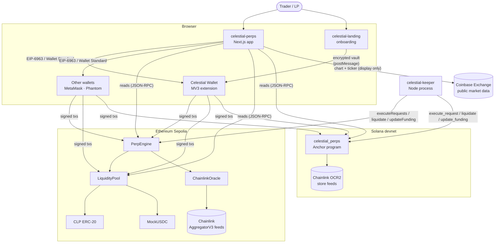
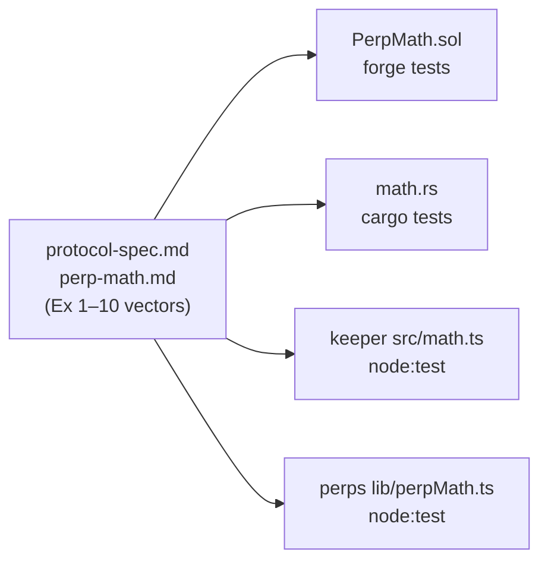
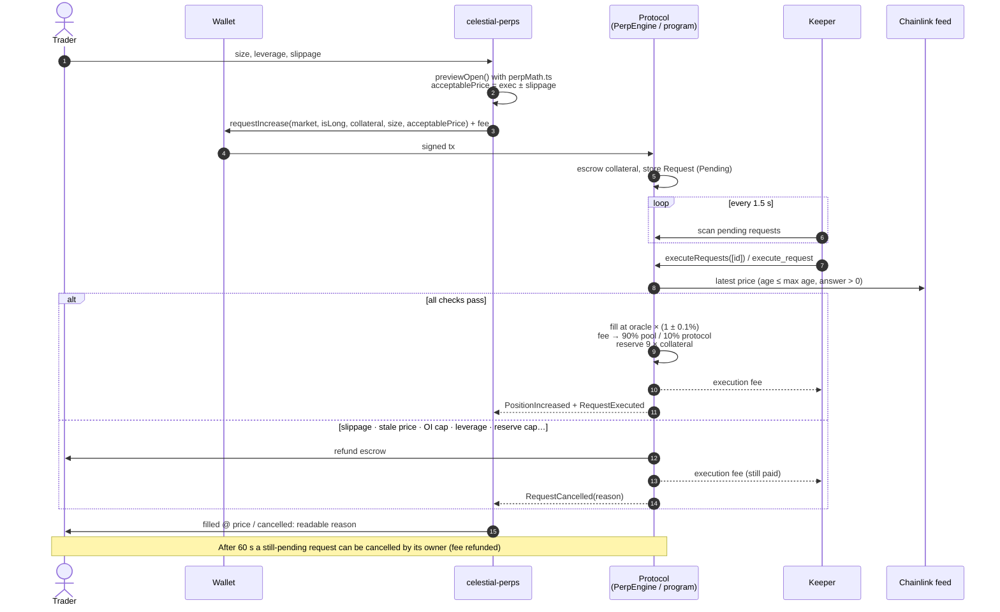
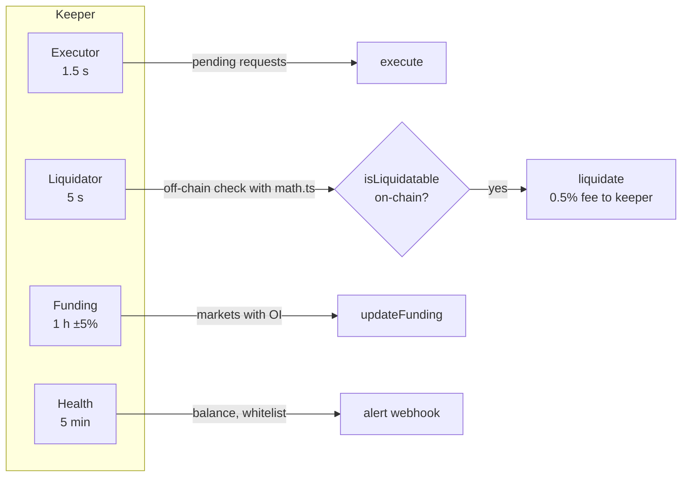
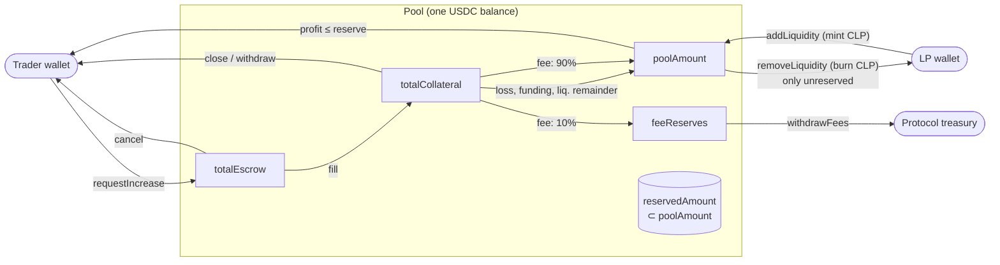
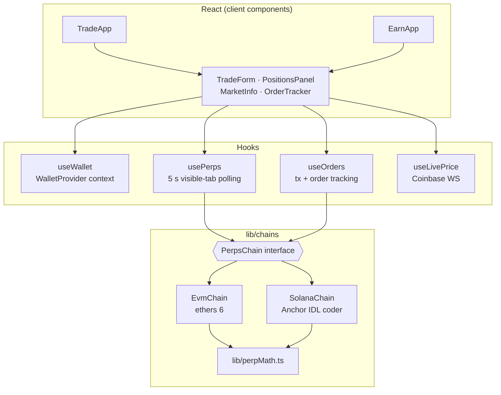
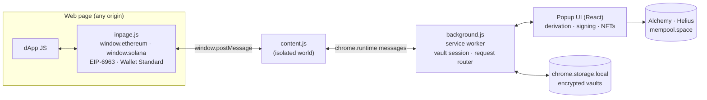

# Architecture

Celestial is a monorepo of six packages that together form a non-custodial trading stack:

| Package | Stack | Role |
|---|---|---|
| `celestial-contracts/` | Solidity 0.8.24, Foundry, OpenZeppelin | Perps protocol on **Ethereum Sepolia**, plus testnet fixtures (Mock USDC, test NFTs) |
| `celestial-solana/` | Rust, Anchor 1.1.2, Token-2022 | The same protocol on **Solana devnet**, as one program (`celestial_perps`) |
| `celestial-keeper/` | Node 24, TypeScript, ethers 6, @solana/web3.js | Off-chain operator for both chains: executes orders, liquidates, updates funding |
| `celestial-perps/` | Next.js (App Router), React, Tailwind | Trading and liquidity app (`/trade`, `/earn`) for both chains |
| `celestial-react-wallet/` | React 19, Vite, Chrome MV3 | **Celestial Wallet**: an EVM + Solana + Bitcoin browser extension |
| `celestial-landing/` | React 19, Vite | Marketing site and **wallet onboarding** (seed generation, vault encryption) |

Shared assets live at the root: `docs/` (this reference), `deployments/` (addresses), and the ABIs and IDL, which `celestial-perps/src/abis` and `celestial-perps/src/idl` export and the keeper consumes.

## System context



## The protocol in one paragraph

Celestial Perps is a **pool-based** perpetual futures exchange in the style of GMX v1. A single USDC pool is the counterparty to every trader. Liquidity providers deposit USDC and receive **CLP**, which is valued at the pool's assets under management (AUM) minus the traders' unrealised PnL. Traders open leveraged long or short positions on synthetic markets (BTC-USD, ETH-USD, and SOL-USD on Solana), and the positions are priced by **Chainlink** push feeds. Orders use **two steps**. The trader submits a request that escrows collateral and an execution fee. A whitelisted **keeper** then fills it at the oracle price ± a 0.1% spread, or cancels and refunds it if any rule fails. The protocol guards pool solvency in three ways: it **reserves** 9× collateral of pool liquidity for each position's maximum profit, caps open interest per side at 30% of AUM, and charges skew-based **funding** from the heavier side. Full rules: [protocol-spec.md](protocol-spec.md).

## One protocol, two chains

Both implementations follow the same specification and the same integer maths. They differ only where the chains force them to:



| Concern | EVM (Sepolia) | Solana (devnet) |
|---|---|---|
| Contract layout | 4 contracts: `PerpEngine`, `LiquidityPool`, `CLP`, `ChainlinkOracle` | 1 program, state in PDAs: `Config`, `Pool`, `Market`, `Position`, `Request`, `UserState` |
| Token custody | `LiquidityPool` holds all USDC | `vault` PDA token account (Token-2022), owned by `Pool` |
| Failed order | `try this.executeRequestInternal()` → catch → cancel | Engine runs on in-memory copies; on failure nothing is committed → cancel |
| AUM over all markets | Loop over `marketIds` in storage | Every market and oracle passed as `remaining_accounts` in `Config.markets` order |
| Execution fee | ETH (`msg.value`, ≥ 0.0002 ETH) | Lamports held in the `Request` account (≥ 50,000) |
| CLP decimals | 18 | 6 (fits `u64`) |
| Oracle max age | 3,960 s (hourly heartbeat + 10%) | 120 s (feeds update every few seconds) |
| Markets | BTC-USD, ETH-USD | SOL-USD, BTC-USD, ETH-USD |

Details: [contracts.md](contracts.md), [solana-program.md](solana-program.md).

## Order lifecycle



Liquidations and funding run on their own keeper loops:



## Money flow and pool accounting

Every USDC unit sits in exactly one accounting **bucket**. The solvency invariant, checked by the Foundry invariant suite and by the Solana tests after every scenario, is:

```
vault balance ≥ poolAmount + feeReserves + totalCollateral + totalEscrow
reservedAmount ≤ poolAmount
```



## Frontend architecture

The trading app talks to one interface, `PerpsChain`, with an implementation for each chain. React never touches ethers or web3.js directly.



Details: [frontend.md](frontend.md).

## Wallet architecture



Details: [wallet.md](wallet.md), [wallet-nfts.md](wallet-nfts.md), [landing.md](landing.md).

## Repository layout

```
.
├── celestial-contracts/     Foundry project: src/{PerpEngine,pool/,oracle/,libraries/,test-nfts/}, test/, script/
├── celestial-solana/        Anchor workspace: programs/celestial-perps/src/{engine,math,oracle,instructions/}, tests/, scripts/
├── celestial-keeper/        src/{index,config,retry,log,health,math}.ts, src/evm/, src/solana/, test/
├── celestial-perps/         app/, components/, hooks/, lib/chains/, lib/perpMath.ts, src/{abis,idl}/, test/
├── celestial-react-wallet/  public/{manifest.json,background.js,content.js,inpage.js}, src/, tests/, scripts/
├── celestial-landing/       src/pages/{LandingPage,OnboardingPage}.tsx, src/lib/crypto.ts
├── deployments/             sepolia.json · solana-devnet.json · mock-usdc metadata
└── docs/                    this reference
```

## Design decisions

| Decision | Alternatives considered | Why |
|---|---|---|
| Pool-based (LP as counterparty) instead of an order book | CLOB, vAMM | Instant liquidity for any size under the caps. Simple enough to implement identically on two chains |
| Two-step orders with a keeper | Direct market orders | A trader can't choose the oracle round they trade against. Business failures cancel cleanly instead of reverting in the wallet |
| Chainlink push feeds | Pyth pull oracle | Free to read on both testnets and no price-update fetching. Pyth Hermes needs a paid key since Aug 2026. Front-running protection is weaker (see [security.md](security.md)) |
| 0.1% execution spread | Zero spread | Partly offsets the stale-price edge of a slow push oracle (Sepolia heartbeat 1 h) |
| Profit reserved at open (9× collateral) | Unbounded PnL | The pool can always pay every open position's maximum profit |
| One spec, four maths ports, shared vectors | Shared code | No language is shared across Solidity, Rust and TypeScript. Exact vectors make divergence a test failure |
| SOL-USD only on Solana | Custom oracle on EVM | Sepolia has no Chainlink SOL/USD feed |
