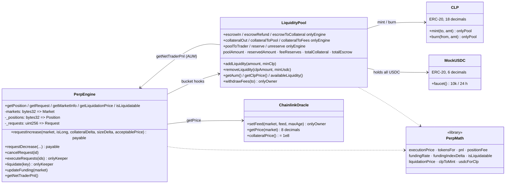
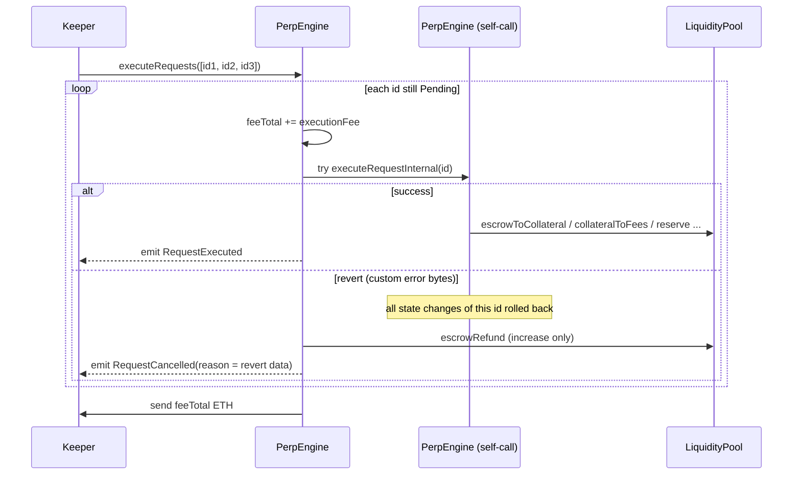

# EVM Contracts

The Solidity implementation of Celestial Perps, deployed on **Ethereum Sepolia**. Built with Foundry. Solidity 0.8.24, OpenZeppelin 5.

Package: `celestial-contracts/` · Rules: [protocol-spec.md](protocol-spec.md) · Maths: [perp-math.md](perp-math.md) · Deploy: [operations.md](operations.md#sepolia)

## Contract map



| File | Contract | Sepolia address |
|---|---|---|
| `src/PerpEngine.sol` | `PerpEngine`: requests, positions, funding, liquidation | `0x49765B9bEFed004A6462ad2025C240191e762b60` |
| `src/pool/LiquidityPool.sol` | `LiquidityPool`: custody of all USDC, bucket accounting, LP entry/exit | `0xB2DF5d7C1BCa2d82ECA1D591F0E58B335387b24b` |
| `src/pool/CLP.sol` | `CLP`: LP token, mint/burn restricted to the pool | `0x303C049BF526bD40d82E2Bd405af34bB095A55DA` |
| `src/oracle/ChainlinkOracle.sol` | `ChainlinkOracle`: feed registry, validation, 8-dec normalisation | `0xFF6a6Da437b16e5dd29D2eF8Aa38517911320cC0` |
| `src/libraries/PerpMath.sol` | `PerpMath`: every formula in perp-math.md | (internal library) |
| `src/MockUSDC.sol` | `MockUSDC`: 6-dec collateral with public faucet | `0x88a77050162285276d6346a4Bc07C406572d6cD2` |
| `src/interfaces/*.sol` | `IPerpEngine`, `ILiquidityPool`, `IChainlinkOracle` | — |
| `src/test-nfts/*.sol` | `TestERC721`, `TestERC1155`: wallet NFT fixtures ([wallet-nfts.md](wallet-nfts.md#test-fixtures)) | see `broadcast/MintTestNFTs.s.sol/` |
| `src/legacy/CelestialVault.sol` | **Deprecated** first prototype (ETH collateral, no pool) | `0x786f4037924772c79F39D49C302dC3D3eDd14b04` |

The PerpEngine deploy block is **11757411**. The keeper and the app start their log scans there.

## Why the pool holds the money

`LiquidityPool` is the **only** contract that holds USDC. The engine never touches tokens. It moves amounts between the pool's accounting buckets through `onlyEngine` hooks. The design has three consequences:

- **Traders and LPs approve the pool**, not the engine (`usdc.approve(LiquidityPool, amount)`).
- Solvency can be stated and tested as one invariant over one balance.
- The engine can be replaced (`setEngine` is one-shot in this deployment, so a new engine means a new pool).

| Hook | Bucket movement | Used by |
|---|---|---|
| `escrowIn(from, amt)` | wallet → `totalEscrow` (transferFrom) | `requestIncrease` |
| `escrowRefund(to, amt)` | `totalEscrow` → wallet | cancel of an increase |
| `escrowToCollateral(amt)` | `totalEscrow` → `totalCollateral` | increase fill |
| `collateralToFees(amt)` | `totalCollateral` → 90% `poolAmount` / 10% `feeReserves` | open/close fee |
| `collateralToPool(amt)` | `totalCollateral` → `poolAmount` | losses, funding, liquidation remainder |
| `collateralOut(to, amt)` | `totalCollateral` → wallet | decrease payout, liquidation fee |
| `poolToTrader(to, amt)` | `poolAmount` → wallet (reverts if reserve > pool after) | realised profit |
| `reserve` / `unreserve` | `reservedAmount` ± (must stay ≤ `poolAmount`) | open / close / resize |

## Storage

```solidity
struct Request  { address account; bytes32 market; bool isLong; RequestKind kind; RequestStatus status;
                  uint64 createdAt; uint256 collateralDelta; uint256 sizeDelta; uint256 acceptablePrice; uint256 executionFee; }
struct Position { address account; bytes32 market; bool isLong; uint256 size; uint256 collateral;
                  uint256 tokens; uint256 reserved; uint256 entryFundingIndex; uint64 lastUpdated; }
struct Market   { bool listed; bool enabled; uint64 lastFundingTime;
                  uint256 longSize; uint256 shortSize; uint256 longTokens; uint256 shortTokens;
                  uint256 longCollateral; uint256 shortCollateral; uint256 cumFundingLong; uint256 cumFundingShort; }
```

- **Position key:** `getPositionKey(account, market, isLong)`, a `keccak256` of the three fields. One position per side per market per account.
- **Request ids** are sequential from `nextRequestId = 1`. Each account has an `EnumerableSet` of its pending ids (`getPendingRequestIds`). There is **no global pending list**, so the keeper walks ids with a cursor.
- **Market ids** are `keccak256("BTC-USD")` and `keccak256("ETH-USD")`. `marketIds` is the iteration list used for AUM.

## Execution



`executeRequestInternal` can only be called by the engine itself (`OnlySelf`). The external self-call gives each request its own revert scope, so one bad request can't break a batch and never leaves partial state behind. The keeper is paid for cancelled requests too, which stops a trader from submitting cheap failing orders to grief it.

The increase and decrease step lists are in [protocol-spec.md §5](protocol-spec.md#execution-checks). Implementation notes:

- `_increase` re-reads AUM **before** the fill for the OI cap, and validates the position **after** fees at the **raw** oracle price.
- `_decrease` computes `tokensOut = mulDiv(tokens, sizeDelta, size)` (all tokens on a full close) and caps profit at `p.reserved`. On a partial close it re-reserves `min(multiplier × collateral, oldReserve − profit)` so that it never needs new pool capacity.
- `_updateFunding(market)` runs at the start of every fill and liquidation. It is a no-op within the same block, and the first call only sets `lastFundingTime`.

## Oracle adapter

`ChainlinkOracle.getPrice(market)`:

1. `latestRoundData()` from the registered feed (`UnknownFeed` otherwise).
2. `answer > 0` (`InvalidAnswer`), `updatedAt ≠ 0 && answeredInRound ≥ roundId` (`IncompleteRound`).
3. `updatedAt ≤ now && now − updatedAt ≤ maxAge` (`StalePrice`).
4. Scale from the feed's decimals to 8.

`setFeed` reads `decimals()` once and stores it with `maxAge` (3,960 s on Sepolia). `collateralPrice()` returns `1e8`. It is marked `TODO(mainnet)` for a USDC/USD feed.

## Events

| Event | Emitted when |
|---|---|
| `RequestCreated(id, account, market, isLong, kind, collateralDelta, sizeDelta, acceptablePrice, executionFee)` | request submitted |
| `RequestExecuted(id, account, keeper)` | fill succeeded |
| `RequestCancelled(id, account, by, bytes reason)` | keeper cancel (reason = custom-error revert data) or owner cancel (empty) |
| `PositionIncreased(key, account, market, isLong, sizeDelta, collateralDelta, executionPrice, fee, fundingPaid, size, collateral, entryPrice)` | increase fill |
| `PositionDecreased(key, account, market, isLong, sizeDelta, collateralOut, executionPrice, realisedPnl, fee, fundingPaid, size, collateral)` | decrease fill |
| `PositionClosed(key, account, market, isLong)` | full close |
| `PositionLiquidated(key, account, market, isLong, size, collateral, price, keeper, keeperFee)` | liquidation |
| `FundingUpdated(market, rateLong, rateShort, cumLong, cumShort)` | funding accrued |
| Pool: `LiquidityAdded`, `LiquidityRemoved`, `FeesAdded(amount, toProtocol, toPool)`, `FeesWithdrawn` | LP and fee flows |
| Admin: `KeeperUpdated`, `MarketListed`, `MarketEnabled`, `ParamUpdated(key, value)` | configuration |

The app reconstructs history from these events, and the keeper rebuilds its position index from them ([keeper.md](keeper.md)). The app decodes `RequestCancelled.reason` into a readable message with the ABI's custom errors ([frontend.md](frontend.md#errors)).

## Custom errors

Engine: `NotKeeper`, `OnlySelf`, `ZeroAddress`, `InvalidParam(key, value)`, `MarketNotListed`, `MarketAlreadyListed`, `MarketDisabled`, `NoOracleFeed`, `InsufficientExecutionFee(sent, min)`, `EmptyRequest`, `RequestNotPending`, `NotRequestOwner`, `RequestNotExpired(id, cancellableAt)`, `SlippageExceeded(executionPrice, acceptablePrice)`, `PositionNotFound`, `SizeTooLarge`, `CollateralTooLow`, `LeverageTooLow`, `LeverageTooHigh`, `OpenInterestCap(sideSize, cap)`, `PositionLiquidatable`, `NotLiquidatable`, `InsufficientCollateral`, `EthTransferFailed`, plus OpenZeppelin `EnforcedPause`.

Pool: `OnlyEngine`, `EngineAlreadySet`, `ZeroAmount`, `Slippage(actual, min)`, `CooldownActive(availableAt)`, `InsufficientUnreservedLiquidity`, `InsufficientPoolAmount`, `ReserveExceedsPool`, `ZeroAum`.

Oracle: `UnknownFeed`, `InvalidFeed`, `InvalidMaxAge`, `InvalidAnswer`, `IncompleteRound`, `StalePrice(updatedAt, maxAge)`.

## Access control

| Contract | Pattern |
|---|---|
| `PerpEngine` | `Ownable2Step`, `Pausable`, `ReentrancyGuard` on every external mutator; `onlyKeeper` for execution and liquidation |
| `LiquidityPool` | `Ownable2Step`, `ReentrancyGuard`; `onlyEngine` hooks; `setEngine` callable once |
| `CLP` | `setPool` callable once by the deployer; `mint`/`burn` only by the pool |
| `ChainlinkOracle` | `Ownable2Step`; owner registers and removes feeds |

## Dependencies

Vendored under `lib/` as plain files (no submodules): `forge-std`, OpenZeppelin Contracts (`@openzeppelin/contracts/`), Chainlink brownie contracts (`@chainlink/`: `AggregatorV3Interface`, `MockV3Aggregator`). To add a library, copy its sources into `lib/<name>` without `.git` and add a remapping in `foundry.toml`.

## Build, test, deploy

```bash
cd celestial-contracts
forge build
forge test                                   # unit + fuzz + invariant
FOUNDRY_PROFILE=ci forge test                # longer fuzz/invariant runs
forge coverage --ir-minimum --no-match-path 'test/invariant/*'
```

Test suites and invariants: [testing.md](testing.md#evm-contracts). Deployment runbook: [operations.md](operations.md#sepolia).
