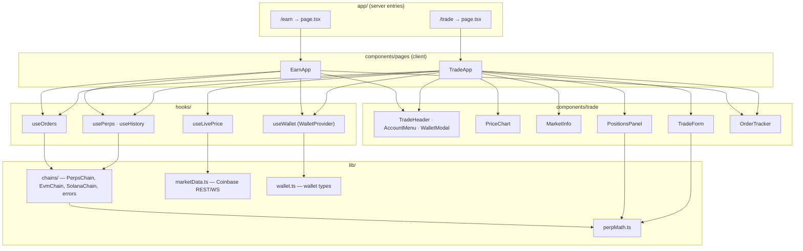
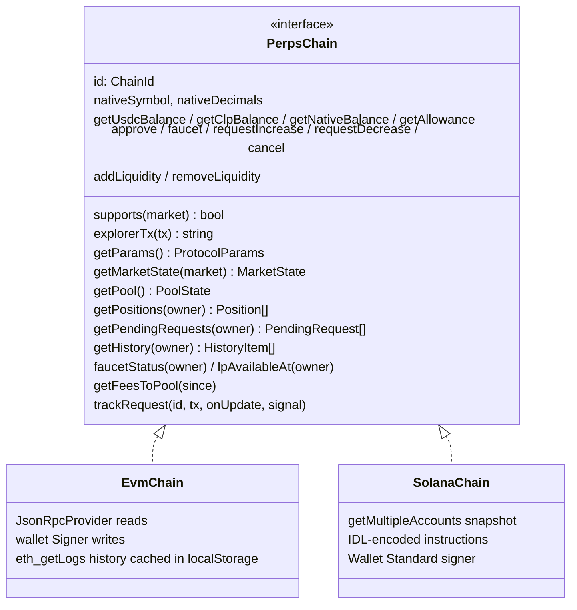
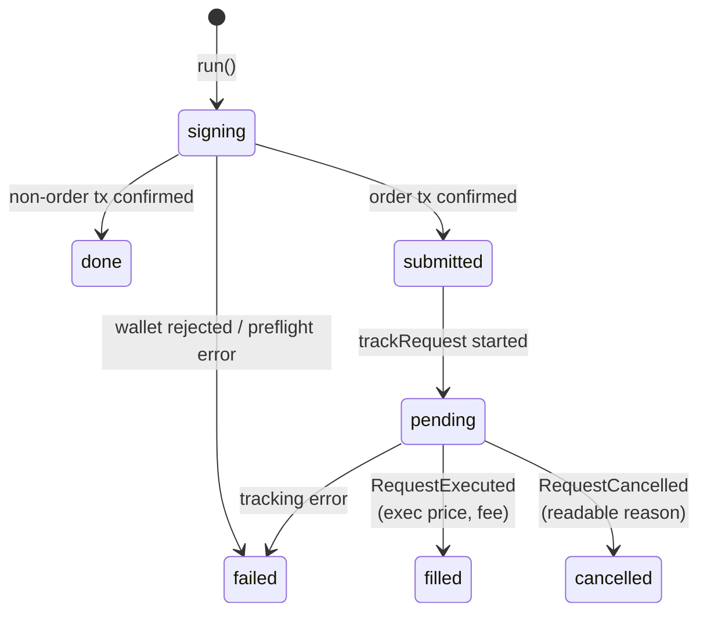

# Trading App (celestial-perps)

`celestial-perps` is the web app for traders and liquidity providers. One codebase trades against both deployments: Sepolia through an EVM wallet and Solana devnet through a Solana wallet.

| Route | Page | Purpose |
|---|---|---|
| `/` | `app/page.tsx` | Marketing landing page |
| `/trade` | `components/pages/TradeApp.tsx` | Chart, order form, positions, pending orders, history |
| `/earn` | `components/pages/EarnApp.tsx` | Pool stats, fee APR estimate, add/remove liquidity |
| `/status` | `components/pages/StatusApp.tsx` | Protocol health for both chains: order queue, keepers, oracles, pool, markets |

Stack: Next.js App Router, React (client components), Tailwind, ethers 6, @solana/web3.js, and the Anchor coder (`@anchor-lang/core`) for the Solana IDL.

## Layers



`app/trade/page.tsx` and `app/earn/page.tsx` are thin server components that render the client pages from `components/pages/`. With the large client pages placed directly in `app/`, `next build` hit a client-reference-manifest bug. `components/Providers.tsx` mounts the `WalletProvider` in `app/layout.tsx`, so one wallet connection survives navigation between `/trade` and `/earn`.

## The chain layer

`lib/chains/types.ts` defines **`PerpsChain`**, the only interface the UI uses to reach a blockchain. All amounts are `bigint` in protocol units (USD 1e6, price 1e8, funding 1e18, CLP in the chain's decimals).



`lib/chains/index.ts` provides the factories:

| Function | Returns |
|---|---|
| `readChain(market, wallet?)` | A cached **read-only** chain: Solana for `SOL-USD` or when a Solana wallet is connected, otherwise Sepolia |
| `walletChain(wallet)` | A chain bound to the connected wallet's signer. EVM: `BrowserProvider(evmProvider).getSigner(address)`. Solana: `standardSigner(wallet)`. A legacy `window.solana` connection gets a read-only chain |
| `standardSigner(wallet, address)` | Adapts Wallet Standard `solana:signTransaction` (preferred) or `solana:signAndSendTransaction` (fallback) to `SolanaSigner`. A wallet that advertises the feature but returns nothing gets a readable `NoSigner` error |

### EvmChain

- **Reads** go through a read-only `JsonRpcProvider` (`NEXT_PUBLIC_SEPOLIA_RPC_URL`). A stale Chainlink feed makes `getPrice` revert. It is reported as `price: null` plus a `priceIssue`, so the UI can block trading on that market.
- **Writes** go through the connected wallet's signer, after checking the wallet is on Sepolia. `send()` **pre-flights every call with `estimateGas`** on the app's own RPC (with `from` and the pending nonce), so reverts are decoded into readable errors before the wallet opens. The wallet is used only to sign: wallets proxy only some JSON-RPC methods (Celestial used to reject `eth_getTransactionCount`). The read provider runs with ethers' request cache off (`cacheTimeout: -1`), so a pre-flight right after a transaction, such as a repeated faucet claim, never sees stale state.
- **History** uses paged `eth_getLogs` from the PerpEngine deploy block (11757411). The block range is halved on provider range errors, and results are cached per owner in `localStorage`. Items are kept in exact chain order (block, then log index) and returned newest-first. A timestamp sort would misorder events in the same block.
- **`trackRequest`** polls `getRequest(id)` every 3 s. When the status leaves `Pending`, it finds the `RequestExecuted`/`RequestCancelled` log, then reads the position event before it in the same transaction to report the fill price and fee.
- **Fee APR input** (`getFeesToPool`) sums `FeesAdded.toPool` over the window. If the RPC can't return the whole window it returns `complete: false`, and the UI shows the APR as a lower bound (`x%+`).

### SolanaChain

- **Reads**: one `getMultipleAccountsInfo` call fetches Config, Pool, the CLP mint, every market and oracle, and the Clock sysvar. From that snapshot the app computes market state, AUM, capacity, funding and CLP price with `lib/perpMath.ts`, exactly as the program does. The program's `get_*` views need a funded fee payer to simulate, and a visitor without a wallet has none. `test/chain-solana.test.mts` cross-checks both paths. Each RPC call has a **15 s timeout**: public devnet sometimes never answers `getMultipleAccounts`.
- **Writes**: instructions are encoded from the IDL (`src/idl/`). Each carries the full market set in `Config.markets` order. The connected wallet signs, and the app sends through its **own** devnet connection with preflight on. The transaction uses a **finalized** blockhash, which every RPC node knows. Otherwise the wallet's own simulation, run on a possibly lagging RPC, fails with "blockhash not found" and shows a misleading "not enough SOL". An expired blockhash gets a readable message. A finalized blockhash stays the same for several seconds, so each transaction's compute-unit limit gets a small varying offset. Otherwise two identical actions in a row (a repeated faucet claim) would be byte-identical and the second would fail as "already processed" instead of with its real reason.
- **Confirmation** polls signature status with backoff. Later reads pass `minContextSlot`, so a lagging node never shows state older than the app's last transaction.
- **History** walks the owner's signatures (newest-first) and fetches transactions **one per request, 3 at a time**. JSON-RPC batches are rejected by many hosted plans with HTTP 413. It then decodes `Program data:` events with the IDL coder, newest event first within each transaction.
- **`trackRequest`** polls until the `Request` account is closed, then reads the closing transaction. In a batch, the position event just before this request's `RequestExecuted` is its fill.

### Errors

`lib/chains/errors.ts` maps EVM custom errors, Anchor error names and cancel reasons to one readable message each (e.g. `SlippageExceeded` → "Price moved past your slippage limit."). `ChainError` carries the user-facing message plus a code. `isUserRejection` recognises wallet rejections (EIP-1193 `4001`, ethers `ACTION_REJECTED`, and the common "user rejected / declined" messages from Solana wallets), so the UI shows "Rejected in wallet." instead of an error.

## Hooks

| Hook | Responsibility |
|---|---|
| `useWallet` (context via `WalletProvider`) | Wallet discovery with **EIP-6963** (EVM) and the **Wallet Standard** (Solana), both registered on mount because both are handshake protocols. Handles connect and disconnect, follows `accountsChanged`/`chainChanged` and Wallet Standard `change` events, and provides `switchToSepolia()` (adds the chain on error `4902`). `onRightNetwork` is true for Solana, or for EVM on Sepolia |
| `usePerps(market, wallet)` | Binds `writeChain` to the wallet and chooses the read chain. Loads params, market, pool and account (balances, positions, pending, faucet, LP cooldown). Polls every 5 s **only while the tab is visible**. Resets state on a chain switch and drops results of loads started for a previous chain or market, so one chain's numbers are never shown in another chain's units |
| `useHistory(chain, owner, enabled, bump)` | Loads order history on demand |
| `useOrders(onSettled)` | Runs every write and tracks it: `signing → submitted → pending → filled / cancelled` for orders, `signing → done / failed` for other transactions. Keeps the last 6 items for `OrderTracker` |
| `useLivePrice` | Coinbase Exchange WebSocket ticker with reconnect. **Display only** |



## Trading flow in the UI

1. **Preview.** `previewOpen()` in `lib/perpMath.ts` computes the execution price (oracle ± spread), open fee, size, tokens, entry price and **liquidation price** with the protocol's integer maths. `maxSizeFor(collateral)` caps the size slider at the largest size that is valid after fees.
2. **Acceptable price.** The execution price ± the chosen slippage (0.3%, 0.5% or 1%; default 0.5%), rounded against the trader.
3. **Approval** (EVM only). If the USDC allowance to the **LiquidityPool** is below the collateral, the button becomes "Approve … & Open Long". One click asks the wallet twice: the approval, then the order, placed automatically once the approval confirms. Earn works the same way ("Approve … & add liquidity"). Solana needs no approval.
4. **Submit.** `requestIncrease`, with the execution fee (and on Solana, first-position rent) shown in the summary.
5. **Track.** `OrderTracker` shows the order through to fill or cancel. On cancel it shows the reason ("Price moved past your slippage limit.").
6. **Positions.** `PositionsPanel` shows size, collateral, entry, mark, PnL, **net PnL if closed now** (`min(pnl, reserved) − closeFee − funding`), funding owed and liquidation price. It supports partial and full close (a `requestDecrease` with an acceptable price), pending orders with a cancel button that activates after 60 s, and history.

Chart candles and the ticker come from the Coinbase Exchange public API. The **fill always happens at the on-chain oracle price**. `MarketInfo` shows the oracle price, its age and its deviation from the Coinbase index price side by side, and flags a stale oracle.

## Earn page

- **Stats:** AUM, CLP price, pool amount, reserved, available (withdrawable), the user's CLP and its value.
- **Fee APR (7-day estimate):** LP fees over the last 7 days × 52 ÷ AUM. It is marked as a lower bound when the RPC limits the log range.
- **Add / remove:** previews the expected CLP or USDC with the same formulas as the chain, and sends `minClp`/`minUsdc` at 0.5% slippage. Shows the 15-minute cooldown countdown from `lpAvailableAt`.

## Status page

`/status` shows protocol health for both deployments, read straight from the chains every 15 s. It keeps working when the keeper is down, which is when it matters. Each chain comes from `PerpsChain.getOpsStatus()` plus the pool and market reads. The rules in `lib/opsHealth.ts` (unit-tested) turn them into checks:

| Check | Operational | Degraded | Down |
|---|---|---|---|
| Order queue (oldest pending request) | ≤ 15 s | > 15 s: the keeper is slow | > 60 s: past the request expiry, the keeper isn't filling |
| Keepers | Whitelisted and funded | Balance < 0.02 ETH / 1 SOL | None whitelisted |
| Oracle, per market | Fresh | Stale or invalid (orders cancel) | — |
| Protocol / market | — | Paused, market disabled, or a side ≥ 90% of its OI cap | — |

EVM keeps no global list of pending requests (the keeper walks request ids with a cursor), so its order queue covers the **most recent 50 request ids**, and the page says so. Solana reads every pending `Request` account with one `getProgramAccounts`.

## Wallet support

| Wallet | Discovery | Sepolia | Solana devnet |
|---|---|---|---|
| MetaMask and other EIP-6963 wallets | EIP-6963 | ✅ | — |
| Phantom | Wallet Standard | — | ✅ |
| Celestial Wallet | EIP-6963 + Wallet Standard | ✅ | ✅ (approval screen simulates on devnet before signing; [wallet.md](wallet.md#solana-provider-windowsolana-windowphantomsolana-wallet-standard)) |

## Configuration

Copy `.env.example` to `.env.local`. **Every `NEXT_PUBLIC_*` value is bundled into browser JavaScript and is public.** Never put a secret there.

| Variable | Default | Notes |
|---|---|---|
| `NEXT_PUBLIC_MARKET_REST_URL` | `https://api.exchange.coinbase.com` | Candles and 24 h stats |
| `NEXT_PUBLIC_MARKET_WS_URL` | `wss://ws-feed.exchange.coinbase.com` | Live ticker |
| `NEXT_PUBLIC_SEPOLIA_RPC_URL` | `https://ethereum-sepolia-rpc.publicnode.com` | Reads and history; must allow wide `eth_getLogs` ranges |
| `NEXT_PUBLIC_SOLANA_RPC_URL` | `https://api.devnet.solana.com` | Reads **and sending**. Public devnet rate-limits; use a dedicated devnet endpoint with a browser-restricted key |

Contract addresses and the IDL are compiled in from `lib/contracts.ts`, `src/abis/` and `src/idl/`.

## Running and testing

```bash
cd celestial-perps
npm install
npm run dev              # http://localhost:3000
npm run build
npm run test:math        # lib/perpMath.ts vs perp-math.md vectors
npm run test:chain       # EvmChain vs local Anvil, SolanaChain vs local validator
npm run typecheck:test
```

See [testing.md](testing.md#trading-app).
