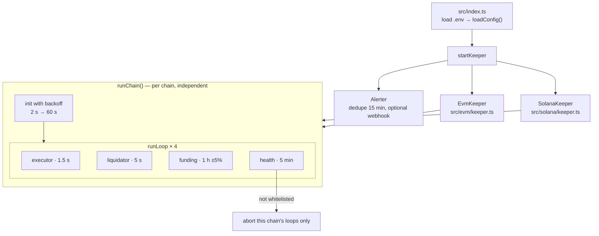
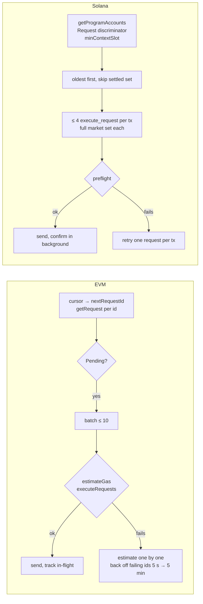

# Keeper

`celestial-keeper` is a single Node/TypeScript process that operates both deployed protocols: `PerpEngine` on Sepolia and `celestial_perps` on Solana devnet. The protocol depends on it for liveness. Without a keeper, orders are never filled (traders can cancel after 60 s), under-margined positions are not liquidated, and funding accrues only on trades.

The keeper is **not trusted with prices**. It never supplies a price: both chains read Chainlink on-chain at execution time. What it controls is **timing** (see [security.md](security.md#keeper)).

## Process structure



| File | Responsibility |
|---|---|
| `src/index.ts` | CLI entry, `startKeeper()` (also used in-process by the integration tests), SIGINT/SIGTERM drain (10 s) |
| `src/config.ts` | Env parsing and validation; addresses, market ids and deploy block from `deployments/*.json`; ABIs from `celestial-perps/src/abis/`, IDL from `celestial-perps/src/idl/` |
| `src/chain.ts` | `ChainKeeper` interface (`init`, `executorTick`, `liquidatorTick`, `fundingTick`, `healthTick`, `drain`) and `FatalError` |
| `src/retry.ts` | `runLoop` with per-loop backoff (1 s up to a per-loop cap), `backoffMs`, `jitter`, abortable `sleep` |
| `src/log.ts` | JSON-lines logger with secret redaction |
| `src/health.ts` | `Alerter` (alert dedupe and webhook) and `alertIfStuck` (oldest pending request over the threshold) |
| `src/math.ts` | Bigint port of `PerpMath.sol` for off-chain liquidation checks |
| `src/evm/keeper.ts` | Sepolia implementation (ethers 6, `NonceManager`) |
| `src/solana/keeper.ts`, `src/solana/oracle.ts` | Devnet implementation (web3.js, Anchor coder, OCR2 decoder) |

## Jobs

### Executor



- **EVM** has no global list of pending requests, so the executor keeps a cursor and walks ids up to `nextRequestId` with `getRequest`. Batches of up to 10 ids go to `executeRequests(ids)`. Each batch is gas-estimated first, so a doomed transaction is never paid for.
- **Solana** runs one `getProgramAccounts` per tick filtered on the `Request` discriminator, oldest first. Up to 4 `execute_request` instructions go into one transaction. Each carries every market and oracle in `Config.markets` order with its own market writable, and the compute budget is raised to about 45k CU per execute.
- A request that fails a business rule is **cancelled on-chain**. The trader is refunded, the keeper is still paid, and the transaction succeeds. The keeper logs `request cancelled` with the reason.

### Liquidator

| Step | EVM | Solana |
|---|---|---|
| Find positions | Position index built from `PositionIncreased` / `PositionClosed` / `PositionLiquidated` logs, rebuilt from the deploy block at start. The `eth_getLogs` range is halved automatically when the RPC limits it | `getProgramAccounts` on the `Position` discriminator |
| Read prices | Re-read each position with `getPosition` | One `getMultipleAccounts` for every market, every oracle and the clock sysvar |
| Check off-chain | `src/math.ts` `isLiquidatable` | same |
| Confirm on-chain | `isLiquidatable(key)` via `eth_call` | Simulate `liquidate` |
| Act | `liquidate(key)` | `liquidate` |

Markets with a stale oracle are skipped, with at most one warning per minute. The contracts would reject the liquidation anyway.

### Funding and health

- **Funding:** every hour ±5% jitter, `updateFunding(market)` / `update_funding(market)` for each market with open interest.
- **Health:** every 5 minutes, check the native balance (alert below 0.02 ETH / 1 SOL) and the keeper whitelist (`isKeeper` / `Config.keepers`). A keeper that isn't whitelisted stops **that chain's** loops with an alert. The other chain keeps running.

## Correctness guarantees

| Guarantee | How |
|---|---|
| A request never executes twice | EVM: `executeRequests` skips non-pending ids. Solana: the `Request` account is closed on settle, so a duplicate fails validation. Ids stay in an in-flight set until their outcome is confirmed |
| Never pay for a transaction that would fail | EVM gas estimation before every send; Solana preflight enabled |
| Only safe failures are retried | Reads: exponential backoff. Sends: retried only when the error is known to come before acceptance (HTTP 429, blockhash not found). Unknown outcome: re-read next tick, never blindly re-sent |
| Nonces stay consistent (EVM) | One `NonceManager`, re-synced after any send failure or confirmation timeout |
| Lagging RPC nodes don't cause double work (Solana) | Reads pass `minContextSlot` = last slot the keeper confirmed. Just-settled accounts are ignored for 2 minutes. `AccountNotInitialized` on a request means "already settled" |
| One failure doesn't stop the others | Each loop backs off independently. Init is retried with backoff, so an RPC outage at start-up isn't fatal |
| Outages cost seconds, not minutes | Backoff is capped per loop: executor 5 s, liquidator 10 s, funding and health 60 s. Every RPC request times out after `RPC_TIMEOUT_MS` (10 s): ethers' default is 5 minutes and web3.js has none, so one hung request could otherwise stall a loop |
| A stuck queue is noticed | Every executor tick checks the oldest pending request; one older than `STUCK_REQUEST_ALERT_S` (30 s) raises a `<chain>-request-stuck` alert |

## Configuration

`cp .env.example .env`, then fill it in. The file is gitignored.

| Variable | Default | Notes |
|---|---|---|
| `SEPOLIA_RPC_URL` | — | Must support `eth_getLogs`. May contain an API key, which is never logged |
| `EVM_KEEPER_PRIVATE_KEY` | — | A whitelisted keeper key. Only the derived address is logged. Startup fails if it doesn't match `EVM_EXPECTED_KEEPER` (defaults to `deployments/sepolia.json`) |
| `SOLANA_RPC_URL` | public devnet | The public endpoint rate-limits (429); a dedicated endpoint is recommended |
| `SOLANA_KEEPER_KEYPAIR_PATH` | — | **Path** to a keypair listed in `Config.keepers`. Read only by the keeper process |
| `ENABLE_EVM` / `ENABLE_SOLANA` | `true` | Run one chain or both |
| `EXECUTOR_INTERVAL_MS` | 1500 | |
| `LIQUIDATOR_INTERVAL_MS` | 5000 | |
| `FUNDING_INTERVAL_MS` | 3600000 | ±5% jitter |
| `HEALTH_INTERVAL_MS` | 300000 | |
| `EVM_LOG_RANGE` | 500 | Starting `eth_getLogs` block range (halved on range errors) |
| `ALERT_WEBHOOK_URL` | unset | Alerts are POSTed as JSON `{ source, alert, message, chain, … }` |
| `LOG_LEVEL` | `info` | `debug` · `info` · `warn` · `error` · `alert` |
| `RPC_TIMEOUT_MS` | 10000 | Per-request RPC timeout, both chains |
| `STUCK_REQUEST_ALERT_S` | 30 | Alert when the oldest pending request is older than this |

Advanced overrides, read by `src/config.ts` and normally left unset: `EVM_START_BLOCK`, `EVM_MAX_BATCH`, `EVM_CONFIRM_TIMEOUT_MS`, `EVM_POLLING_MS`, `EVM_MIN_BALANCE_ETH`, `EVM_ENGINE`, `EVM_ORACLE`, `EVM_DEPLOYMENTS`, `EVM_EXPECTED_KEEPER`, `SOLANA_MAX_BATCH`, `SOLANA_CU_PER_EXECUTE`, `SOLANA_CONFIRM_TIMEOUT_MS`, `SOLANA_MIN_BALANCE_SOL`, `SOLANA_DEPLOYMENTS`, `SOLANA_IDL_PATH`, `SOLANA_EXPECTED_KEEPER`.

## Running

```bash
cd celestial-keeper
pnpm install
pnpm keeper          # both chains
pnpm keeper:evm      # Sepolia only
pnpm keeper:solana   # Solana devnet only
```

Ctrl-C (SIGINT) or SIGTERM stops the loops and gives transactions already in flight up to 10 s to settle.

## Observability

Logs go to stdout as one JSON object per line: `ts`, `level`, `chain`, `job`, `msg` and fields.

| `msg` | Meaning |
|---|---|
| `request seen` (Solana) | First sighting; `age_s` shows RPC lag |
| `execute sent` / `request executed` / `request cancelled` | Per request, with `latency_s` (request → fill, chain time) and `reason` for cancels |
| `liquidation sent` / `position liquidated` | With `keeper_fee` |
| `funding updated` | Rates and cumulative indices |
| `health` | Balance and whitelist status |
| `loop tick failed` / `loop recovered` | RPC trouble and recovery |

Alerts are lines with `"level":"alert"`: low balance, not whitelisted, fatal init, and `request-stuck` (a request pending longer than `STUCK_REQUEST_ALERT_S`). Each alert key fires at most once every 15 minutes. For a live view without logs, the app's `/status` page reads the same signals from the chains ([frontend.md](frontend.md#status-page)).

**Secrets are never logged.** The EVM key is never passed to the logger. URLs are stripped from error messages (they can embed RPC keys), and fields named like `privateKey`, `secret` or `keypair` are redacted.

## Tests

```bash
pnpm typecheck
pnpm test          # perp-math vectors, oracle decoding, config, logging
pnpm test:local    # in-process keeper vs Anvil + solana-test-validator
```

The scenarios are listed in [testing.md](testing.md#keeper). Operational troubleshooting is in [operations.md](operations.md#keeper-troubleshooting).
