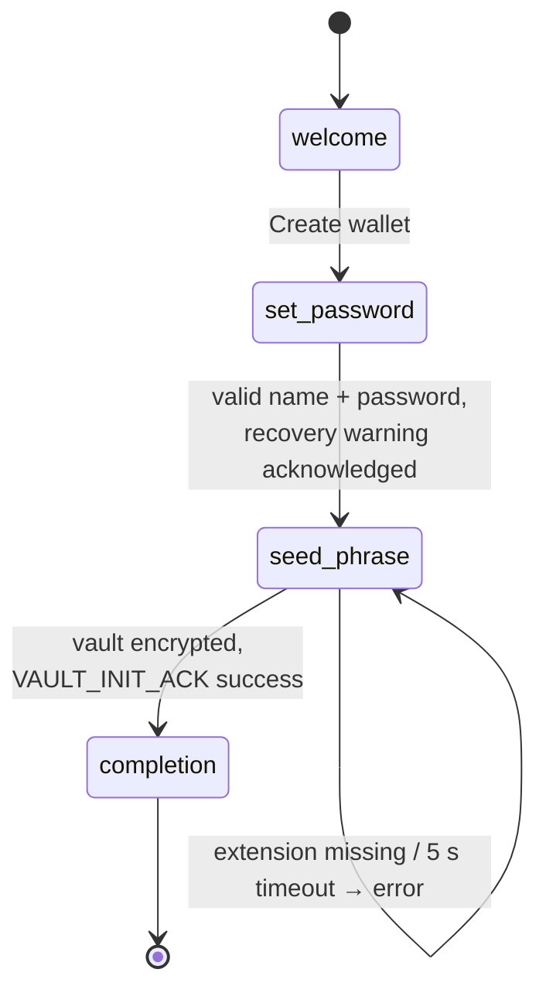
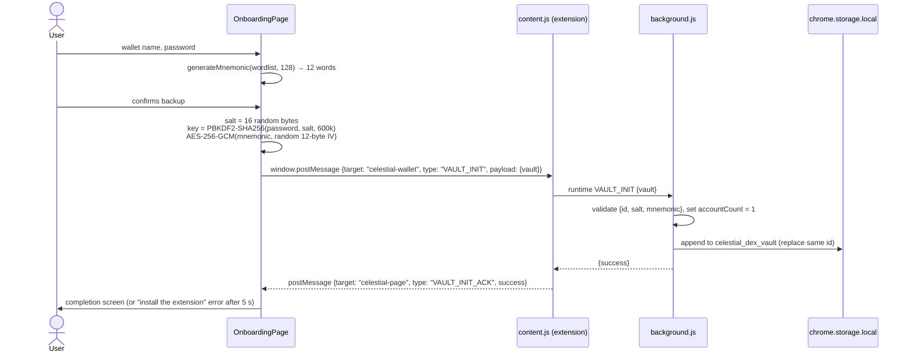

# Landing & Onboarding

`celestial-landing` is the public website. It has two routes:

| Route | Page | Purpose |
|---|---|---|
| `/` | `src/pages/LandingPage.tsx` | Marketing page for the Celestial ecosystem |
| `/onboarding` | `src/pages/OnboardingPage.tsx` | Creates a new wallet and hands the **encrypted** vault to the installed extension |

Stack: React 19, Vite, React Router 7, Tailwind 4, framer-motion, `@scure/bip39`, zod.

## Why onboarding happens on a web page

The extension popup is 360×600 px. Writing down a seed phrase, checking a strong password and explaining the risks work better on a full page. The page only ever produces an **encrypted** blob. The plaintext seed never leaves the page's memory and is never sent over the network.

## Flow





## Password policy

`src/lib/validation.ts` (zod):

- At least 8 characters, with at least one uppercase letter, one number and one special character.
- Confirmation must match, a wallet name is required, and the recovery warning must be acknowledged.
- `PasswordStrength` shows a 0–4 score (one point per rule). Submitting requires a score of 4.

## Cryptography

`src/lib/crypto.ts` uses WebCrypto only:

| Function | Behaviour |
|---|---|
| `generateSalt()` | 16 random bytes (`crypto.getRandomValues`) |
| `deriveKey(password, salt)` | PBKDF2-HMAC-SHA256, 600,000 iterations → non-extractable AES-GCM-256 key |
| `encrypt(key, text)` | AES-256-GCM, 12-byte random IV, returns base64 `{iv, ciphertext}` |
| `createVaultBlob(mnemonic, password, name)` | `{version: 1, id: "wallet_<ms>_<rand>", name, salt, mnemonic: {iv, ciphertext}, createdAt}` |
| `decryptVaultMnemonic(vault, password)` | Inverse. A wrong password fails GCM authentication |

The extension's `src/lib/crypto.ts` and `public/background.js` implement the same parameters to decrypt ([wallet.md](wallet.md#vault-and-key-management)). **Change them together:** any change to iterations, salt size or format needs a new `version` and a migration path in the extension.

## Components

| File | Role |
|---|---|
| `src/components/SeedPhraseGrid.tsx` | Numbered 12-word grid, blurred until hovered, with copy (the copied state resets after 2.5 s) |
| `src/components/PasswordStrength.tsx` | Live rule checklist and strength bar |
| `src/pages/OnboardingPage.tsx` | Reducer-driven step machine with animated transitions and the extension handshake |

## Develop

```bash
cd celestial-landing
npm install
npm run dev        # Vite dev server
npm run build      # tsc -b && vite build
npm run lint
```

To test the handshake end to end, load the built extension unpacked (see [wallet.md](wallet.md#build-and-install)), then open `/onboarding` in the same Chrome profile.

## Security notes

- The seed is generated with `@scure/bip39` (audited, CSPRNG-backed), 128 bits of entropy.
- `postMessage` uses target `'*'`, but it only reaches the same window (`content.js` checks `event.source === window`). The payload is already encrypted.
- The extension currently accepts `VAULT_INIT` from **any** origin. See [security.md](security.md#wallet-extension) for the risk and the planned origin allow-list.
