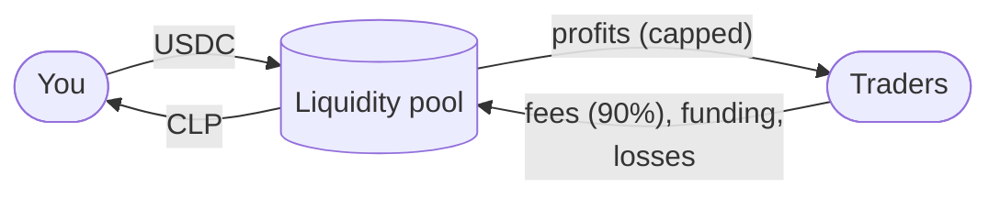

# Liquidity Provider Guide

How to provide liquidity to Celestial Perps and what you're exposed to. Everything runs on testnets with mock USDC.

## What you're doing

The pool is the **counterparty to every trade**. When you deposit USDC you receive **CLP**, a token that represents your share of the pool. Each CLP is worth the pool's **AUM** (assets under management) divided by the CLP supply.

| The pool earns | The pool pays |
|---|---|
| 90% of open and close fees (0.06% of size each) | Traders' realised profits (each capped at 9× their collateral) |
| All funding paid by the heavier side | |
| Traders' losses and liquidated collateral (minus the 0.5% keeper fee) | |
| The 0.1% LP mint fee on deposits | |

`AUM = pool USDC − traders' unrealised PnL`. While traders are in profit, AUM (and the CLP price) goes down. When they're losing, it goes up.

## Deposit

1. Open **Earn**, connect your wallet, and claim test USDC if you need it.
2. Enter an amount on the **Add** tab. The panel shows the CLP you'll receive and the minimum after 0.5% slippage.
3. Click **Add liquidity**. On EVM the first deposit reads *Approve … & add liquidity*: the wallet asks twice, first to approve and then to deposit.

A 0.1% mint fee stays in the pool, so existing LPs aren't diluted by deposits.

## Withdraw

1. Go to the **Remove** tab and enter the CLP to redeem. The panel shows the USDC you'll receive.
2. Withdrawals open **15 minutes after your last deposit** (a countdown is shown). The cooldown stops anyone depositing just before a known fee and leaving right after.
3. You can only withdraw **unreserved** liquidity. Open positions reserve their maximum profit in the pool, so if most of the pool is reserved, withdrawals are limited until positions close.

## Reading the Earn page

| Number | Meaning |
|---|---|
| Pool AUM | Total value owned by LPs |
| CLP price | AUM ÷ CLP supply ($1.00 at launch) |
| Fee APR (7d est.) | LP fee income over the last 7 days × 52 ÷ AUM. It excludes trader PnL and funding. A "+" means the RPC couldn't return the whole week, so it's a lower bound |
| Available (unreserved) | What LPs could withdraw right now |
| Reserved for traders | Maximum profit reserved for open positions |

## Risks

- **Trader PnL.** When traders win, LPs lose. The caps limit exposure: open interest per side is at most 30% of AUM, and each position's profit is capped and pre-reserved. They don't remove it.
- **Oracle lag.** Fills use Chainlink push prices. On Sepolia they update roughly hourly, which gives well-informed traders a small edge. The 0.1% spread only partly offsets it.
- **Keeper dependence.** Liquidations need a running keeper. If it stops and prices move a lot, losing positions may not be liquidated in time. The **Status** page shows keeper health.
- **Withdrawal limits.** Reserved liquidity and the 15-minute cooldown can delay withdrawals.
- **Stale feeds.** If a feed for a market with open positions goes stale, deposits and withdrawals revert until it updates, because AUM can't be priced.
- **Testnet software.** Unaudited, testnet only. See [security.md](security.md).
