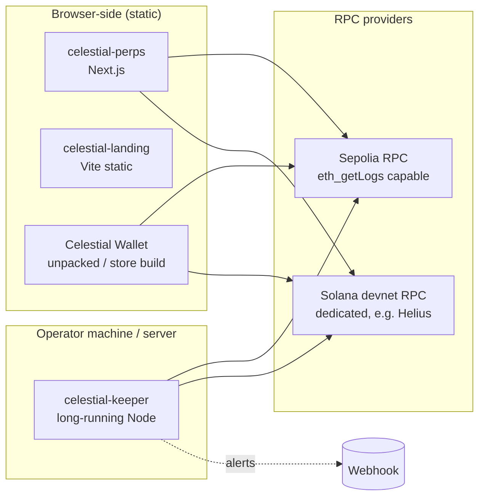
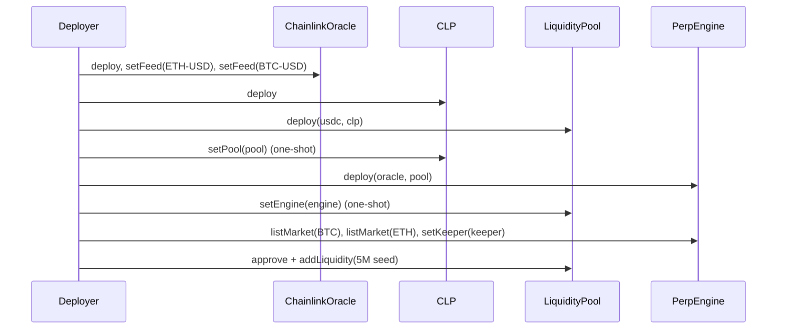

# Operations Runbook

This runbook covers deployments, configuration, day-2 operations and troubleshooting for the live testnet system. The canonical address records are `deployments/sepolia.json` and `deployments/solana-devnet.json`.

> **Key handling rules.** Never commit, print or paste private keys or keypair files. Pass keypair **paths** to tools, not contents. Load `celestial-contracts/.env` in a subshell only. Deployer and keeper keys are never used as test trading wallets. `NEXT_PUBLIC_*` and `VITE_*` values are public by design.

## Deployment topology



## Live deployments

### Sepolia

Chain id `11155111`. PerpEngine deploy block `11757411`.

| Contract | Address |
|---|---|
| PerpEngine | `0x49765B9bEFed004A6462ad2025C240191e762b60` |
| LiquidityPool (approve this) | `0xB2DF5d7C1BCa2d82ECA1D591F0E58B335387b24b` |
| CLP | `0x303C049BF526bD40d82E2Bd405af34bB095A55DA` |
| ChainlinkOracle | `0xFF6a6Da437b16e5dd29D2eF8Aa38517911320cC0` |
| MockUSDC | `0x88a77050162285276d6346a4Bc07C406572d6cD2` |
| Keeper / deployer | `0xA0c3A70806983a965e43961DE48658a9D41f2322` |
| Legacy CelestialVault (deprecated) | `0x786f4037924772c79F39D49C302dC3D3eDd14b04` |

### Solana devnet

| Account | Address |
|---|---|
| Program | `EK1KpDGfUiZ4XkWixAaRFonDexZYSKnJm8oJz5s7HLTL` |
| Config | `CCof8LtZZpL6U2wXDS7sp3yV2r6v5QuTbvE6ms8m2wgX` |
| Pool | `2jZjsSQMRrRWhRupktSbHeo1SDLgAs4fePT5ndhtTNmF` |
| Vault | `5spmkMFD9EiX9LFd7dAXzXDAjm6UDVea6wUEsNthJv5o` |
| CLP mint | `JCboCWJVi1qq3P1vhSwqc1TEhq1udxf3AnxT2UJ27iTz` |
| Mint authority PDA | `xAsm3yj7Y1XbBi4DKXPA2UHuLX3GyEgWpVBdR7HkPUB` |
| USDC mint (Token-2022) | `2LW8DzDa2KVxDxqUqZLALc6htcVSDwGK1JGz4VaaTn1Y` |
| Market SOL-USD | `2TJGAiKhFDB8L59PYjy5vQ11Gh4T2CozTGNcU8RBK3dJ` |
| Market BTC-USD | `H2T9yj2qZjcgEutpjZRjmCtzSBPJ32oNo2JiWBSMrmfs` |
| Market ETH-USD | `CXrmiKWoB6WpbHtUAedUdi17drAJax7sxSDavwkBzZW3` |
| Feed SOL-USD | `99B2bTijsU6f1GCT73HmdR7HCFFjGMBcPZY6jZ96ynrR` |
| Feed BTC-USD | `6PxBx93S8x3tno1TsFZwT5VqP8drrRCbCXygEXYNkFJe` |
| Feed ETH-USD | `669U43LNHx7LsVj95uYksnhXUfWKDsdzVqev3V4Jpw3P` |
| Chainlink store | `HEvSKofvBgfaexv23kMabbYqxasxU3mQ4ibBMEmJWHny` |
| Keeper | `6DoRfsEtFC2LFEEvSEuYjeNo7vJHnFrx8EzffksVy5ED` |

`Config.markets` order (and so the `remaining_accounts` order): **SOL-USD, BTC-USD, ETH-USD**.

## Deploying

### Sepolia

```bash
cd celestial-contracts
cp .env.example .env        # SEPOLIA_RPC_URL, PRIVATE_KEY, ETHERSCAN_API_KEY — testnet-only key

# 1. Collateral (once): mints 10M to the deployer
( set -a; source .env; set +a
  forge script script/DeployMockUSDC.s.sol:DeployMockUSDC \
    --rpc-url "$SEPOLIA_RPC_URL" --private-key "$PRIVATE_KEY" --broadcast --verify )

# 2. Perps stack: oracle (ETH/BTC feeds, maxAge 3960) → CLP → pool → engine,
#    list BTC/ETH, set keeper, seed 5M USDC.   Optional: KEEPER_ADDRESS, SEED_USDC
( set -a; source .env; set +a
  forge script script/DeployPerps.s.sol:DeployPerps \
    --rpc-url "$SEPOLIA_RPC_URL" --private-key "$PRIVATE_KEY" --broadcast --verify )
```

Then update `deployments/sepolia.json` (addresses and PerpEngine deploy block). Refresh the ABIs in `celestial-perps/src/abis/` if the interfaces changed, and update `celestial-perps/lib/contracts.ts`. The keeper reads addresses from `deployments/`.



### Solana devnet

```bash
cd celestial-solana
anchor build                                          # plain build: NO mock-oracle feature
solana rent $(( $(stat -f%z target/deploy/celestial_perps.so) * 2 ))   # buffer estimate; hold ~1.5× in the wallet
anchor deploy --provider.cluster devnet

export ANCHOR_PROVIDER_URL=<devnet RPC> ANCHOR_WALLET=<path to admin keypair>
pnpm init-devnet                  # initialize, 3 Chainlink markets (max_age 120), keeper, seed 5M USDC — idempotent
spl-token authorize 2LW8DzDa2KVxDxqUqZLALc6htcVSDwGK1JGz4VaaTn1Y mint <MINT_AUTHORITY_PDA>
spl-token display 2LW8DzDa2KVxDxqUqZLALc6htcVSDwGK1JGz4VaaTn1Y          # confirm the authority moved
pnpm init-devnet --smoke          # faucet + open/close a 100 USDC 5x SOL-USD long; writes deployments/solana-devnet.json
```

`target/deploy/celestial_perps-keypair.json` is the program's upgrade identity. **Back it up outside the repository.** It is gitignored and must never be committed. After a redeploy, copy the IDL to `celestial-perps/src/idl/`, where the keeper also reads it.

### Keeper

```bash
cd celestial-keeper
cp .env.example .env     # the operator fills in EVM_KEEPER_PRIVATE_KEY and SOLANA_KEEPER_KEYPAIR_PATH
pnpm keeper
```

Run it under a process supervisor (systemd, pm2, a container with a restart policy). It shuts down cleanly on SIGTERM. Keep ≥ 0.02 ETH and ≥ 1 SOL on the keeper accounts. The health loop alerts below these levels.

### Trading app

```bash
cd celestial-perps
cp .env.example .env.local   # public RPC URLs (see frontend.md)
npm run build && npm start   # or deploy to any Next.js host
```

### Wallet and landing

Build the extension (`npm run build` → `dist/`) and load it unpacked, or package it for the store. Build the landing site with `npm run build` and serve it as static files. It needs no environment variables.

## Routine operations

| Task | EVM | Solana |
|---|---|---|
| Add a keeper | `engine.setKeeper(addr, true)` | `set_keeper(pubkey, true)` (≤ 4) |
| Pause new positions | `engine.pause()` | `set_paused(true)` |
| Disable a market | `setMarketEnabled(id, false)` | `set_market_enabled(false)` |
| Change a parameter | Bounded setter (e.g. `setPositionFeeBps`) | `set_params({...})` |
| Withdraw protocol fees | `pool.withdrawFees(to)` | `withdraw_fees` |
| Check the oracles | `cast call <oracle> "getPrice(bytes32)" $(cast keccak ETH-USD)` | `pnpm check-oracle` |
| Rotate admin | `transferOwnership` → `acceptOwnership` | `transfer_admin` → `accept_admin` |

Pausing blocks **new increases** only. Traders can still close positions, cancel requests and be liquidated.

## RPC guidance

| Consumer | Needs | Recommendation |
|---|---|---|
| Keeper, Sepolia | `eth_getLogs` over wide ranges, steady rate | Alchemy/Infura with a private key (server-side) |
| Keeper, Solana | `getProgramAccounts`, frequent polling | A dedicated devnet endpoint. Public devnet returns 429 and lags |
| App, Sepolia | Reads, `eth_getLogs` for history | A public endpoint works but is slower. Keys here are public |
| App, Solana | Reads **and sending**, no JSON-RPC batches | A dedicated devnet endpoint with a **browser-restricted** key. Must be **devnet**, not mainnet |

## Troubleshooting

### Trading app

| Symptom | Cause / fix |
|---|---|
| Solana data never loads, spinner then "timed out" | The public devnet sometimes never answers `getMultipleAccounts`. The app times out after 15 s. Set `NEXT_PUBLIC_SOLANA_RPC_URL` to a dedicated devnet endpoint |
| History fails with HTTP 413 / `-32413` | The RPC plan rejects JSON-RPC batches. The app already fetches one transaction per request; check for an old build or a proxy that batches |
| Phantom shows "Not enough SOL / failed to simulate" with enough SOL | The wallet simulated against a lagging node that didn't know the blockhash. The app uses a finalized blockhash; retry. "Blockhash expired" means the approval took longer than ~60 s |
| "… can't sign Solana transactions yet" | The connected wallet advertises Solana signing but returns nothing. Celestial Wallet signs Solana transactions since its signing update: reload the extension and the page. Otherwise use Phantom |
| Phantom warns "This transaction reverted during simulation" on devnet | Phantom's own scanner can't preview this devnet program ("Unknown"). The transaction is valid: the app re-simulates on devnet before sending, and a failing one is rejected with no fee |
| "Switch your wallet to Sepolia" | The EVM wallet is on another chain; use the in-app switch button |
| Order **cancelled: Oracle price was stale** | The Chainlink feed is older than the max age (Sepolia heartbeat is 1 h). Retry after the next update |
| Order stays **pending** | The keeper isn't running or not whitelisted. After 60 s the trader can cancel for a full refund |
| Earn APR shows `x%+` | The RPC capped the log range; the value is a lower bound |

### Keeper troubleshooting

| Symptom | Cause / fix |
|---|---|
| `loop tick failed … 429` (Solana) | Public devnet rate limit. Use a dedicated endpoint or raise `EXECUTOR_INTERVAL_MS` |
| `eth_getLogs range reduced` | The RPC caps the block range; halved automatically. Lower `EVM_LOG_RANGE` to avoid retries |
| `oracle stale or invalid; skipping market` | Feed older than max age. Contracts reject too, so orders on that market cancel with `StalePrice` |
| `is not a whitelisted PerpEngine keeper` / `not in Config.keepers` | Wrong key or removed keeper. Fix with `setKeeper` / `set_keeper` |
| `execute would revert; not sending` (EVM) | Problem with the request itself. The id is backed off (5 s → 5 min). Inspect with `getRequest(id)` |
| `bigint: Failed to load bindings` on stderr | Harmless; a Solana dependency falls back to pure JS |
