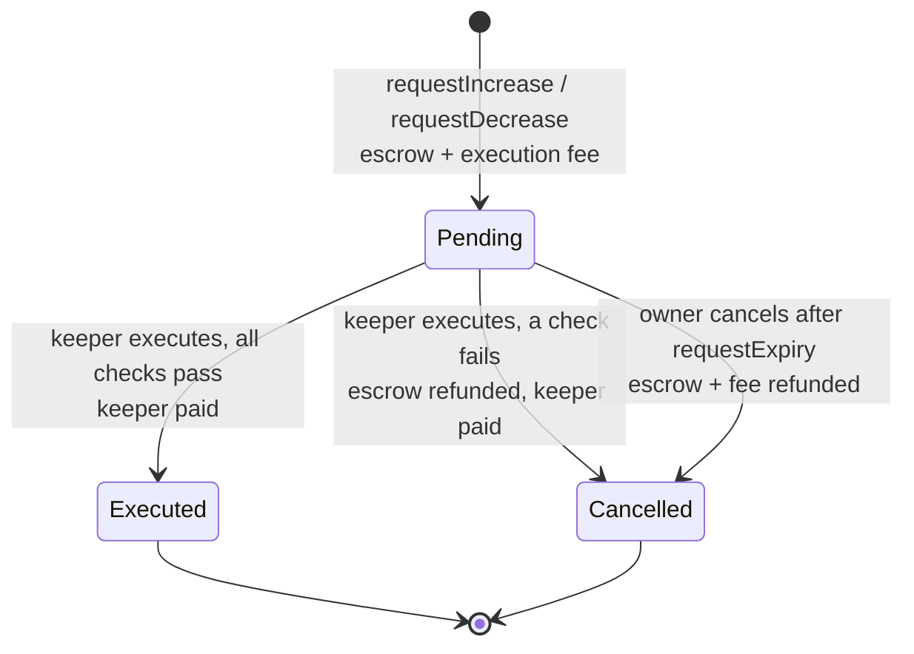

# Protocol Specification

> **Normative.** This document and [`perp-math.md`](perp-math.md) are the source of truth for both implementations: the EVM contracts in `celestial-contracts/` and the Solana program in `celestial-solana/`. To change a rule or a default, change it here first, then in both chains, then in the keeper (`celestial-keeper/src/math.ts`) and the app (`celestial-perps/lib/perpMath.ts`). The app reads live parameters from the chain at runtime. `celestial-perps/lib/protocol.ts` only holds UI fallbacks.

- [1. Overview](#1-overview)
- [2. Actors and roles](#2-actors-and-roles)
- [3. Assets, markets and oracles](#3-assets-markets-and-oracles)
- [4. Parameters](#4-parameters)
- [5. Orders](#5-orders)
- [6. Positions](#6-positions)
- [7. Funding](#7-funding)
- [8. Liquidation](#8-liquidation)
- [9. Liquidity pool and CLP](#9-liquidity-pool-and-clp)
- [10. Fees](#10-fees)
- [11. Administration](#11-administration)
- [12. Chain-specific deviations](#12-chain-specific-deviations)
- [13. Oracle decision record](#13-oracle-decision-record)

## 1. Overview

Celestial Perps is a pool-based perpetual futures protocol. One USDC pool is the counterparty to every position. Traders open leveraged long or short exposure to **synthetic** markets: no base asset is ever held, and PnL settles in USDC. Liquidity providers own the pool through the **CLP** token and earn 90% of trading fees, all funding, and traders' net losses. They also carry traders' net profits.

The protocol stays solvent by construction:

1. **Profit reserve.** Opening a position reserves `maxProfitMultiplier × collateral` of pool liquidity. That is the most the position can ever be paid.
2. **Open-interest cap.** Each side of each market is capped at `oiCapBps` of AUM.
3. **Maintenance margin.** A position is liquidated before its losses can exceed its collateral.
4. **Skew funding.** The heavier side pays the pool hourly, which pushes open interest toward balance.

## 2. Actors and roles

| Actor | Can do | Trust |
|---|---|---|
| **Trader** | Request increases and decreases on their own positions; cancel their own pending request after expiry; claim testnet USDC from the faucet | None |
| **Liquidity provider** | Add liquidity (mint CLP); remove liquidity (burn CLP) after the cooldown, up to the unreserved amount | None |
| **Keeper** (whitelisted, ≤ 4 on Solana) | Execute pending requests; liquidate positions that fail the margin check | Can choose **when** to execute within the 60 s window and which requests to batch. Can't choose the price or execute outside the rules. See [security.md](security.md) |
| **Anyone** | `updateFunding(market)` | None |
| **Owner / admin** | List, enable and disable markets; set keepers; pause; change parameters within hard bounds; withdraw protocol fees; transfer admin (two-step) | Trusted; testnet deployer |

## 3. Assets, markets and oracles

### Collateral

| | |
|---|---|
| Token | Mock USDC, 6 decimals (EVM ERC-20 `MockUSDC`; Solana Token-2022 mint) |
| Price | Fixed at $1 (`collateralPrice() = 1e8`). **Mainnet TODO:** a USDC/USD feed |
| Faucet | 10,000 USDC per address every 24 h (testnet only) |

### Markets

| Market | Sepolia | Solana devnet |
|---|---|---|
| BTC-USD | ✅ | ✅ |
| ETH-USD | ✅ | ✅ |
| SOL-USD | ❌: Sepolia has no Chainlink SOL/USD feed | ✅ |

Markets are identified by `keccak256("<SYMBOL>")` on EVM and by the PDA `["market", symbol]` on Solana. A chain supports at most 8 markets (the Solana `Config.markets` capacity).

### Oracles

Trades, liquidations and AUM always use the **on-chain Chainlink price**. The chart and ticker in the app come from the Coinbase Exchange public API and are for **display only**.

| Market | Sepolia `AggregatorV3` (8 dec) | Solana devnet OCR2 feed (store `HEvSKofvBgfaexv23kMabbYqxasxU3mQ4ibBMEmJWHny`) |
|---|---|---|
| ETH-USD | `0x694AA1769357215DE4FAC081bf1f309aDC325306` | `669U43LNHx7LsVj95uYksnhXUfWKDsdzVqev3V4Jpw3P` |
| BTC-USD | `0x1b44F3514812d835EB1BDB0acB33d3fA3351Ee43` | `6PxBx93S8x3tno1TsFZwT5VqP8drrRCbCXygEXYNkFJe` |
| SOL-USD | — | `99B2bTijsU6f1GCT73HmdR7HCFFjGMBcPZY6jZ96ynrR` |

A price is **valid** only if all of these hold:

| Check | EVM | Solana |
|---|---|---|
| `answer > 0` | ✅ | ✅ |
| Round complete (`updatedAt ≠ 0`, `answeredInRound ≥ roundId`) | ✅ | timestamp ≠ 0 (OCR2 has no `answeredInRound`) |
| Age ≤ max age | 3,960 s (Sepolia heartbeat 3,600 s + 10%) | 120 s (devnet feeds update every few seconds) |
| Not from the future | `updatedAt ≤ block.timestamp` | skew ≤ 60 s accepted (validator clock drift) |

Prices are normalised to **8 decimals**. An invalid price **cancels** an order (`StalePrice` / `InvalidPrice`) and makes a liquidation **revert**. AUM reads every market that has open interest, so a stale feed on such a market also makes LP deposits and withdrawals revert until the feed recovers. Markets with no open interest are skipped.

## 4. Parameters

Defaults are identical on both chains unless marked. **Bounds** are the hard limits the admin setters enforce.

| Parameter | Default | Bounds | Meaning |
|---|---|---|---|
| `maxLeverage` | 20 | `≥ 1`, `maxLeverage × mmBps < 10,000` | `size ≤ maxLeverage × collateral` after every update |
| `maintenanceMarginBps` | 250 (2.5%) | `> 0` (see above) | Liquidation threshold as a fraction of size |
| `positionFeeBps` | 6 (0.06%) | 0–100 | Charged on size opened and on size closed |
| `liquidationFeeBps` | 50 (0.5%) | 0–200 | Paid to the liquidating keeper, capped at collateral |
| `executionSpreadBps` | 10 (0.1%) | 0–100 | Fill price = oracle ± spread, always against the trader |
| `maxProfitMultiplier` | 9 | 1–20 | Reserve = multiplier × collateral; the cap on realised profit |
| `oiCapBps` | 3,000 (30% of AUM) | 0–10,000 | Per side, per market |
| `fundingFactorPerHour` | `3e14` (0.03%/h at 100% skew) | 0–`1e16` | Funding sensitivity to skew |
| `maxFundingRatePerHour` | `1e14` (0.01%/h) | 0–`1e16` | Funding cap |
| `requestExpiry` | 60 s | 10 s – 1 h | After this the owner may cancel a pending request |
| `minExecutionFee` | EVM 0.0002 ETH · Solana 50,000 lamports | EVM ≤ 0.01 ETH | Keeper compensation, paid per processed request |
| `minCollateral` | 10 USDC | 1–10,000 USDC | Minimum collateral of an open position |
| `lpMintFeeBps` | 10 (0.1%) | 0–100 | Charged on deposits, stays in the pool |
| `protocolFeeShareBps` | 1,000 (10%) | 0–5,000 | Share of position fees sent to `feeReserves` |
| `lpCooldown` | 15 min | 0–1 day | Minimum time between an LP's last deposit and a withdrawal |
| Oracle `maxAge` | EVM 3,960 s · Solana 120 s | per market | See §3 |

Precision: USD in 1e6, prices in 1e8, funding in 1e18, `tokens` in 1e18-scaled base units (`size × 1e20 / price`). **Every rounding goes against the trader.** Formulas: [perp-math.md](perp-math.md).

## 5. Orders

### Request types

| Request | Arguments | Escrow at request time |
|---|---|---|
| **Increase** | market, isLong, `collateralDelta`, `sizeDelta`, `acceptablePrice` | `collateralDelta` USDC + execution fee |
| **Decrease** | market, isLong, `collateralDelta` (USDC to withdraw), `sizeDelta`, `acceptablePrice` | execution fee |

- A request with both deltas zero is rejected (`EmptyRequest`).
- `sizeDelta == position.size` is a **full close**: all remaining collateral returns to the trader and `collateralDelta` is ignored.
- An increase with `sizeDelta = 0` only adds collateral. A decrease with `sizeDelta = 0` only withdraws collateral.
- `acceptablePrice` is the worst fill price the trader accepts. For an increasing long or a decreasing short, the fill must be `≤ acceptablePrice`. For the other two cases it must be `≥ acceptablePrice`.

### Lifecycle



A keeper execution **never fails because of the request's content**. On EVM each request runs inside `try/catch`. On Solana the engine works on in-memory copies and commits nothing on failure. Either way, the request is cancelled with a reason and the transaction succeeds. The reasons are shared across chains:

`Paused` · `MarketDisabled` · `StalePrice` · `InvalidPrice` · `SlippageExceeded` · `PositionNotFound` · `SizeTooLarge` · `CollateralTooLow` · `LeverageTooLow` · `LeverageTooHigh` · `OpenInterestCap` · `ReserveCap` · `PositionLiquidatable` · `InsufficientCollateral` · `InsufficientPoolAmount` · `MathError` (EVM: panic) · `UserCancelled`

### Execution checks

**Increase** (in order):
1. Protocol not paused, market enabled.
2. Accrue funding for the market.
3. Oracle price valid. Fill at `executionPrice(P, isLong, increase)` and check `acceptablePrice`.
4. Settle funding owed on the existing position (must be less than collateral + delta).
5. Move escrow to collateral. Deduct funding (to the pool) and the open fee.
6. Add size and tokens. Reset the position's funding index.
7. OI cap: `sideSize + position.size ≤ oiCapBps × AUM`.
8. Validate: `collateral ≥ minCollateral`, `collateral ≤ size ≤ maxLeverage × collateral`, not liquidatable at the raw oracle price.
9. Set reserve to `maxProfitMultiplier × collateral` (must stay ≤ `poolAmount`).

**Decrease** (in order):
1. Position exists and `sizeDelta ≤ size`.
2. Accrue funding. Fill at `executionPrice(P, isLong, decrease)` and check `acceptablePrice`.
3. Realise PnL on the closed portion (`tokens × sizeDelta / size`). Profit is capped at the position's reserve.
4. Charge loss + funding + close fee from collateral (if charges exceed collateral → `PositionLiquidatable`).
5. Pay out `collateralDelta` (or everything on a full close) plus the realised profit.
6. On a partial close: re-validate as above. The new reserve is `min(multiplier × collateral, oldReserve − profitPaid)`, so a partial close can never fail on pool capacity.

Pausing blocks **new increases** only. Decreases, cancels and liquidations keep working, so traders can always exit.

## 6. Positions

One position per `(account, market, side)`. A position stores `size` (USD), `collateral` (USD), `tokens`, `reserved` and `entryFundingIndex`. The average entry price is derived: `entry = size × 1e20 / tokens`.

| Quantity | Definition |
|---|---|
| Leverage | `size / collateral`, between 1× and `maxLeverage` |
| PnL | long `tokens × P / 1e20 − size`; short `size − tokens × P / 1e20` |
| Net value on close | `collateral + min(PnL, reserved) − fundingOwed − closeFee` |
| Liquidation price | The oracle price at which `remainingMargin = maintenanceMargin` (formula 7 in [perp-math.md](perp-math.md)) |

## 7. Funding

Funding is **skew-based** and **one-sided**. It is charged continuously and accrued into per-side cumulative indices.

```
rate/h = AUM == 0 ? 0 : min(maxFundingRatePerHour, fundingFactorPerHour × |longOI − shortOI| / AUM)
```

- Only the heavier side's index grows. The lighter side pays nothing and receives nothing, and funding is paid **to the pool** (LPs), not to the other side.
- Indices accrue at every trade and liquidation on the market, and whenever anyone calls `updateFunding` (the keeper does so hourly for markets with open interest).
- A position owes `size × (index − entryIndex) / 1e18`. The debt is settled from collateral at each update, and the entry index resets.

Example: with long OI $2M, short OI $1M and AUM $5M, the rate is 0.006%/h and longs pay. A $10,000 long owes $4.80 after 8 h ([Ex 5](perp-math.md#ex-5-funding-accrual)).

## 8. Liquidation

```
remainingMargin = collateral + PnL(P) − fundingOwed − closeFee
liquidatable    ⇔ remainingMargin < ceil(size × maintenanceMarginBps / 10,000)
```

- Liquidations use the **raw oracle price** (no spread) and are keeper-only.
- On liquidation: the position is deleted and its reserve released. The keeper receives `min(size × 0.5%, collateral)`. **The rest of the collateral goes to the pool.** The trader receives nothing.
- A position can never be opened in a liquidatable state. Validation runs after the open fee and at the raw oracle price, so opening at maximum leverage stays safe despite the spread ([Ex 8](perp-math.md#ex-8-regression-opening-at-max-leverage-is-not-liquidatable-immediately)).

## 9. Liquidity pool and CLP

```
AUM = max(0, poolAmount − Σ_markets netTraderPnL)
```

`netTraderPnL` is each market's aggregate long plus short PnL at the oracle price, floored at `−(long collateral + short collateral)`. Traders can't lose more than they deposited.

| Action | Rule |
|---|---|
| Add liquidity | Fee `ceil(amount × 0.1%)` stays in the pool. Mint `supply == 0 ? afterFee × SCALE : afterFee × supply / AUM`. Slippage check `minted ≥ minClp`. Starts the cooldown |
| Remove liquidity | Allowed `lpCooldown` after the LP's last deposit. Pays `clp × AUM / supply`, only from **unreserved** liquidity (`poolAmount − reservedAmount`). Slippage check `out ≥ minUsdc` |
| CLP price | `AUM / supply`, reported as 8 decimals per whole CLP. $1.00 before the first deposit |

`SCALE` is `1e12` on EVM (18-decimal CLP) and `1` on Solana (6-decimal CLP).

## 10. Fees

| Fee | Rate | Paid by | Goes to |
|---|---|---|---|
| Open fee | 0.06% of size opened | Trader (from collateral) | 90% pool, 10% `feeReserves` |
| Close fee | 0.06% of size closed | Trader | 90% pool, 10% `feeReserves` |
| Execution spread | 0.1% of price | Trader (worse fill) | Pool (implicitly, via PnL) |
| Funding | ≤ 0.01%/h of size | Heavier side | Pool |
| Liquidation fee | 0.5% of size, ≤ collateral | Liquidated trader | Keeper |
| Execution fee | 0.0002 ETH / 50,000 lamports | Trader | Keeper (paid on fill **or** keeper cancel) |
| LP mint fee | 0.1% of deposit | LP | Pool |

`feeReserves` is withdrawable only by the owner/admin.

## 11. Administration

| Capability | EVM | Solana |
|---|---|---|
| Ownership transfer | `Ownable2Step` | `transfer_admin` → `accept_admin` |
| List market | `listMarket(id)` + `oracle.setFeed(id, feed, maxAge)` | `add_market(symbol, oracle_kind, max_age)` |
| Enable/disable market | `setMarketEnabled` | `set_market_enabled` |
| Keepers | `setKeeper(addr, active)` (unbounded set) | `set_keeper(pubkey, active)` (≤ 4 slots) |
| Pause | `pause` / `unpause` | `set_paused` |
| Parameters | One bounded setter per parameter | `set_params(ParamsUpdate)` with the same bounds |
| Protocol fees | `pool.withdrawFees(to)` | `withdraw_fees` |

Parameter bounds (§4) are enforced on-chain, so a compromised admin key can't set, for example, a 100% fee. It **can** pause, disable markets and change keepers. See [security.md](security.md).

## 12. Chain-specific deviations

Settled during the Solana implementation (2026-09-25). Everything not listed is identical.

| Item | EVM | Solana | Why |
|---|---|---|---|
| CLP decimals | 18 | 6 | Solana token amounts are `u64`. The first mint is `× 1` instead of `× 1e12` ([Ex 10](perp-math.md#ex-10-clp-lp-token)) |
| CLP price view | `aum × 1e20 / supply` | `aum × 1e8 / supply` | Same 8-decimal price per whole CLP |
| Oracle max age | 3,960 s | 120 s | Feed update cadence |
| Oracle round check | `answeredInRound ≥ roundId` | not available | The OCR2 layout has no `answeredInRound` |
| Execution fee | ETH | Lamports | Native gas token |
| Failed execution | `try/catch` → cancel | Copy-then-commit → cancel | Solana has no try/catch |
| Position storage | Mapping by `keccak(account, market, isLong)` | PDA `["position", owner, market, [isLong]]`; rent prepaid at request, refunded on close | Solana rent |
| Keepers | Unbounded | 4 slots | Fixed account size |

## 13. Oracle decision record

**Chainlink push feeds, not Pyth.** Since the Pyth Core upgrade (26 Aug 2026), Hermes and Benchmarks need a paid API key (plans from $500/month). Chainlink push feeds are free to read on both testnets, and the keeper never has to fetch or post prices.

**Consequence.** A push oracle with a 1 h heartbeat (Sepolia) lags the market. The two-step flow stops a trader from picking a known-stale round. The 0.1% spread partly offsets the remaining edge. Full front-running protection needs a low-latency pull oracle and is on the roadmap.

> Before any redeploy, re-check feed addresses and decimals at docs.chain.link. For Solana, confirm freshness with `pnpm check-oracle` in `celestial-solana/`.
