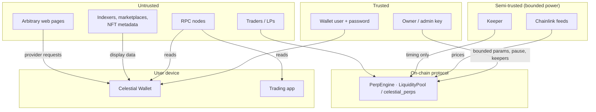

# Security Model

This document covers the trust assumptions, the protections implemented, and the **known risks** of every component. Everything is deployed on **testnets only**: Sepolia and Solana devnet, with mock USDC. None of it has been externally audited. Don't use it with real funds.

## Trust boundaries

## Protocol

### Protections

| Threat | Mitigation |
|---|---|
| Pool insolvency from trader profits | Maximum profit reserved at open (`9 × collateral`); the reserve must stay ≤ `poolAmount`; profit is capped at the reserve; per-side OI cap of 30% of AUM |
| Losses larger than collateral | Maintenance margin 2.5% with keeper liquidation; market net PnL floored at −collateral in AUM |
| Rounding extraction | Every rounding goes against the trader or LP ([perp-math.md](perp-math.md#rounding)); fuzz tests check that opening and closing at one price never profits |
| Trading against a known stale price | Two-step orders: the fill uses the oracle price **at execution**, not at request time; 0.1% spread against the trader; oracle max-age checks |
| Bad oracle data | `answer > 0`, round completeness, max age, and future-timestamp checks. Orders cancel, liquidations revert |
| One bad order blocking others | Per-request revert scope (EVM `try/catch`, Solana copy-then-commit); business failures cancel, never revert |
| Keeper griefing with failing orders | The execution fee is paid to the keeper on cancel too |
| Reentrancy | `ReentrancyGuard` on every external mutator; only the pool moves tokens, after state updates |
| Accounting drift | Bucket accounting with invariant suites (Foundry) and post-scenario checks (LiteSVM) |
| Admin abuse | Hard bounds on every parameter setter (e.g. fee ≤ 1%, spread ≤ 1%, `maxLeverage × mm < 100%`); two-step ownership |
| Stuck funds when the keeper is down | The trader who placed a request can cancel it after 60 s for a full refund. Pause never blocks closing |
| Solana account substitution | PDA seed and owner checks on every account; market set validated for count, order, PDA and oracle owner (the Chainlink store program) |

### Known risks and limitations

| Risk | Detail | Direction |
|---|---|---|
| **Push-oracle latency** | Sepolia feeds have a 1 h heartbeat. Within the max age (3,960 s), the on-chain price can lag the market by more than the 0.1% spread, which gives informed traders an edge against LPs | A low-latency pull oracle with request-time price commitments |
| **Keeper timing power** | A whitelisted keeper chooses *when* to execute within the 60 s window, and so which oracle round a request fills at (bounded by `acceptablePrice`). It could delay or reorder, and a keeper that is also a trader could exploit this | Multiple independent keepers; execute-by-deadline rules; pull oracle with price at request time |
| **Keeper liveness** | With no keeper, orders don't fill and liquidations don't happen. Bad debt is possible if prices move far | Run redundant keepers (up to 4 on Solana); permissionless liquidation |
| **Centralised admin** | One testnet deployer key can pause, disable markets, change keepers, change parameters within bounds and withdraw protocol fees. It can't take LP or trader funds directly | Multisig and timelock before any mainnet use |
| **Fixed USDC price** | `collateralPrice()` is a constant $1 | A USDC/USD feed on mainnet |
| **Stale feed blocks LPs** | AUM reads every market that has open interest. A stale feed on such a market makes add/remove liquidity revert until it recovers | Accepted: safer than pricing CLP with stale data |
| **Liquidation fee capped at collateral** | Deeply underwater positions pay the keeper less, and the pool absorbs the shortfall through AUM | Accepted; the reserve and caps bound the exposure |
| **Unaudited** | No external audit | Required before mainnet |

## Keeper

- **Key custody.** The EVM key comes from `.env` (gitignored). The Solana key is read from a **file path**, and the contents are never loaded into config or logs. Only derived addresses are logged.
- **Log hygiene.** URLs are stripped from error messages (RPC URLs embed API keys), and fields named like `privateKey`, `secret` or `keypair` are redacted.
- **Blast radius.** A compromised keeper key can execute requests at bad *times* within the rules and collect execution and liquidation fees. It can't set prices, move pool funds or change parameters. The admin removes it with `setKeeper(addr, false)` / `set_keeper(pubkey, false)`.
- **No double spends.** Execution is idempotent on-chain (request status or closed account), and sends are retried only when the error is known to come before acceptance.

## Trading app

- **No secrets in the bundle.** Every configuration value is `NEXT_PUBLIC_*`. RPC keys used there must be browser-restricted.
- **Writes only through the user's wallet.** The app never holds keys. The EVM signer comes from the EIP-6963 provider the user picked, never an implicit `window.ethereum`. Network guard: EVM writes require Sepolia.
- **Pre-flight.** Every EVM write is gas-estimated and every Solana transaction simulated (preflight) before the wallet opens, so users don't sign a doomed transaction.
- **Acceptable price** is always set from the previewed execution price and an explicit slippage tolerance, so the keeper can't fill worse than the user agreed to.
- **Display vs. settlement.** Chart prices (Coinbase) are labelled and never used for settlement. The oracle price and its age are shown next to them.

## Wallet extension

### Protections

| Area | Implementation |
|---|---|
| Seed at rest | Only the mnemonic is stored, encrypted with AES-256-GCM under a PBKDF2-SHA256 (600k iterations) key with a random salt and IV. Private keys are never persisted |
| Password verification | GCM authentication: no password hash is stored |
| Key derivation | Standard paths (BIP-44 / SLIP-0010 / BIP-84), compatible with MetaMask, Phantom and common BTC wallets |
| dApp isolation | The page talks only to `content.js` through `postMessage`; the content script checks `event.source === window`; the service worker holds the session |
| Connection and signing | Explicit approval popups for `eth_requestAccounts`, Solana `connect`, `eth_sendTransaction` and every Solana signature. EVM transactions are signed by the account named in `from` |
| Solana signing checks | The popup refuses transactions that don't list the wallet's account as a required signer, shows the programs involved (unknown programs highlighted), and simulates on the requested cluster before the user confirms. Closing the window rejects |
| Keys and the service worker | The popup sends the background **addresses only** (`ACCOUNTS_UPDATE`); private keys stay in the popup |
| NFT metadata | Treated as untrusted: plain-text descriptions, `javascript:` URIs rejected, HTML and 3D media never rendered |
| Partner API keys | Never read from the bundle. They go through the optional server-side proxy |
| Keys in NFT sends | Used only by local signers, never included in a network request |

### Known risks and limitations

| Risk | Detail | Severity |
|---|---|---|
| **`VAULT_INIT` from any origin** | `content.js` runs on `<all_urls>` and relays `VAULT_INIT` from any page. A malicious site could add a vault whose password it knows, and a user who later unlocks and funds that wallet would be sending to the attacker. Existing vaults are not readable or overwritable unless the site guesses their exact id | **High.** Fix: restrict relaying to the onboarding origin(s), and show a confirmation in the popup |
| **Mnemonic in service-worker memory and returned by `VAULT_STATE_GET`** | While unlocked, the plaintext mnemonic lives in the worker and is returned to the popup on request. Only extension pages can send runtime messages (content scripts relay a fixed set of types, not `VAULT_STATE_GET`) | Medium. Fix: keep the key only, and sign in the worker |
| **Keys derived and used in the popup** | Transactions are signed in the popup's JS context | Medium. Fix: move signing to the background |
| **No auto-lock** | The session ends only on lock or when the worker is stopped | Medium. Fix: idle timer with `chrome.alarms` |
| **No per-origin permissions** | Approving one site doesn't restrict other sites. There is no connected-sites list or revoke | Medium |
| **`isMetaMask = true`, `isPhantom = true`** | Compatibility shims that can confuse wallet selection when several wallets are installed | Low. EIP-6963 / Wallet Standard discovery is unaffected |
| **Placeholder `eth_accounts` address** | A leftover development fallback returns a fixed address when unlocked with no accounts synced | Low. Remove it |
| **Build-time API keys** | `VITE_*` RPC and data keys ship in the bundle | Low. Use restricted keys |
| **Transak staging, 0x quotes** | Third-party flows; the swap and buy UIs trust those services' responses | Informational |

## Landing / onboarding

- The seed comes from `@scure/bip39` (CSPRNG, 128-bit) and is encrypted **before** leaving the page. Only the ciphertext is posted to the extension. No network requests carry wallet data.
- Password policy: ≥ 8 characters with uppercase, digit and symbol. PBKDF2 at 600k iterations slows offline guessing but doesn't prevent it for weak passwords.

## Repository hygiene

- `.env` / `.env.local` files and keypair files (`*-keypair.json` in celestial-solana and celestial-keeper, `celestial-react-wallet/scripts/.keys/`) are gitignored. Local Anvil and dry-run broadcast logs are ignored; Sepolia broadcast records are committed (they hold no secrets). Program upgrade keypairs must be backed up **outside** the repository.
- Only testnet keys are used, and deployer and keeper keys are never used as trading wallets.

## Reporting

This is a private project. Report suspected vulnerabilities directly to the maintainer, not in public channels. Include the component, the steps to reproduce, and the impact.
