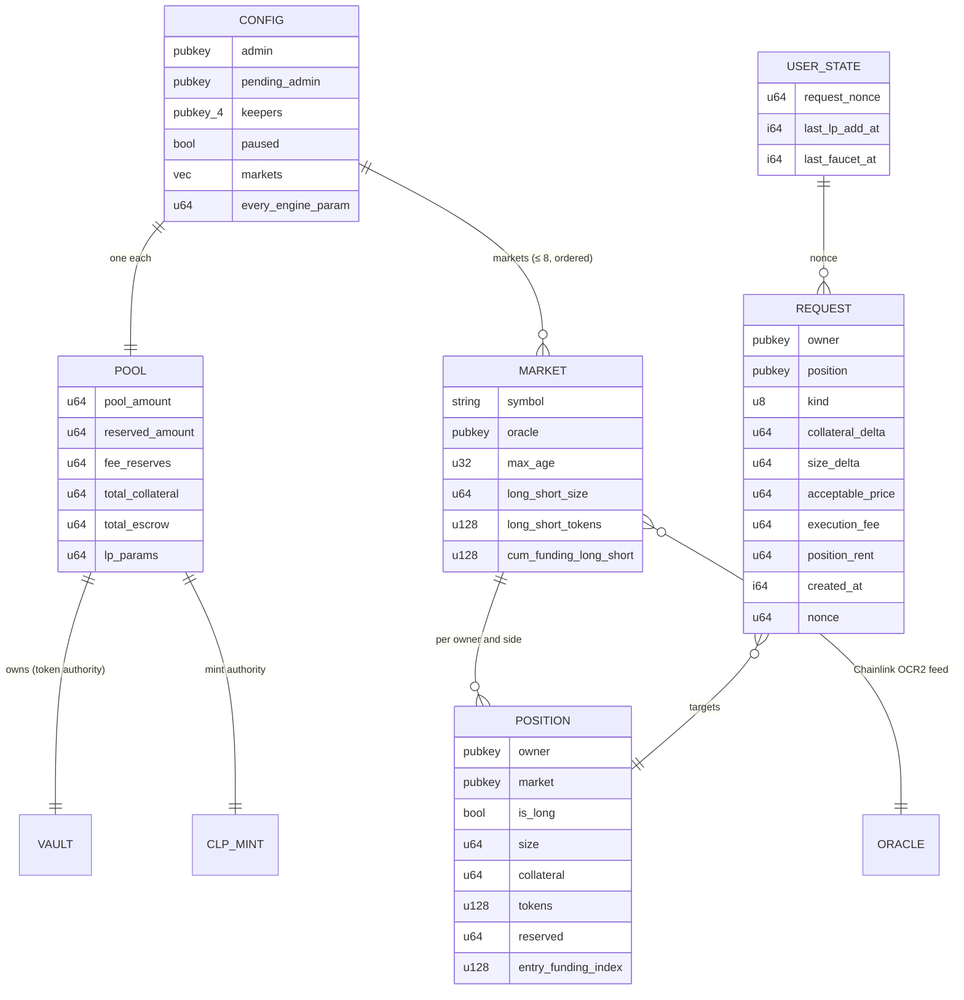
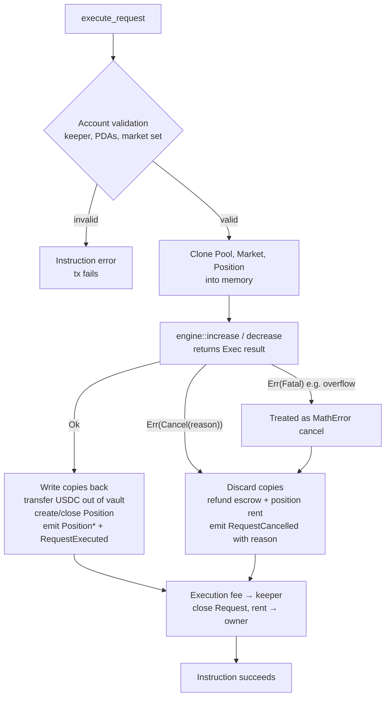

# Solana Program

`celestial_perps` is the Anchor implementation of Celestial Perps on **Solana devnet**. It has the same economics as the [EVM contracts](contracts.md), in a single program whose state lives in PDAs.

| | |
|---|---|
| Program ID | `EK1KpDGfUiZ4XkWixAaRFonDexZYSKnJm8oJz5s7HLTL` |
| Package | `celestial-solana/` (Anchor workspace) |
| Toolchain | anchor-cli 1.1.2 · solana-cli 3.1.10 (Agave) · Rust 1.89 (`rust-toolchain.toml`) · Node 24 · pnpm |
| Token program | **Token-2022** for USDC and CLP |
| Rules / maths | [protocol-spec.md](protocol-spec.md) · [perp-math.md](perp-math.md) |

## Source layout

```
programs/celestial-perps/src/
├── lib.rs              #[program]: one thin entrypoint per instruction
├── constants.rs        seeds, precision, limits, defaults (mirrors protocol-spec.md)
├── state.rs            Config, Pool, Market, Position, Request, UserState, MarketInfo
├── math.rs             every formula in perp-math.md (u128, checked)
├── engine.rs           execution core: bucket moves, MarketSet (AUM), increase/decrease/liquidate
├── oracle.rs           Chainlink OCR2 decoder + validity checks (and the test-only mock oracle)
├── error.rs            PerpError (hard errors) + CancelReason (business failures)
├── events.rs           events named after the EVM events, snake_case fields
├── utils.rs            vault transfers, lamport moves, account close, event helpers
└── instructions/       one file per instruction (accounts struct + handler)
```

## Accounts



| Account | Seeds | Notes |
|---|---|---|
| `Config` | `["config"]` | admin / pending_admin, 4 keeper slots, paused, USDC mint and token program, market list (≤ 8, **AUM order**), every engine parameter |
| `Pool` | `["pool"]` | `pool_amount`, `reserved_amount`, `fee_reserves`, `total_collateral`, `total_escrow`, LP parameters |
| Vault | `["vault"]` | Token-2022 USDC account owned by `Pool`; holds every bucket |
| CLP mint | `["clp_mint"]` | Token-2022, **6 decimals**, mint authority `Pool` |
| `Market` | `["market", symbol]` | oracle, oracle kind, max age, enabled, per-side size/tokens/collateral, funding indices |
| `Position` | `["position", owner, market, [is_long]]` | Created on the first fill. Rent is **prepaid in the request**. Closed on full close or liquidation, with rent back to the trader |
| `Request` | `["request", owner, nonce_le_u64]` | Pending order. Holds the execution fee in lamports. Closed on execute or cancel, with rent back to the owner |
| `UserState` | `["user", owner]` | `request_nonce`, `last_lp_add_at` (cooldown), `last_faucet_at` |
| Mint authority | `["mint_authority"]` | Signs faucet mints once the mock-USDC mint authority is moved to it |

Devnet addresses are in [operations.md](operations.md#solana-devnet) and `deployments/solana-devnet.json`.

## Instructions

| Group | Instruction | Signer | Notes |
|---|---|---|---|
| Admin | `initialize` | admin | Creates Config, Pool, vault, CLP mint with defaults |
| | `add_market(symbol, oracle_kind, max_age)` | admin | Appends to `Config.markets` (≤ 8) |
| | `set_market_enabled(enabled)` | admin | |
| | `set_keeper(pubkey, active)` | admin | 4 slots |
| | `set_paused(paused)` | admin | Blocks new increases only |
| | `set_params(ParamsUpdate)` | admin | Same bounds as the EVM setters. A funding change needs the market list (remaining accounts) |
| | `transfer_admin` / `accept_admin` | admin / new admin | Two-step |
| | `withdraw_fees` | admin | `fee_reserves` → admin's USDC account |
| Faucet | `faucet` | user | 10,000 USDC once per 24 h. Creates the user's ATA if needed |
| LP | `add_liquidity(amount, min_clp)` | LP | Starts the 15 min cooldown |
| | `remove_liquidity(clp_amount, min_usdc)` | LP | Only from unreserved liquidity |
| Trader | `request_increase(nonce, is_long, collateral_delta, size_delta, acceptable_price, execution_fee)` | trader | Escrows USDC + fee + position rent (if new) |
| | `request_decrease(...)` | trader | Fee only |
| | `cancel_request` | owner | After `request_expiry` (60 s). Refunds everything |
| Keeper | `execute_request` | keeper | Fill or cancel; never fails on business rules |
| | `liquidate` | keeper | Raw oracle price |
| Anyone | `update_funding(market)` | anyone | |
| Views | `get_aum`, `get_clp_price`, `get_liquidation_price`, `get_market_info(market)` | — | Call with `simulateTransaction` and read the return data |
| Test only | `init_mock_oracle`, `set_mock_price` | — | Compiled only with the `mock-oracle` feature |

`request_increase` takes the client-chosen `nonce`, which must equal `UserState.request_nonce`. That lets the client derive the `Request` PDA before sending.

## `remaining_accounts`: the market set

Solana programs can't iterate storage, so every instruction that needs **AUM** receives **all markets and their oracles** as remaining accounts, in `Config.markets` order:

```
[market_0, oracle_0, market_1, oracle_1, …]         devnet order: SOL-USD, BTC-USD, ETH-USD
```

`MarketSet::load` (in `engine.rs`) checks the count, the order, each market's PDA and owner, and that each oracle is the market's configured oracle owned by the Chainlink store program. A missing, extra or reordered entry fails with `InvalidMarketAccounts` or `OracleMismatch`. The market an instruction **mutates** must be passed **writable** (`MarketNotWritable` otherwise).

This applies to `add_liquidity`, `remove_liquidity`, `execute_request`, `liquidate`, `update_funding`, `set_params` (funding changes only), `get_aum`, `get_clp_price` and `get_market_info`.

## Execution model: copy, then commit

The EVM engine gives each request its own revert scope with `try/catch`. Solana has no try/catch: an error aborts the whole transaction, including other requests in the same batch. The program reproduces the EVM semantics instead:



`engine.rs` defines `ExecError::{Cancel(CancelReason), Fatal(Error)}`. Inside keeper execution **every** failure after account validation becomes a cancel (`into_reason`), and a fatal error maps to `MathError`, the counterpart of an EVM panic caught by `try/catch`. Outside keeper execution (LP actions, liquidation, funding, views) the EVM reverts, so the program does too (`into_error`).

This is why the keeper can batch up to 4 `execute_request` instructions in one transaction: one bad request never breaks the batch.

## Oracle decoding

`oracle.rs` decodes the Chainlink OCR2 `Transmissions` account by hand (no extra crate):

| Field | Offset |
|---|---|
| `decimals` | byte 138 |
| `live_length` | byte 148 |
| `live_cursor` | byte 152 |
| rounds | 48-byte records from byte 200 |
| latest round | index `(cursor + length − 1) % length` |

Checks: account owned by the store program `HEvSKofvBgfaexv23kMabbYqxasxU3mQ4ibBMEmJWHny`, answer > 0, timestamp ≠ 0, age ≤ `max_age` (120 s), and a timestamp no more than 60 s in the future (validator clock drift). The layout has no `answeredInRound`. The decoder is unit-tested against a captured devnet account and cross-checked against the live feeds in `pnpm test:chainlink`.

The `mock-oracle` feature adds `OracleKind::Mock` and the two mock instructions for the LiteSVM tests. The devnet build is plain `anchor build`: its IDL has no mock instructions, and `OracleKind::Mock` fails with `UnsupportedOracleKind`.

## Events

Events are emitted as `Program data: <base64>` log lines. Decode them with `BorshCoder(idl).events.decode`. Names and fields follow the EVM events in snake_case: `RequestCreated`, `RequestExecuted`, `RequestCancelled { reason: CancelReason }`, `PositionIncreased`, `PositionDecreased { position: Pubkey, … }`, `PositionClosed`, `PositionLiquidated`, `FundingUpdated`, `LiquidityAdded`, `LiquidityRemoved`, `FeesAdded`, plus the admin events `MarketListed`, `KeeperUpdated`, `FeesWithdrawn`, and `FaucetClaimed`.

## Differences from `PerpEngine.sol`

| EVM | Solana | Reason |
|---|---|---|
| `executeRequests(ids[])` with `try/catch` | one `execute_request` per request, batched in one tx | Copy-then-commit, see above |
| `RequestCancelled(bytes reason)` | `reason: CancelReason` enum | Typed reasons |
| Execution fee in ETH | Lamports held in the `Request` account | Native gas token |
| Positions in a mapping | `Position` PDA; rent prepaid by the trader, refunded on close/liquidation | Rent |
| `marketIds` loop | Market set in `remaining_accounts` | No storage iteration |
| CLP 18 decimals; price `aum × 1e20 / supply` | CLP 6 decimals; price `aum × 1e8 / supply` | `u64` amounts |
| `answeredInRound` check | not available | OCR2 layout |
| `Ownable2Step` | `transfer_admin` / `accept_admin` | Same semantics |
| `PositionDecreased.key` (bytes32) | `position` (Pubkey) | PDA address |

## Client integration notes

These notes are for the keeper and the app:

- **Pending requests:** `getProgramAccounts(programId, { filters: [{ memcmp: { offset: 0, bytes: <Request discriminator b58> } }] })`. The discriminator is in the IDL (`accounts[].discriminator`). Add `{ memcmp: { offset: 8, bytes: owner } }` to filter one user's requests. `created_at` (i64) is at offset 146.
- **Positions:** the same pattern with the `Position` discriminator, plus `memcmp` on `market` at offset 40.
- **Batching:** put up to 4 `execute_request` instructions in one transaction, each with the full market set and its own market writable. Raise the compute limit (about 45k CU per execute).
- **Views without a wallet:** the `get_*` views need a funded fee payer to simulate. The app computes the same numbers from one `getMultipleAccounts` snapshot, and a test cross-checks both ([frontend.md](frontend.md#solanachain)).
- **Faucet accounts:** `user, config, user_state, usdc_mint, mint_authority, user_usdc (ATA, created if missing), token_program (Token-2022), associated_token_program, system_program`.

## Build and test

```bash
cd celestial-solana
pnpm install
cargo test -p celestial-perps --lib   # maths + oracle decoding: every perp-math.md vector + property sweeps
pnpm test                             # mock-oracle build, then the LiteSVM suite (tests/*.test.ts)
pnpm test:chainlink                   # devnet build + solana-test-validator with the Chainlink store & feeds cloned
pnpm check-oracle                     # decode the 3 devnet Chainlink feeds (price, decimals, age)
```

The LiteSVM tests control the clock (request expiry, LP cooldown, 24 h faucet, hours of funding). After every scenario they assert `vault ≥ pool_amount + fee_reserves + total_collateral + total_escrow` and `reserved ≤ pool_amount`. See [testing.md](testing.md#solana-program). Deploy and initialisation: [operations.md](operations.md#solana-devnet).
