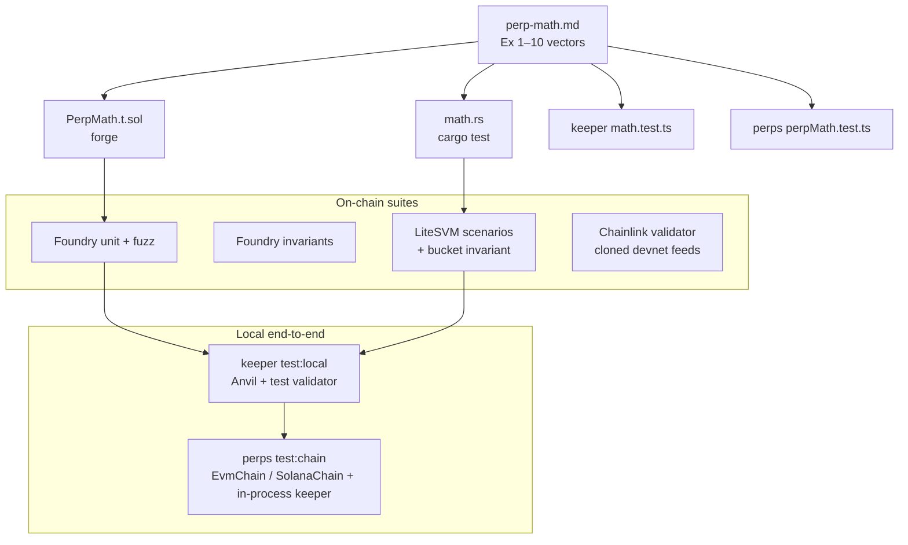

# Testing

Testing has three layers:

1. **Shared vectors.** Every maths implementation asserts the exact worked examples in [perp-math.md](perp-math.md).
2. **Per-package suites.** Unit, fuzz and invariant tests on-chain; unit tests off-chain.
3. **Local end-to-end.** The keeper and the app's chain layer run against a local Anvil and a local `solana-test-validator` with the real contracts and program.



## Test matrix

| Package | Command | What it covers | Needs |
|---|---|---|---|
| contracts | `forge test` | Unit, fuzz and invariant suites | Foundry |
| contracts | `FOUNDRY_PROFILE=ci forge test` | Longer fuzz/invariant runs | Foundry |
| solana | `cargo test -p celestial-perps --lib` | Maths vectors, property sweeps, OCR2 decoding of a captured account | Rust |
| solana | `pnpm test` | Builds with `mock-oracle`, runs the LiteSVM suite | Anchor, Node |
| solana | `pnpm test:chainlink` | Devnet build against `solana-test-validator` with the Chainlink store and feeds cloned from devnet | Network access |
| keeper | `pnpm test` | Maths vectors (Ex 1–9), oracle decoding, config, logging redaction | Node |
| keeper | `pnpm test:local` | In-process keeper vs Anvil + test validator | `forge build`, `pnpm build:test` in celestial-solana |
| perps | `npm run test:math` | `lib/perpMath.ts` vs every vector | Node |
| perps | `npm run test:chain` | `EvmChain` and `SolanaChain` end to end with the keeper in-process | Same as keeper `test:local` |
| wallet | `npm test` | NFT module (normalisers, spam, media, grouping, transfers, marketplaces) | Node |

## EVM contracts

| Suite | Tests | Focus |
|---|---|---|
| `test/PerpMath.t.sol` | 18 | Every perp-math.md vector, plus fuzzed properties: spread always against the trader, open/close at one price never profits, liquidation price is the exact boundary |
| `test/PerpEngine.t.sol` | 38 | Request lifecycle, fills, cancels with reasons, partial closes, funding, liquidation, profit cap, caps, pause, admin bounds |
| `test/LiquidityPool.t.sol` | 15 | Add/remove, CLP pricing, cooldown, reserved-liquidity limit, fee split, access control |
| `test/ChainlinkOracle.t.sol` | 11 | Stale, incomplete, non-positive and future answers; decimal normalisation |
| `test/ChainlinkSmoke.t.sol` | 2 | The vendored Chainlink interfaces and `MockV3Aggregator` behave as the oracle wrapper expects |
| `test/MockUSDC.t.sol` | 8 | Faucet amount and cooldown, owner mint |
| `test/TestNFTs.t.sol` | 8 | NFT fixture contracts |
| `test/invariant/PerpInvariants.t.sol` | 6 invariants | See below |

`test/utils/PerpTestBase.sol` deploys the full stack with `MockV3Aggregator` feeds.

**Invariants.** A handler drives random sequences of `addLiquidity`, `removeLiquidity`, `openPosition`, `decreasePosition`, `liquidateAll`, `cancelExpired`, `leavePending`, `movePrice` and `warp` across 3 actors and 2 markets:

| Invariant | Statement |
|---|---|
| `PoolSolvent` | USDC balance ≥ every bucket owed, and `reserved ≤ poolAmount` |
| `CollateralAccounting` | `totalCollateral` = Σ open positions' collateral |
| `OpenInterestAccounting` | Per-market side sizes = Σ position sizes |
| `EscrowAccounting` | `totalEscrow` = Σ pending increase requests' collateral |
| `ClpBacked` | CLP supply > 0 ⇒ AUM > 0 |
| `TradersBoundedByReserves` | Total paid to traders ≤ total they put in + total profit reserved for them |

Coverage: `forge coverage --ir-minimum --no-match-path 'test/invariant/*'`.

## Solana program

| Suite | Focus |
|---|---|
| `math.rs` unit tests | Every perp-math.md vector (both CLP columns) plus property sweeps |
| `oracle.rs` unit tests | Decoding a real captured devnet `Transmissions` account; age, future skew and non-positive checks |
| `tests/pool.test.ts` | Liquidity (add/remove, cooldown, reserved limit), faucet, admin (initialise once, keepers, params, fees) |
| `tests/requests.test.ts` | Cancellations during execution (slippage, OI cap, min collateral, leverage bounds…), owner cancel, request validation, batching, access control, pause and disabled markets, AUM market-account validation |
| `tests/trading.test.ts` | Open, decrease/close (partial, full, profit cap, rent refund), liquidation, funding over hours |
| `tests/chainlink-validator.ts` | The devnet build reading real Chainlink feeds cloned into a local validator |

The LiteSVM harness (`tests/harness.ts`) controls the clock, and after **every** scenario it asserts:

```
vault ≥ pool_amount + fee_reserves + total_collateral + total_escrow
reserved_amount ≤ pool_amount
```

## Keeper

`pnpm test:local` starts the keeper **in-process** against:

- **Anvil**, with the contracts deployed from forge artifacts and `MockV3Aggregator` prices
- **`solana-test-validator`**, with the `mock-oracle` build of the program (the keeper uses the devnet IDL)

| Scenario | EVM | Solana |
|---|---|---|
| Fill within 5 s | ✓ | ✓ |
| Batch: one request hits slippage and cancels, the others fill, every fee goes to the keeper | ✓ | ✓ (one transaction) |
| Stale oracle → `StalePrice` cancel, keeper still paid | — | ✓ |
| Liquidation within 10 s of crossing the liquidation price; healthy positions untouched | ✓ | ✓ |
| Funding accrues on the heavier side only | ✓ | ✓ |
| RPC outage (proxy switched off), then recovery with exactly-once execution | ✓ | ✓ |

For a live check against a running keeper, from a **separate test wallet**:

```bash
TRADER_KEYPAIR_PATH=<test keypair path> node --import tsx scripts/live-trade.ts solana
TRADER_PRIVATE_KEY=<test key> SEPOLIA_RPC_URL=… node --import tsx scripts/live-trade.ts evm
```

## Trading app

`npm run test:chain` runs the same scenarios through the app's `PerpsChain` implementations on both local chains:

- reads params, markets (Solana: in `Config` order), oracle and pool
- faucet: 10,000 USDC, then a readable cooldown error
- approve (EVM)
- open → filled; `getPositions` shows the Ex 1 numbers. On Solana, the client-side snapshot maths also equals the on-chain `get_*` views
- add collateral, remove collateral, partial close
- slippage → cancelled with the decoded reason, escrow refunded
- full close → no positions (Solana: position rent refunded)
- history lists every step with its details
- liquidity: add at the maths' CLP amount, readable cooldown error, remove
- cancel after expiry (keeper stopped, so the order stays pending)

The EVM set-up is in `test/support/evm-local.mts`. The Solana set-up reuses the keeper's local harness (`celestial-keeper/test/support/solana-local.ts`), and both suites start the keeper in-process with `startKeeper`.

## Wallet

`npm test` in `celestial-react-wallet` runs `tests/nft/*.test.ts` with Node's built-in runner (not Vitest, which would pull in `esbuild` and break the Vite build). The suites are listed in [wallet-nfts.md](wallet-nfts.md#tests). The extension UI and the onboarding handshake are checked manually in Chrome at 360×600.

## Continuous checks before merging

```bash
(cd celestial-contracts && forge fmt --check && forge test)
(cd celestial-solana && cargo test -p celestial-perps --lib && pnpm test)
(cd celestial-keeper && pnpm typecheck && pnpm test && pnpm test:local)
(cd celestial-perps && npm run test:math && npm run test:chain && npm run build)
(cd celestial-react-wallet && npm test && npm run build)
(cd celestial-landing && npm run lint && npm run build)
```
