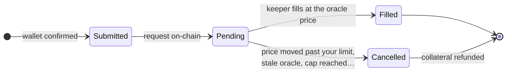

# Trader Guide

How to trade on Celestial Perps with test funds. Everything runs on **testnets** (Ethereum Sepolia and Solana devnet) with mock USDC, so nothing here costs real money.

> New to perpetual futures? A perp lets you bet on a price going up (**long**) or down (**short**) with **leverage**. You post collateral, and your profit or loss is based on the full position size. Leverage multiplies both gains and losses, and a position that loses too much is **liquidated**.

## 1. Get set up

| You need | Sepolia (BTC-USD, ETH-USD) | Solana devnet (SOL-USD, BTC-USD, ETH-USD) |
|---|---|---|
| Wallet | Celestial Wallet or MetaMask | Celestial Wallet or Phantom (set to **Devnet**) |
| Gas | A little Sepolia ETH (a faucet such as Google Cloud's or Alchemy's) | A little devnet SOL (`faucet.solana.com`) |
| Collateral | Test USDC from the app's faucet | Test USDC from the app's faucet |

1. Open the app and go to **Trade**.
2. Click **Connect Wallet** and pick your wallet. On EVM, if the app says your wallet isn't on Sepolia, click **Switch to Sepolia**.
3. Click **Get test USDC** in the header: 10,000 USDC, once every 24 hours per address.

## 2. Open a position

1. Pick a market at the top (SOL-USD exists only on Solana).
2. Choose **Long** or **Short**.
3. Enter your **collateral** in USDC and choose **leverage** (1×–20×). Size = collateral × leverage.
4. Check the **order summary** before confirming:

| Row | Meaning |
|---|---|
| Entry (oracle ± 0.1%) | Expected fill price. Orders fill at the on-chain Chainlink price plus a 0.1% spread against you |
| Acceptable price | The worst price you accept (your slippage setting, 0.5% by default). If the fill would be worse, the order is **cancelled and refunded** |
| Liquidation price | Where the position would be liquidated |
| Open fee | 0.06% of the size |
| Execution fee | A small ETH or SOL fee that pays the keeper to fill your order |

5. Click **Open Long** or **Open Short** and confirm in your wallet.
   - **On EVM the first time:** the button reads *Approve … & Open Long* and your wallet asks twice. First you approve the pool to use your USDC, then you confirm the order. Choose **Approve max** to skip the approval next time.

## 3. What happens after you confirm

Orders use two steps. Your transaction creates a **request**, and the **keeper** fills it at the next oracle price, usually within a few seconds. The order tracker shows the progress:

- **Filled** shows the fill price and fee. The position appears in **Positions**.
- **Cancelled** shows the reason, for example "Price moved past your slippage limit." Your collateral is refunded automatically. The keeper still keeps the small execution fee.
- **Pending for a long time?** If the keeper hasn't filled it after 60 seconds, **Cancel** becomes available in the **Orders** tab and refunds everything, including the execution fee. The **Status** page shows whether the keeper is healthy.

## 4. Manage a position

| Action | How |
|---|---|
| See PnL | **Positions** shows mark price, PnL, and *net if closed now* (PnL − close fee − funding owed) |
| Close fully | **Close** on the position |
| Close part | **Partial**: enter the percentage of the position to close |
| Add collateral | **Add**: lowers leverage and moves the liquidation price away |
| Remove collateral | **Remove**: allowed while the position stays within 20×, keeps ≥ 10 USDC and stays above the liquidation threshold |
| History | The **History** tab lists every request, fill, cancel and close |

Closing and adding or removing collateral are orders too, so they go through the keeper in the same way.

## 5. Costs and risks

| Item | Amount |
|---|---|
| Open fee / close fee | 0.06% of size each |
| Spread | 0.1% of price against you on every fill |
| Funding | Up to 0.01% of size per hour, paid by the side with more open interest |
| Execution fee | 0.0002 ETH or 0.00005 SOL per order |
| Liquidation | You lose your collateral; 0.5% of size goes to the keeper |

- **Liquidation** happens when collateral + PnL − funding − close fee falls below **2.5% of size**. At 20× that's an adverse move of about 2.3% (the open fee and spread use part of the margin). Lower leverage gives you more room.
- **Profit is capped** at 9× your collateral for a single position. That cap is reserved in the pool when you open, so profits can always be paid.
- **Chart vs. fill price:** the chart and ticker come from Coinbase for display. Fills and liquidations always use the on-chain Chainlink price, which can lag the chart, especially on Sepolia where feeds update roughly hourly.

## 6. Troubleshooting

| Message | What to do |
|---|---|
| "Faucet already claimed — try again in 24 h" | Each address can claim once a day. Use another account for more |
| "Switch your wallet to Sepolia" | Use the switch button, or change network in your wallet |
| "Price moved past your slippage limit" | Price moved between request and fill. Retry, or raise slippage |
| "Oracle price was stale" | The Chainlink feed hasn't updated recently. Retry later; the Status page shows oracle freshness |
| "Open-interest cap reached for this side" | That side of the market is full (30% of pool AUM). Try a smaller size or the other side |
| "Leverage above the maximum" | Lower leverage slightly; the open fee reduces your collateral |
| Phantom warns "reverted during simulation" (devnet) | Phantom can't preview this devnet program. The app re-checks every transaction on devnet before sending |
| Order stays pending | Check **Status**. After 60 s you can cancel for a full refund |
