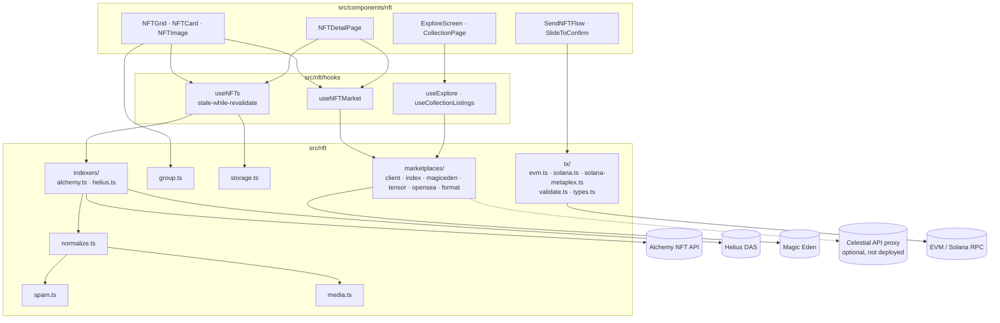
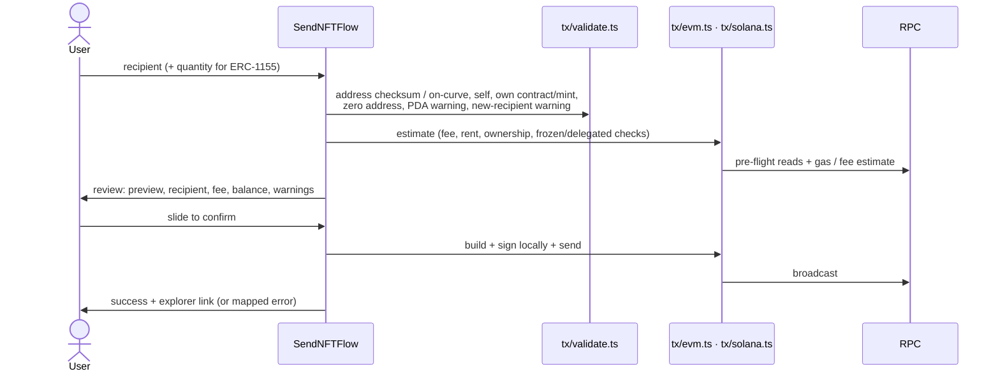

# Wallet NFTs

The NFT module of [Celestial Wallet](wallet.md) shows, groups, filters, prices and transfers NFTs on **EVM** (Ethereum and Sepolia) and **Solana** (mainnet and devnet). It covers seven token standards. Ownership comes from indexers, all signing happens locally in the popup, and marketplace data is read-only.

## Architecture



## Data model

`src/nft/types.ts` normalises both indexers into one type:

```ts
type NFTStandard =
  | 'erc721' | 'erc1155'
  | 'metaplex-nft'     // Token Metadata, non-programmable
  | 'metaplex-pnft'    // Programmable NFT
  | 'metaplex-cnft'    // Bubblegum compressed
  | 'metaplex-core'    // mpl-core asset
  | 'token-2022-nft';  // Token-2022 with the metadata extension

interface NFTAsset {
  key: string;              // `evm:<contract>:<tokenId>` or `solana:<assetId>`, globally unique
  chain: NFTChain;          // 'EVM' | 'Solana'
  standard: NFTStandard;
  contract?: string;        // EVM contract (checksummed)
  tokenId?: string;         // EVM token id (decimal string)
  assetId?: string;         // Solana mint / asset id
  name: string;
  description: string | null;
  images: string[];         // ordered candidates, best first
  animation: { url: string; kind: NFTMediaKind } | null;
  attributes: NFTAttribute[];
  collection: NFTCollection | null;   // id, name, image, verified
  amount: string;           // "1", or the ERC-1155 quantity
  symbol: string | null;
  royaltyBps?: number;
  tokenProgram?: string;    // Solana token program (transfers)
  providerSpam: boolean;    // indexer's own flag (Alchemy mainnet)
}
```

Two design choices:

- **`images: string[]`**, not one URL. Indexer cache URLs are sometimes unusable (Alchemy's `cachedUrl` can echo a broken source), so `NFTImage` tries each candidate in turn and then falls back to a bundled placeholder.
- **Spam and hidden state are computed at read time** (`NFTVisibility`), not stored. Improvements to the heuristics apply to cached data immediately.

## Ownership indexing

| Chain | Indexer | Pagination | Standard mapping |
|---|---|---|---|
| EVM | Alchemy `getNFTsForOwner?withMetadata=true&pageSize=100` | Follows `pageKey`, ≤ 20 pages | `tokenType` → `erc721` / `erc1155`; `balance` → `amount` |
| Solana | Helius DAS `getAssetsByOwner` (`limit: 1000`) | Until a short page, ≤ 10 pages | `compression.compressed` → cNFT; `ProgrammableNFT` → pNFT; `MplCoreAsset` → Core; `V1_NFT`/`V1_PRINT` → NFT; fungible interfaces excluded |

Indexer quirks the normalisers handle:

- Fresh EVM contracts have no contract metadata in Alchemy (`name: null`, `tokenType: UNKNOWN`). The collection name falls back to on-chain `name()`.
- `cachedUrl` can be a `data:` URI (on-chain SVG). It is rendered directly.
- Helius lists only **verified** collections in `grouping`, so presence there is treated as verified. Helius CDN URLs (`files[].cdn_uri`) are the preferred image candidates.
- Testnets have no provider spam classification, so local heuristics are always applied.

## Media, spam and caching

| Module | Behaviour |
|---|---|
| `media.ts` | Resolves `ipfs://`, bare CIDs, `ar://` and `data:` URIs; **rejects `javascript:`**; detects the media kind. Images, muted looping video and audio are rendered. HTML and 3D animation URLs are **linked out, never rendered** |
| `spam.ts` | Scored heuristics: links in the name or description, scam phrases ("claim", "airdrop", "reward"), currency bait, the provider flag. Users can **hide or unhide** any NFT, and the override is stored per network, keyed by the NFT key |
| `storage.ts` | `chrome.storage.local` cache per network, chain and owner. Hide/show overrides. The last 5 recipients per network and chain |
| `useNFTs` | Stale-while-revalidate: the cached list renders instantly and refreshes in the background. Errors are tracked per chain, and fetches are abortable. `applyLocalTransfer` removes a sent NFT (or decrements an ERC-1155 quantity) optimistically and refetches after 8 s |
| `group.ts` | Groups by collection (EVM addresses case-insensitive), largest first, ungrouped last |

## UI

- **Tokens | NFTs** tab inside the asset drawer. The count badge follows the active tab.
- **Grid:** collapsible collection sections (image, verified badge, count, floor), "Show hidden & spam (n)" footer, loading skeletons, empty state with a Receive shortcut.
- **Detail page:** media, collection and verified badge, spam warning, expandable plain-text description (metadata is **never rendered as HTML**), attributes, details (standard, network, contract/mint/asset id, token id, quantity, royalty, owner) with copy and explorer links, a Market panel, Hide/Unhide, Send.
- **Explore** (compass in the bottom nav): featured collections with live floor and listed count → collection page (stats, cheapest-first listings in SOL and USD, "Load more", link out to the marketplace).

## Sending



| Standard | Transfer |
|---|---|
| ERC-721 | `safeTransferFrom(from, to, tokenId)`; ownership checked first; gas estimate +20% |
| ERC-1155 | `safeTransferFrom(from, to, id, amount, "0x")`; balance checked first |
| `metaplex-nft` / `token-2022-nft` | SPL `transferChecked` (amount 1, decimals 0) + idempotent ATA creation, with the matching token program |
| `metaplex-pnft` | `mpl-token-metadata` `transferV1` (token records, rule sets, 400k CU). A plain SPL transfer would fail |
| `metaplex-cnft` | `mpl-bubblegum` transfer with an asset proof from DAS. V1 or V2 is picked from the tree owner |
| `metaplex-core` | `mpl-core` `transfer`, passing the collection when there is one |

- Metaplex libraries (Umi) are **lazy-loaded**: a separate ~1.8 MB chunk (233 KB gzip), downloaded only on the first pNFT, cNFT or Core send.
- Umi's `sendAndConfirm` resolves even when a transaction lands but fails, so `result.value.err` is checked explicitly.
- `friendlyTransferError` maps RPC errors to messages: insufficient fee balance, invalid address, no longer owned, frozen or delegated, over quantity, mismatched signing key.
- **Keys never enter a network request.** They only reach `ethers.Wallet`, `Keypair.fromSecretKey` and Umi `keypairIdentity`, and `NFTTransferParams` carries no key.

## Marketplace data

Marketplace data is read-only. The wallet shows floor prices, collection stats and listings. Buying, listing and offers are not implemented, and listings link out to the marketplace.

| Module | Role |
|---|---|
| `marketplaces/types.ts` | `MarketplaceProvider` (`getCollectionStats`, `getListings`, `getNFTListing`, `getBestOffer`), `CollectionStats` (volume carries its own `'24h' \| '7d'` window), `Listing`, `Offer` |
| `marketplaces/client.ts` | The single point for partner HTTP: proxy-vs-direct routing, 8 s timeout, 404 → `null`, TTL cache that tells "no data" apart from a cache miss, in-flight de-duplication |
| `marketplaces/magiceden.ts` | Keyless v2 API on Solana. One wallet request maps every mint to its Magic Eden collection symbol |
| `marketplaces/tensor.ts`, `opensea.ts` | Proxy-only; response shapes unverified without partner keys |
| `marketplaces/index.ts` | Per-chain provider order (`PROVIDER_ORDER`), `fetchMarketData` (dedupes by collection, ≤ 30 collections per refresh, best-effort per collection) |
| `marketplaces/format.ts` | Magnitude-aware native formatting |

Keyless Magic Eden reality (probed live, 2026-09):

| Route | Result | Consequence |
|---|---|---|
| `/v2/collections/{symbol}/stats` | 200 | Solana floors work |
| `/v2/collections/{symbol}/listings` | 200 | Listings and collection thumbnails work |
| `/v2/wallets/{owner}/tokens` | 200 | Mint → collection mapping works |
| `/v2/collections/{symbol}` | 429 | Collection names in Explore are curated, not fetched |
| `/v2/marketplace/popular_collections` | empty | Explore shows a curated **"Featured"** list (`ranked: false`), not "Trending" |
| `/v3/rtp/ethereum/…` | 400 | **EVM market data needs the proxy.** EVM NFTs show "No market data" until then |

**API proxy.** Partner keys must never ship in the extension bundle. When `VITE_CELESTIAL_API_URL` is set, every marketplace request goes to `<base>/market/<provider>/<path>`, and the proxy injects keys server-side. The extension never reads a partner key from `import.meta.env`. The proxy is **not deployed yet**, so only keyless endpoints are used.

**Portfolio value.** With "Include NFTs at floor" on (Settings → Networks), floor values are added to the displayed total. The 24 h change stays token-only, because floor prices have no 24 h series. A floor of 0 is shown as "Not listed", never as free. Testnets show "No market data".

## Network support

| Capability | Solana devnet | Solana mainnet | Sepolia | Ethereum mainnet |
|---|:-:|:-:|:-:|:-:|
| View, group, hide | ✅ | ✅ | ✅ | ✅ |
| Send (all standards) | ✅ | ✅ | ✅ | ✅ |
| Floor prices / Explore | — ("No market data") | ✅ Magic Eden | — | Needs proxy |
| Buy / list / offers | not implemented | not implemented | not implemented | not implemented |

## Test fixtures

Reproducible test NFTs covering every standard and edge case:

| Chain | Source | Contents |
|---|---|---|
| Sepolia | `celestial-contracts/src/test-nfts/TestERC721.sol`, `TestERC1155.sol`, `script/MintTestNFTs.s.sol` | ERC-721: 5 standard, 1 spam-style, 1 broken image. ERC-1155: 2 ids (×10, ×1). Metadata and SVG art are generated on-chain as base64 data URIs. Deployed: ERC-721 `0xaeE65b84d152Ee214A2e7607fcBFe302BD3EffDe`, ERC-1155 `0x74e5e2d01969f52375E26FF8119E06BfDE633213` |
| Solana devnet | `celestial-react-wallet/scripts/mint-devnet-nfts.ts` | Collection, 2 standard NFTs, pNFT, Core asset, Merkle tree + 2 cNFTs, a spam-like NFT, a broken-image NFT. Addresses in `scripts/fixtures.devnet.json` |

```bash
# Sepolia (from celestial-contracts/, fixture key only)
PRIVATE_KEY=<fixture key> RECIPIENT=<evm address> \
  forge script script/MintTestNFTs.s.sol:MintTestNFTs --rpc-url sepolia --broadcast

# Solana devnet (from celestial-react-wallet/)
npm run fixtures:solana -- --owner <solana address>
```

The Solana script uses a **dedicated local test keypair** (gitignored, never the user's vault), refuses to run unless the RPC genesis hash is devnet, and uploads metadata to Irys devnet. Irys devnet uploads are not permanent, so re-run the script or use `--metadata-base-url` with self-hosted files if images disappear. Node 24 runs the TypeScript directly. Don't add `tsx` to this package: it pulls in `esbuild`, which breaks the Vite build.

## Tests

```bash
cd celestial-react-wallet
npm test                  # tests/nft/*.test.ts (node:test, recorded indexer payloads)
npm run typecheck:tests
```

| Suite | Covers |
|---|---|
| `normalize.test.ts`, `indexers.test.ts` | Recorded Alchemy/Helius payloads → `NFTAsset`, standards, pagination (mocked fetch) |
| `spam.test.ts`, `media.test.ts`, `group.test.ts` | Heuristics, URI resolution, grouping |
| `transfer.test.ts` | Recipient validation, EVM calldata (selectors, decoded args), SPL/Token-2022 instruction accounts and data, error mapping |
| `marketplaces.test.ts` | Mapping, lamport conversion, zero floor, volume windows, per-chain reachability, listings and paging, dedupe, outage degradation |
| `tests/nft/integration/{evm,solana}-transfers.ts` | End-to-end transfers on Anvil / devnet (manual, not part of `npm test`) |
