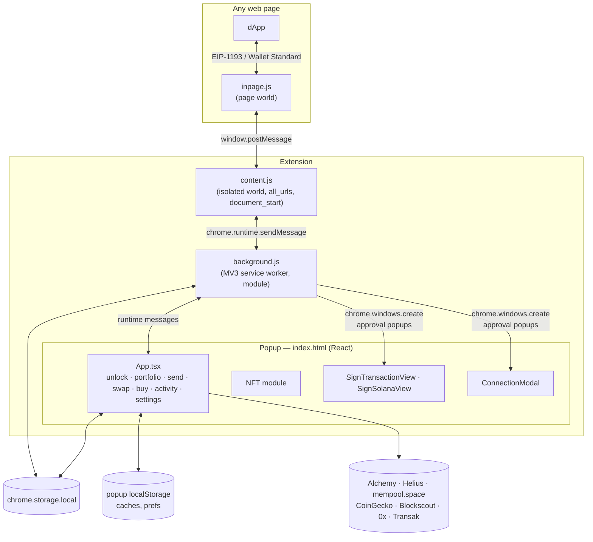
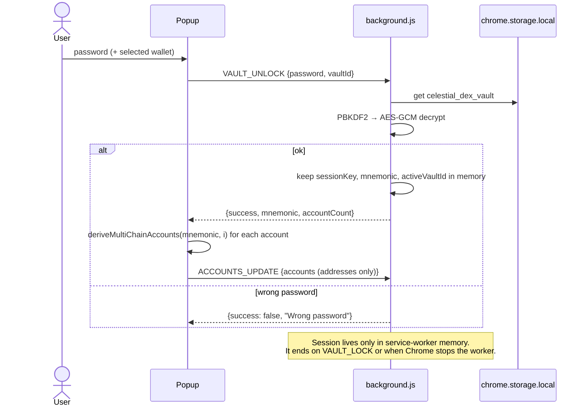
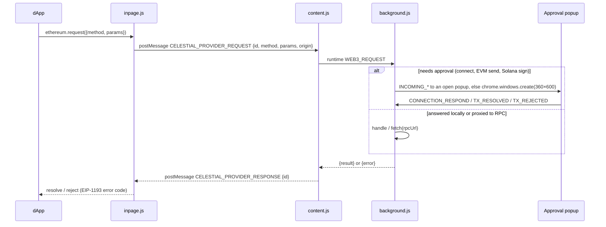
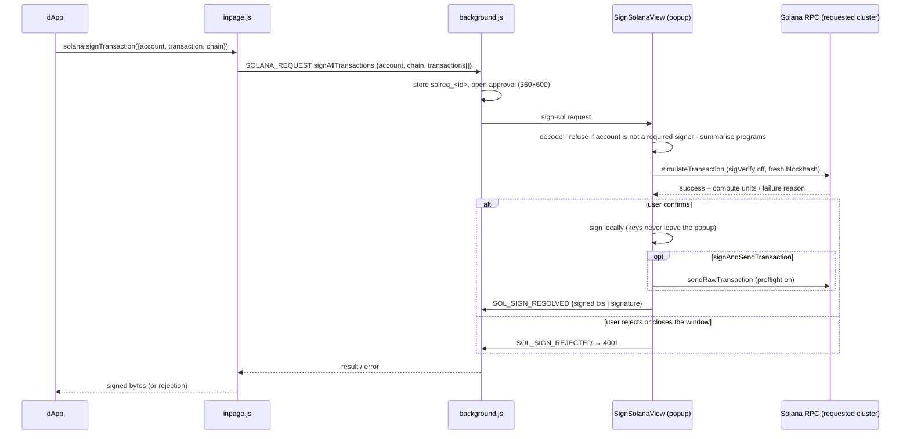

# Celestial Wallet (browser extension)

Celestial Wallet is a non-custodial **Chrome Manifest V3** extension. From one BIP-39 seed it manages **EVM** (Ethereum and Sepolia), **Solana** (mainnet and devnet) and **Bitcoin** (mainnet and testnet) accounts. It also injects dApp providers for EVM and Solana and has a full NFT module ([wallet-nfts.md](wallet-nfts.md)).

Package: `celestial-react-wallet/` · React 19 + Vite + Tailwind 4 · ethers 6 · @solana/web3.js · bitcoinjs-lib

## Components



| File | World | Responsibility |
|---|---|---|
| `public/manifest.json` | — | MV3 manifest. Permissions `storage`, `activeTab`, `scripting`. Module service worker `background.js`. `content.js` on `<all_urls>` at `document_start`. Web-accessible `inpage.js` and `assets/*.wasm` |
| `public/inpage.js` | Page | Defines `window.ethereum`, `window.celestial`, `window.solana`, `window.phantom.solana`. Announces over **EIP-6963** and registers with the **Wallet Standard** |
| `public/content.js` | Isolated | Injects `inpage.js`. Relays provider requests to the background and network changes back to the page. Relays `VAULT_INIT` from the onboarding page |
| `public/background.js` | Service worker | Vault storage and unlock session, dApp request router, pending approval queues, network state |
| `src/App.tsx` | Popup | Main UI and state (unlock, accounts, balances, send, swap, buy, activity, settings, NFTs) |
| `src/utils/walletUtils.ts` | Popup | HD derivation for all three chains |
| `src/lib/crypto.ts` | Popup | PBKDF2 + AES-GCM (mirrors the landing page) |
| `src/solana/signing.ts` | Popup | Solana dApp signing: decode, summarise, required-signer check, sign transactions, Ed25519 message signatures (WebCrypto) |
| `src/utils/*` | Popup | RPC balances and prices, tokens, transactions, history, swap quotes, on-ramp |
| `src/components/*` | Popup | `SignTransactionView` (EVM), `SignSolanaView` (Solana), `ConnectionModal`, `SwapModal`, `BuyModal`, `ReceiveModal`, `ActivityTab`, `TokenPage`, `TokenIcon`, `components/nft/*` |

## Vault and key management

### Storage format

Vaults are created by the onboarding site ([landing.md](landing.md)) and stored under `chrome.storage.local["celestial_dex_vault"]` as an **array**. Several named wallets are supported:

```ts
interface VaultBlob {
  version: 1;
  id: string;             // "wallet_<ms>_<random>"
  name: string;           // user-chosen, e.g. "Wallet 1"
  salt: string;           // base64, 16 random bytes
  mnemonic: { iv: string; ciphertext: string };  // base64; AES-256-GCM, 12-byte IV
  createdAt: number;
  accountCount?: number;  // set by the background; incremented by "Add account"
}
```

Only the **mnemonic** is stored, and only encrypted. Private keys are never persisted. They are re-derived in memory after unlock.

### Cryptography

| Step | Algorithm |
|---|---|
| Key derivation | PBKDF2-HMAC-SHA256, **600,000 iterations**, 16-byte random salt, via WebCrypto |
| Encryption | AES-256-GCM, 12-byte random IV. The GCM tag authenticates the ciphertext |
| Password check | Decryption itself: a wrong password fails GCM authentication ("Wrong password") |
| Key handling | `CryptoKey` is non-extractable |

### Unlock session



When the popup reopens it calls `VAULT_STATE_GET`. While the worker is alive and unlocked, the mnemonic is returned and the popup re-derives the accounts without asking for the password again.

### Derivation

`deriveMultiChainAccounts(seed, index)` in `src/utils/walletUtils.ts`:

| Chain | Path | Scheme | Address |
|---|---|---|---|
| EVM | `m/44'/60'/0'/0/{i}` | BIP-44 secp256k1 (ethers `HDNodeWallet`) | EIP-55 checksummed |
| Solana | `m/44'/501'/{i}'/0'` | SLIP-0010 ed25519 (`ed25519-hd-key`) | base58 public key (Phantom-compatible) |
| Bitcoin | `m/84'/0'/0'/0/{i}` | BIP-84 (bip32 + tiny-secp256k1) | Native SegWit P2WPKH (`bc1…`) |

"Add account" sends `VAULT_ADD_ACCOUNT`, which increments `accountCount`. Account `i` uses index `i` on all three chains.

## dApp providers

### Message path



Requests time out after 5 minutes in `inpage.js`. If the extension was reloaded under the page, the page gets `-32603 "Extension context invalidated. Please reload the page."`.

### EVM provider (`window.ethereum`)

Flags: `isCelestial`, `isCelestialWallet`, and `isMetaMask = true` (for compatibility with dApps that only check for MetaMask). EIP-6963 info: `name "Celestial Wallet"`, `rdns "app.celestial.wallet"`, uuid `a6813b1f-e3c3-4f9e-8c6c-84d7285a86ef`. It also supports the legacy `enable()`, `send()` and `sendAsync()` methods.

| Method | Handling |
|---|---|
| `eth_requestAccounts` | Returns cached accounts if already connected. Otherwise opens the **connect approval** (`index.html?request=connect&id=…&origin=…`) and returns every account's EVM address on approval, or `4001` on rejection |
| `eth_accounts` | Cached in the page provider. Background: `[]` while locked |
| `eth_chainId` / `net_version` | `0xaa36a7` / `11155111` when the popup is on testnet, else `0x1` / `1` |
| `eth_sendTransaction` | Stores the payload as `tx_<id>` and opens the **sign-tx** popup. `SignTransactionView` shows the request, signs with the key of the account named in the transaction's `from` (not simply the active account) via `ethers.Wallet`, broadcasts through the network's RPC and returns the hash |
| `wallet_switchEthereumChain` | Switches between Ethereum mainnet (`0x1`) and Sepolia (`0xaa36a7`): stores the network, emits `chainChanged` in every tab, and the popup follows. Any other chain → `4902` |
| `wallet_addEthereumChain` | `null` for the two built-in chains; custom chains → `4200` |
| `eth_getBalance`, `eth_call`, `eth_estimateGas`, `eth_blockNumber`, `eth_getTransactionReceipt`, `eth_getTransactionByHash`, `eth_getTransactionCount`, `eth_getBlockByNumber`, `eth_getBlockByHash`, `eth_getLogs`, `eth_getStorageAt`, `eth_feeHistory`, `eth_maxPriorityFeePerGas`, `eth_gasPrice`, `eth_getCode`, `eth_syncing`, `web3_clientVersion` | Read-only; proxied to the network RPC (`rpcUrl` from the popup) |
| `personal_sign`, `eth_signTypedData(_v4)` | Accepted by the page provider but **not implemented** in the background (see limitations) |
| anything else | `4200` "Celestial does not support the method" |

Switching network in the popup sends `NETWORK_CHANGE {isTestnet, rpcUrl, rpcUrls}`. The background stores it and broadcasts `CELESTIAL_NETWORK_CHANGED` to every tab, and the page provider emits `chainChanged`. Since a dApp can also switch the network, the background's stored value is authoritative: the popup adopts it when it opens and follows `chrome.storage` changes.

### Solana provider (`window.solana`, `window.phantom.solana`, Wallet Standard)

- `connect()` goes through the same approval popup as EVM (`SOLANA_REQUEST connect`) and returns the first account's Solana address. `disconnect()` clears local state. Both emit the Wallet Standard `change` event.
- It registers as the Wallet Standard wallet **"Celestial Wallet"** on `solana:mainnet`, `solana:devnet` and `solana:testnet`, with `standard:connect`, `standard:disconnect`, `standard:events`, `solana:signTransaction`, `solana:signAndSendTransaction` and `solana:signMessage`. Accounts carry their real 32-byte public key.
- `window.solana` also offers the legacy adapter methods: `signTransaction`, `signAllTransactions`, `signAndSendTransaction` (returns `{ signature, publicKey }`) and `signMessage`. Signed transactions come back as the dApp's own class (`Transaction` or `VersionedTransaction`).
- `isPhantom = true`, for dApps that only look for Phantom.

**Signing flow.** Transactions travel as base64 wire bytes, and messages as base64:



The popup uses the cluster the dApp names (`solana:devnet` etc.), falling back to the wallet's network. It signs with whichever unlocked account the request names, not only the active one. Closing the approval window counts as a rejection.

## Popup features

| Feature | Implementation |
|---|---|
| Portfolio | Native balances (Alchemy for ETH, Helius for SOL, mempool.space for BTC), ERC-20 and SPL tokens, CoinGecko prices and charts. Cached per network in `localStorage` and refreshed in the background. Optional NFT floor value in the total |
| Send | ETH/ERC-20 (`ethers.Wallet`), SOL/SPL (`@solana/web3.js`, idempotent ATA creation), BTC (UTXOs from mempool.space, P2WPKH, flat fee estimate). Keys are used in-process only |
| Swap | 0x Swap API (`/swap/permit2/quote`) quotes on EVM |
| Buy | Transak widget (**staging** environment) |
| Activity | Blockscout (EVM), Helius signatures (Solana), mempool.space (BTC), with explorer links |
| Receive | Address + QR |
| NFTs | Grid, detail, send, floor prices, Explore. See [wallet-nfts.md](wallet-nfts.md) |
| dApp approvals | Connect, EVM transaction, Solana transaction/message screens (with devnet/mainnet simulation for Solana) |
| Settings | Networks (mainnet/testnet), manage accounts, reveal seed / private key (password re-entry), delete wallet |

## Configuration

Build-time variables are read in `src/config/networks.ts`. **Every `VITE_*` value is compiled into the extension bundle**, so use keys that are safe to ship (domain- or extension-restricted).

| Variable | Used for |
|---|---|
| `VITE_ALCHEMY_ETH_URL` / `VITE_ALCHEMY_SEPOLIA_URL` | EVM balances, tokens, NFTs, sending |
| `VITE_HELIUS_SOL_URL` / `VITE_HELIUS_DEVNET_URL` | Solana balances, tokens, NFTs (DAS), sending |
| `VITE_MEMPOOL_BTC_URL` / `VITE_MEMPOOL_TESTNET_URL` | Bitcoin |
| `VITE_COINGECKO_API_KEY` | Prices and charts |
| `VITE_ETHERSCAN_API_KEY` | Explorer lookups |
| `VITE_CELESTIAL_API_URL` | Optional marketplace API proxy ([wallet-nfts.md](wallet-nfts.md#marketplace-data)) |

## Build and install

```bash
cd celestial-react-wallet
npm install
npm run build            # tsc -b && vite build → dist/
npm test                 # NFT module + Solana signing / inpage provider tests (node:test)
```

Load `dist/` at `chrome://extensions` → Developer mode → **Load unpacked**. Then create a wallet through the onboarding site ([landing.md](landing.md)), which hands the encrypted vault to the extension.

## Known limitations

These are tracked in [security.md](security.md#wallet-extension) where they have security impact.

| Area | Current behaviour |
|---|---|
| `personal_sign` / typed data | Not implemented: the request falls through to the RPC proxy and fails |
| `eth_accounts` fallback | The background returns a hard-coded placeholder address when unlocked with no accounts synced (a leftover from early development) |
| Chains | Only Ethereum mainnet and Sepolia (EVM); `wallet_addEthereumChain` for custom networks is refused |
| Per-origin permissions | Connection approval is not remembered per origin, and there is no "connected sites" list |
| Signing location | Transactions are signed in the popup with keys derived there. The background receives addresses only |
| Auto-lock | No idle timer. The session ends on manual lock or when Chrome stops the service worker |
| Vault import origin | `content.js` accepts `VAULT_INIT` from any page |
